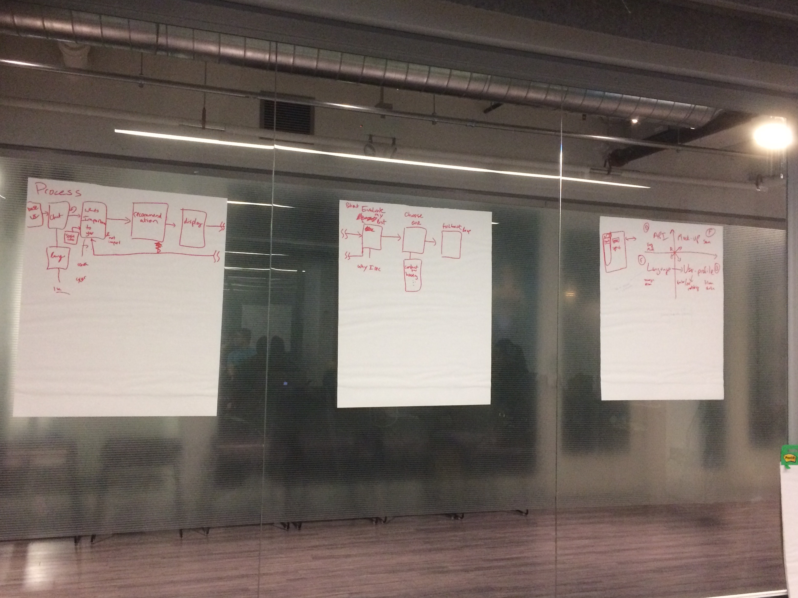
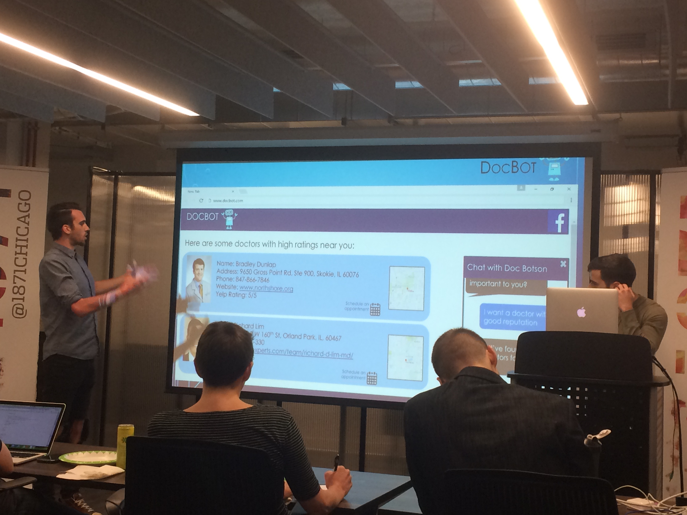
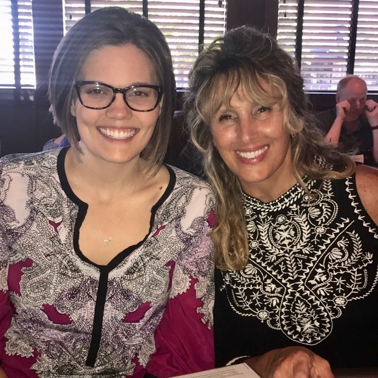

This Mother's Day weekend, I traveled home to Chicago to attend [ProPublica's](https://www.propublica.org/) [Vital Signs Hackathon](https://www.propublica.org/atpropublica/item/propublica-is-hosting-a-chicago-hackathon-to-design-innovative-new-health-c) and surprise my mom for Sunday dinner. This was my first hackathon experience, and I learned a lot.

## How a Hackathon Works

In the beginning, a bunch of nerds like myself sit in a room drinking boxed coffee and eating mini muffins and talking about what they do for a living. I very quickly found out that I don't fit in here as well as I thought I would. I was surrounded by web developers, software engineers, CompSci majors, and healthcare professionals, not statisticians (although there was at least one data scientist).  
I was quite nervous that I was too out of place, and I considered leaving and going straight to my mom's. I decided to stick it out, though, after listening to the ideas pitched by the other attendees. There were some really great ones, like an SMS messaging service for people to find mental health care in Chicago based on what bus stops they use, and a way for people to find accessibile medical facilities (ADA accessible, gender neutral restrooms, etc). After milling around the room for about a quarter hour listening to people talk about their ideas and their experience, I found [Charlie](https://www.linkedin.com/in/charles-arthur/), who was, from what I could tell, one of the only other R users in the room, and he pulled me into the DocBot team (more on DocBot later).

The DocBot team also consists of 

- [Matt](https://www.linkedin.com/in/mbogen)
- [Ferg](https://www.linkedin.com/in/feargalwalsh/) 
- [Lillian](https://www.linkedin.com/in/lilian-huang-91504413b/)
- Alison 
- [Iswarya](https://www.linkedin.com/in/iswarya-srinivasan-492a86b1/)
- Jonathan

We spent the first couple of hours brainstorming and planning how the DocBot should work. We outlined the flow of the tools, and split the work into four categories: accessing the API, writing the language used in the tool, creating user profiles, and chatbot platform and website mockup. We then determined which team members would work on which parts of the tool and got to work! 

<figure>
  
  <figcaption>Our brainstorm of a DocBot user's experience</figcaption>
</figure>

After lunch, we started developing DocBot, and everyone went home at around 8:30pm. Some of us kept working from home in the evening (mostly Matt, who developed the chatbot). In the morning on Sunday, we met up at about 9:00am (I was late because I snoozed my alarm one too many times) and prepared our presentation for the judges, and put the finishing touches (for the weekend) on DocBot.

On Sunday afternoon, we had some pizza for lunch, gave our pitch for DocBot and watched the other presentations from the group. 

## What is DocBot?

<figure>
  
  <figcaption>Ferg (left) and Matt presenting our idea</figcaption>
</figure>

[DocBot](https://www.facebook.com/DocBot-661289917402677) is our answer to the question, "How do I find the best doctor for me?" Finding a new doctor when you move, change insurances, need a specialist, or need a specific procedure done can be incredibly frustrating. You need to know if the doctor accepts your insurance, is close to you, specializes in what you need, is experienced, and has good reviews. DocBot is a chatbot that can answer these questions in a place you probably already use regularly: Facebook Messenger. 

DocBot uses information collected from the [BetterDoctor](https://developer.betterdoctor.com/), [ProPublica Vital Signs](https://projects.propublica.org/api-docs/vital-signs/api/), and [Yelp Fusion](https://www.yelp.com/developers/) APIs to filter through doctors in the user's area according to their personal preferences. DocBot is available 24/7, and you can find a provider for you with just a few simple questions. The tool is in its infancy, and only works for a few specialties (orthopedists and neurologists) in a limited location (Chicago metro area). But theoretically, we could expand it to any location in the U.S. and any medical specialties. 

## What I Learned

This experience was incredibly humbling. I was not expecting to feel as out of place as I did initially, but I figured out how I could contribute (by pulling data from the APIs and combining it in R) and went with it. I learned so much about how APIs work, how to work with data from them, and what they can be used for. I also learned that hackathons are **hard**. The time limit is stressful, and when you're under a time pressure like that, your brain doesn't necessarily make the best choices, and you have to recode things a bunch of times because you made a bunch of silly mistakes. 

I also learned a lot about JSON formatted data, which I had definitely encountered before, but not in such a large or complicated way. Learning more about JSON data made me realize that there are always ways to improve my skills when it comes to working with real-life, non-tidy data. As another example, consider that this hackathon offered prizes for the best use of data from the Yelp Fusion API. However, our team didn't really consider all the information that we had at hand before planning our tool. We just thought of things that would be nice to have, and then when some of those things didn't have corresponding data sources, we had to rework the tool, which just wasted time. The lesson here is: learn as much as you can about the data before you start planning how to use it! This applies to hackathons with specific data sources that want to optimize use of those data sources, as well as any other data source you might encounter in work or life. 

We also learned that hackathon teams should err on the side of *small*. The most awarded teams at the Vital Signs hackathon had two or three members, not eight like ours did. I found working in a group of eight people extremely difficult at times, and I often left the group to code things up that I couldn't focus on with multiple conversations happening around me. With too many members, we had too many ideas that were too hard to keep track of, and it definitely hindered the presentation of our tool to the judges, because we just couldn't keep all of it straight. Too many members also means that some people can get left out and ignored. There were moments where I felt like I was contributing, and then there were others where I felt like I was a burden, and I'm sure others had similar feelings. 

Finally, when developing a tool that could win a prize, make sure you have the specifics really nailed down when you present it. It needs to solve a specific and well-defined problem in an understandable way that you can present in under two minutes. If you don't understand who would use your tool, why they would want to use it, and how your tool solves their problem, your pitch will not be successful. 

## Happy Mother's Day!

<figure>
  
  <figcaption>At Mother's Day dinner with my momma. She was very surprised!</figcaption>
</figure>

