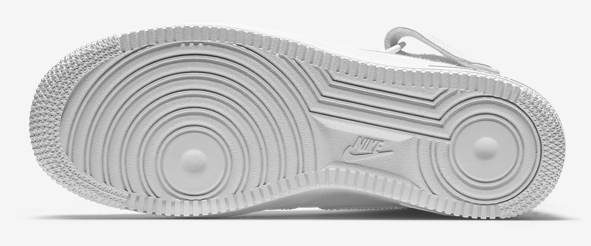

```{r setup, include=FALSE}
knitr::opts_chunk$set(echo = TRUE, message = FALSE, warning = FALSE, 
                      fig.align = "center")
```

# What is footwear impression evidence? 

In the mess of a crime scene, one of the most abundant pieces of evidence is a shoe outsole impression. A *shoe outsole impression* is the trace of a shoe that is left behind when the pattern of the sole is transferred in some way to the walking surface. Sometimes, the shoe impressions need to be "lifted" like fingerprints with powdering methods, and impressions are also often left in pliable materials such as sand, dirt, or snow. These crime scene impressions are collected using dusting or casting techniques to obtain the print left behind. The photo below shows a cast left behind by a shoe in a pile of dirt.[^1] 

<figure>
  <center>
    
    <figcaption>The impression left by a Nike left shoe. Source: <a href="https://github.com/CSAFE-ISU/slides/tree/master/02_weekly-updates/images/James">Github</a></figcaption>
  </center>
</figure>

In casework, a forenic scientist will examine the crime scene impression and identify the class, subclass, and identifying characteristics of the shoe sole. In statistics, we'd call these *sources of variability*.

# Sources of variability in footwear impressions

There are many characteristics of footwear impressions that examiners look for. First, the size of the shoe is determined, then the style and manufacturer, if possible. These characteristics are known as *class characteristics* because there are many, many shoes that share these characteristics, but they can be used to easily exclude most other shoes. For instance, a very popular shoe in the United States is the Nike Air Force one, pictured below [1]. So, seeing a Nike logo and concentric circles in an impression from a Men's size 13 instantly excludes all shoes that are not Nike Air Force Ones in Men's size 13. 

<figure>
  <center>
    
    <figcaption>The outsole of a Nike Air Force One. Source: <a href="https://www.nike.com/t/air-force-1-mid-07-womens-shoe-0nT1KyYW">Nike</a></figcaption>
  </center>
</figure>

Next, *subclass characteristics* are examined. These characteristics are shared by a subset of elements in a class, but not by all elements in the class. In shoe impressions, subclass characteristics usually occur during the manufacturing process. For instance, air bubbles may form in one manufacturing run but not in another. Or, the different molds used to create the same style and size shoes can have slight differences, such as where pattern elements intersect [2]. Just like with class characteristics, subclass characteristics can be used to *eliminate* possible shoes very easily. 

Finally, the most unique parts of a shoe outsole impression are the randomly acquired characteristics (RACs) left behind. The RACs are smaller knicks, gouges, areas of wear, and debris in soles of shoes that are acquired over time, seemingly at random, as the shoes are worn. These are the *identifying* characteristics of shoe impressions, and examiners look for these irregularities in the crime scene impressions to come to a conclusion. 

# Drawing conclusions

In forensics, a shoe that investigators think could have caused the print (let's call it the suspect's shoe) is studied for its class, subclass, and randomly acquired characteristics. Depending on the degree of correspondence between the crime scene impression and the suspect's shoe, the examiner makes one of several possible (categorical) conclusions. The conclusions that examiners can make in reports and on the witness stand according to the standards proposed by the [Department of Justice](https://www.justice.gov/archives/olp/file/861936/download) in 2016 are: 

1. **Identification**: "The examiner may state that it is his/her opinion that the shoe is the source of the impression because there is sufficient quality and quantity of corresponding features such that the examiner would not expect to find that same combination of features repeated in another source." 
2. **Probably Made**: "The examiner may state that it is his/her opinion that the shoe probably made the impression and it is unlikely that another shoe is the source of the impression; however, there are limitations which prevent effecting an identification." 
3. **Could Have Made**: "The examiner may state that it is his/her opinion that the shoe/tire is a possible source of the impression, but other shoes/tires with the same class characteristics are also included in the population of possible sources." 
4. **Could Not Be Determined**: "The examiner may state that it is his/her opinion that it could not be determined if the known shoe is the source of the impression."
5. **Indications Did Not Make**: "The examiner may state that it is his/her opinion that the evidence indicates that the shoe is not the source of the impression, but there are limitations which prevent eliminating the shoe." 
6. **Elimination**: "The examiner may state that the shoe is not the source of the impression." 
7. **Unsuitable**: "The examiner may state that it is his/her opinion that the submitted evidence is unsuitable to conduct footwear examinations."

The examiner is limited to these categories of conclusions to avoid overstating the strength of their conclusions and to avoid ambiguous language used in the past, like "the [suspect's] shoe is the source of a questioned impression *to the exclusion of all other shoes*" (emphasis mine). 

# What are the statistical questions? 

There is a lot of room for statistics in the analysis of footwear impressions. At CSAFE, we have several researchers working on important statistical problems: 

1. Database construction: In order to determine the likelihood that a given shoe generated a given impression, we need statistical models for shoe sole impressions. To build these models, we need large databases of shoe characteristics such as tread pattern, wear pattern, and location & shape of RACs. CSAFE researchers at University of California Irvine and Iowa State are working on [this problem](https://forensicstats.org/our-research/statistical-foundations/shoeprints-and-tread-marks/)
2. Automated image matching: The class characteristics that forensic scientists identify with ease are much more difficult for computers to "see." CSAFE researchers at ISU are using machine learning methods such as neural networks to match shoe sole patterns. 
3. Assessing distribution of RACs: Currently, there are many independence assumptions made about how and where on the shoe RACs are acquired. Assessing these assumptions and modeling the creation of RACs is a key piece of the statistical foundation work at CSAFE. 

I will continue to blog about footwear analysis as a part of CSAFE. Watch this space! 


# References 

1. Smith, Michael B. 2009. "The Forensic Analysis of Footwear Impression Evidence.(Report)." *Forensic Science Communications.* 11 (3). Federal Bureau of Investigation.
2. Bodziak, William J. 1986. "Manufacturing Processes for Athletic Shoe Outsoles and Their Significance in the Examination of Footwear Impression Evidence." *Journal of Forensic Science.* 31 (1): 153–76.


[^1]: Thanks to CSAFE student employee James Kruse for the cast and photo.


