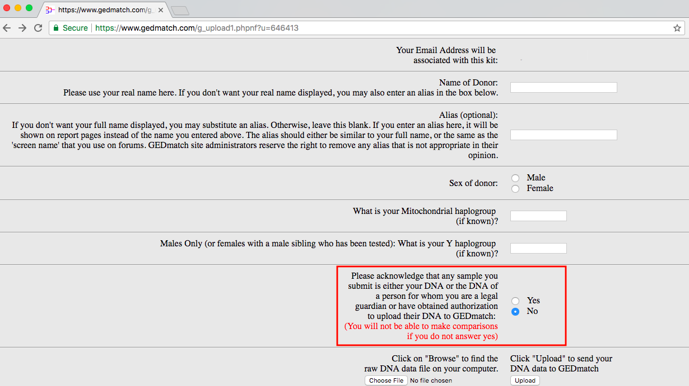

```{r setup, include=FALSE}
knitr::opts_chunk$set(echo = FALSE)
```


#### A Case Study in Forensic Science: Finding the "Golden State Killer" 
<!--
## Links 

- More open-source investigations: https://www.nytimes.com/2018/05/13/opinion/oscar-perez-venezuela-forensic-architecture.html
- GED Match Policy: https://www.gedmatch.com/policy.php
- JJD timeline from Reddit: https://image.ibb.co/eUdxdn/deangelo_timeline7.jpg
- JJD all we know from Reddit: https://www.reddit.com/r/EARONS/comments/8g62pj/joseph_james_deangelo_golden_state_killer/
- WaPo article, "DNA db concern": https://www.washingtonpost.com/national/golden-state-killer-suspect-charged-with-four-more-murders/2018/05/11/64dbe640-5531-11e8-9c91-7dab596e8252_story.html?noredirect=on&utm_term=.741208609ba5 
- 23andme privacy policy: https://www.23andme.com/about/privacy/
- Ancestry DNA privacy policy: https://www.ancestry.com/cs/legal/privacystatement
- Policy for Law Enforcement (Ancenstry DNA): https://www.ancestry.com/cs/legal/lawenforcement 
- Transparency 2015, Ancestry DNA: https://www.ancestry.com/cs/transparency-2015 
- Policy for Law Enforcement 23 and me: https://www.23andme.com/law-enforcement-guide/ 
- Transparency, 23andme: https://www.23andme.com/transparency-report/ 
-->

## What's open source got to do with it? 

As a statistician, data scientist, and R-user, I am a big believer in open source tools and open data. I'm lucky to be working for CSAFE, who strive to increase the use and availability of [open source software and tools](https://forensicstats.org/2017/11/29/open-source-software-applications-forensics-courtroom/) in forensic science.  This past spring, in news [coverage](https://www.scientificamerican.com/article/the-golden-state-killer-case-was-cracked-with-a-genealogy-web-site1/) of the arrest of the Golden State Killer, including [nationwide coverage on NBC](https://www.nbcnews.com/news/us-news/golden-state-killer-suspect-s-capture-sparks-dna-site-privacy-n869661), reporters describe the website police used to find the offender as "open source." Investigators used the online database [GEDmatch.com](https://www.gedmatch.com/) to find relatives of the offender, which then lead to the suspect.  This website, however, does not fit the definition of open source. 

Below, I define open source and explain why it is important to forensic science. I also explain why, if you're considering getting a DNA test from a commercial provider or using a service like GEDmatch.com, you should read the privacy policies of the service you are going to use very carefully. If you are not an informed consumer, you may find [your DNA](https://idahostatejournal.com/news/local/east-idaho-link-to-golden-state-killer-dna-test-helps/article_7f37fb6a-1cd0-5b5a-a627-a7a5bc29f17a.html) involved in a police investigation without your knowledge.

## Who is the Golden State Killer? 

The *Golden State Killer*, also known as the *East Area Rapist*, the *Original Nightstalker*, and the *Visalia Ransacker*, terrorized the state of California for a decade in the 1970s and 1980s. The offender committed over 50 rapes and 12 murders. Investigators were able to connect the many attacks with DNA evidence, but no suspect was ever a DNA match. 

The term "Golden State Killer" was coined by [Michelle McNamara](https://archive.li/20171020222155/http://www.lamag.com/longform/in-the-footsteps-of-a-killer/) in 2013. Her posthumously published book, *I'll Be Gone in the Dark: One Woman's Obsessive Search for the Golden State Killer*, a number one New York Times bestseller, was released in February of this year. Then, on April 25, 2018, the Sacramento County District Attorney [announced](https://youtu.be/V5umyT0JH3s) that the Golden State Killer had been caught. 

## The role of DNA in catching the culprit

In their decades long quest to uncover the identiy of the Golden State Killer, police always had one solid piece of evidence: the killer's DNA. The same DNA found at several crime scenes links rapes, murders, and buglaries across the state of California. The statute of limitations is long expired on the rapes and burglaries, but there is no such limit on murder.  

The search for the killer ended when investigators uploaded the offender's DNA profile to the website [GEDMatch.com](https://www.gedmatch.com). By using a one-to-many database search allowing police to compare the offender's DNA to all others in the database, they discovered a fourth cousin.[^1] Police then used the family tree of the known individual to come up with several suspects. The only suspect who was in California at the time was Joseph James DeAngelo. The police surveilled him, took his DNA from something he discarded, and found it was a match to the DNA of the Golden State Killer. This led to his arrest. 

## Why the methods used may be inappropriate 

There has been [some speculation](http://www.sacbee.com/news/local/crime/article209987599.html) that the DNA evidence may not be admissable, due to a statement on the GEDMatch upload page (see below) regarding permission to share DNA. 



However, the [terms of service and privacy policy](https://www.gedmatch.com/tos.htm) of the company GEDMatch, Inc. clearly states that "users participating in this Site agree that their information will be shared with other users," and "[w]hile the results presented on this site are intended solely for genealogical research, we are unable to guarantee that users will not find other uses." In addition, as of May 20, 2018, they also updated their policy to include "DNA obtained and authorized by law enforcement to either: (1) identify a perpetrator of a violent crime against another individual; or (2) identify remains of a deceased individual" as an authorized DNA upload.

The company GEDMatch, Inc. is a [privately-held, for-profit corporation](http://search.sunbiz.org/Inquiry/CorporationSearch/SearchResultDetail?inquirytype=EntityName&directionType=Initial&searchNameOrder=GEDMATCH%20P110000769900&aggregateId=domp-p11000076990-1c39e17f-bf5a-4120-b7be-047e98fbe4e5&searchTerm=GEDMatch&listNameOrder=GEDMATCH%20P110000769900). Many news outlets (e.g. [The Atlantic](https://www.theatlantic.com/science/archive/2018/04/golden-state-killer-east-area-rapist-dna-genealogy/559070/) and [NBC News](https://www.nbcnews.com/news/us-news/golden-state-killer-suspect-s-capture-sparks-dna-site-privacy-n869661)) have referred to this company as "open-source." "Open-source" is not, however, the correct term for this website. 

Some of GEDmatch.com's features are free, and your DNA data, if you choose to make it public, can be matched with any other public data in the database, but that does *not* make it open source. 

## What is open source software?

The term *open source* (also stylized as *open-source*) was coined in 1998. It has a very *precise* definition. The non-profit organization, [the Open Source Initiative](https://opensource.org/), was established in 1998 to "protect and promote open source software, development and communities, champion software freedom in society through education, collaboration, and infrastructure, steward the [Open Source Definition (OSD)](https://opensource.org/osd), and prevent abuse of the ideals and ethos inherent to the open source movement." 

According to the OSD, for any piece of software to have the label open source, 

> "The program must include [source code](https://en.wikipedia.org/wiki/Source_code), and must allow distribution in source code as well as compiled form. Where some form of a product is not distributed with source code, there must be a well-publicized means of obtaining the source code for no more than a reasonable reproduction cost, preferably downloading via the Internet without charge. The source code must be the preferred form in which a programmer would modify the program. Deliberately obfuscated source code is not allowed."

The [policy](https://www.gedmatch.com/tos.htm) of GEDmatch.com states, "Changes in software and analysis tools may be made from time to time that could change results from those previously provided," with no links to the source code of the software or analysis tools made available. Without easy access to the source code, the software cannot be open source. Thus, GEDMatch.com is not an open source tool. 

A more appropriate description of GEDmatch.com would be *open-source intelligence* (OSINT), a term from the [intelligence](https://www.cia.gov/news-information/featured-story-archive/2010-featured-story-archive/open-source-intelligence.html) community that is completely unrelated to *open-source software*. By leaving out the word "intelligence" from the description of GEDmatch.com, news articles are, intentionally or not, misleading the public.

The investigation of the Golden State Killer's crimes existed well outside the realm of official police territory. There is a [dedicated subreddit](https://www.reddit.com/r/EARONS/) as well as many news articles and the book by McNamara. This sort OSINT use in criminal investigations is becoming [more common](https://www.nytimes.com/2018/05/13/opinion/oscar-perez-venezuela-forensic-architecture.html), and as huge amounts of video and other data are becoming available through social media, investigations get easier. It is important, however, to be conscious of who *owns* this data and the software used create and combine it.[^2] Ultimately, if the software used to distribute and analyze data is not open source, you cannot know how it works or how it is being used.

## Comparing GEDmatch.com policies to other popular DNA companies

After the arrest of Joseph James DeAngelo, there has been a lot of [concern](https://www.washingtonpost.com/national/golden-state-killer-suspect-charged-with-four-more-murders/2018/05/11/64dbe640-5531-11e8-9c91-7dab596e8252_story.html?noredirect=on&utm_term=.741208609ba5) about the privacy of DNA data. Very few people were familiar with GEDmatch.com before this case, and so more well-known companies, like [Ancestry.com](https://www.ancestry.com/) and [23andMe](https://www.23andme.com) are taking the [brunt of the criticism](https://www.cnn.com/2018/04/27/health/golden-state-killer-genetic-privacy/index.html) surrounding DNA and privacy. Their privacy policies, however, are much more strict than those of GEDMatch.com. 
<!--It is worth noting the privacy policies and transparency of both Ancestry.com and 23andMe, and comparing them to similar policies of GEDMatch.--> 

The privacy policy for [Ancestry.com](https://www.ancestry.com/cs/legal/privacystatement) states explicitly that "we will not share your Genetic Information with insurance companies, employers, or third-party marketers without your express consent." In addition, they provide a [transparency report](https://www.ancestry.com/cs/transparency-2015) regarding all law enforcement requests made and a [guideline](https://www.ancestry.com/cs/legal/lawenforcement) for law enforcement officials. These policies are clear: specific user information must be known, and overly broad law enforcment requests, such as a one-to-many database search, will not be accomodated. 

The site 23andMe has a similar [privacy policy](https://www.23andme.com/about/privacy/) and nearly identical [transparency report](https://www.23andme.com/transparency-report/) and [law enforcement guide](https://www.23andme.com/law-enforcement-guide/). The policies mean that these sites do not allow law enforcement to do broad DNA database searches, like they did on GEDMatch.com. This was a point of frustration for the police and McNamara, and on page 308-9 of *I'll Be Gone in the Dark*, you'll find the sentence, "Unfortunately, neither company [23andMe, Ancestry] will work with law enforcement, citing privacy issues and their terms of service." 

The policy of GEDMatch.com, however, contains the following text under the "Security" heading: 

> "We take measures to ensure that only registered users have access to your results, but those measures have not been and never will be perfect. Direct access to your data is available to GEDmatch personnel, including volunteers, on a need to know basis."

In addition, they clearly state the authorized uses of their database as of May 20, 2018: 

> "When you upload Raw Data to GEDmatch, you agree that the Raw Data is one of the following:

> - Your DNA;
> - DNA of a person for whom you are a legal guardian;
> - DNA of a person who has granted you specific authorization to upload their DNA to GEDmatch;
> - DNA of a person known by you to be deceased;
> - DNA obtained and authorized by law enforcement to either: (1) identify a perpetrator of a violent crime against another individual; or (2) identify remains of a deceased individual;
> - An artificial DNA kit (if and only if: (1) it is intended for research purposes; and (2) it is not used to identify anyone in the GEDmatch database); or
> - DNA obtained from an artifact (if and only if: (1) you have a reasonable belief that the Raw Data is DNA from a previous owner or user of the artifact rather than from a living individual; and (2) that previous owner or user of the artifact is known to you to be deceased)."

Thus, by uploading your DNA data to GEDmatch.com, you are consenting for your DNA to potentially be used in a police investigation. Please read privacy policies of DNA testing companies *very carefully*, and to be careful when considering sharing your DNA information. You should be especially cautious when you cannot know how the software works because it is not open source.

## What is CSAFE doing? 

At CSAFE, we value and contribute to open source software, as well as open access to data. Our researchers have written software packages such as [`bulletr`](https://cran.r-project.org/web/packages/bulletr/index.html) for the open source statistical software [`R`](https://www.r-project.org/). They also share their code on [Github.com](https://github.com/csafe-isu) and they have contributed data to existing public databases through [NIST](https://tsapps.nist.gov/NRBTD/Studies/Search). Researchers are also [developing databases](https://baileykong.com/wp-content/uploads/2018/06/CSAFE_All-Hands_2018_poster.pdf) that, once complete, will be made public. CSAFE also recognizes the [legal advantage](https://forensicstats.org/2017/11/29/open-source-software-applications-forensics-courtroom/) of open source software. We advocate for open source software because increasing its use in forensic science will only improve the field: scientists and researchers will have better access and greater understanding of the methodology, problems, and needs of the forensic science community. 

## My own DNA test experience

After researching for this post (several months ago), I decided to go with 23andMe when I wanted a DNA ancestry test. The various genetic traits they test for range from "Can you smell the funny smell asparagus leaves in your pee after you eat it?" to "Do you have this gene associated with higher cancer rates?", so tread lightly. I did really like the ancestry composition (I'm 99.4% European) and I had fun looking at where they got it wrong (like that I have major dimples, but they said I probably didn't). Ultimately, I think they are doing a good service for scientific research and medical advancements, so I opted in to just about everything research related and have taken loads of surveys for them. I will, however, NOT be uploading my DNA results to GEDmatch.com because I don't want to inadvertently be involved in a major police investigation.


[^1]: Fourth cousins share one set of great-great-great-grandparents. An explanation of this relationship with respect to the Golden State Killer can be found [here](https://www.reddit.com/r/EARONS/comments/8fwju9/visual_representation_of_how_far_up_jjds_family/).
[^2]: Hint: it's not you. 


