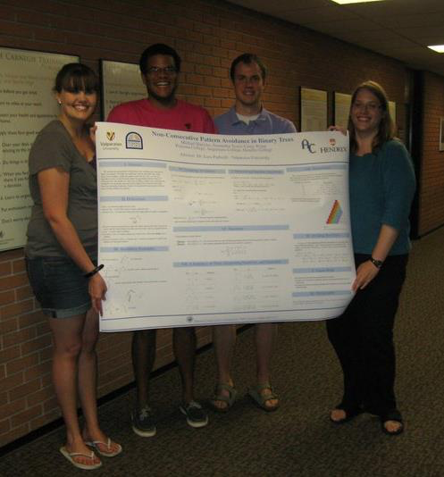
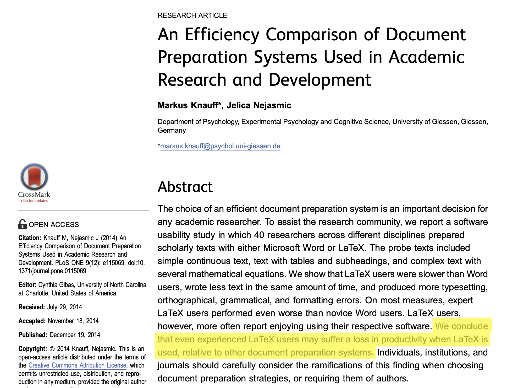
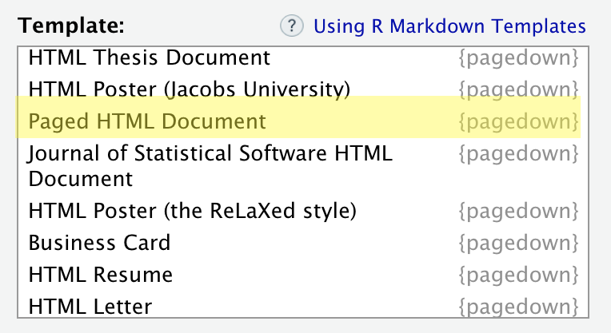
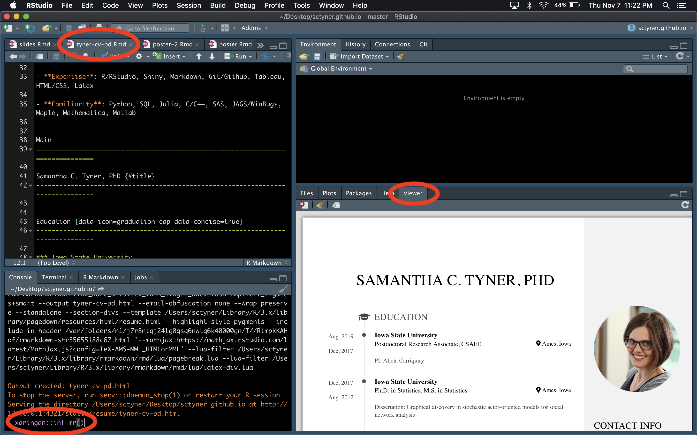

<link rel="stylesheet" href="https://use.fontawesome.com/releases/v5.6.0/css/all.css" integrity="sha384-aOkxzJ5uQz7WBObEZcHvV5JvRW3TUc2rNPA7pe3AwnsUohiw1Vj2Rgx2KSOkF5+h" crossorigin="anonymous">

<style>
ul {list-style-image: url("scroll.png");}
</style>


```{r setup, include=FALSE}
options(htmltools.dir.version = FALSE)
knitr::opts_chunk$set(fig.align = 'center')
```

```{r xaringan-themer, include = FALSE}
library(xaringanthemer)
mono_light(
  base_color = "#AB1222",
  white_color = "white", 
  black_color = "black", 
  link_color = darken_color("#E3E3E3", .4),
  header_font_google = google_font("Lato"),
  text_font_google   = google_font("Lato"),
  code_font_google   = google_font("Droid Mono"), 
  text_font_size = "28px"
)
```


# Disclaimers

This is personal work, independent of my current or past employers. 

All opinions are my own. 

`pagedown` is the work of [Yihui Xie](https://yihui.name/), [Romain Lesur](https://github.com/RLesur), and [Brent Thorne](https://github.com/brentthorne). 

I chose the title of this talk, "In HTML We Trust" based on a post on [Yihui's blog](https://yihui.name/en/2018/07/in-html-i-trust/). 

If you want to learn from the source, watch Yihui's rstudio::conf [talk](https://resources.rstudio.com/rstudio-conf-2019/pagedown-creating-beautiful-pdfs-with-r-markdown-and-css) from January 2019.

???
Think of me as a disciple; not a creator. 

---
# Assumptions


???
I have made some assumptions about you in order to give this talk. They are not going to be accurate 100% percent of the time, so I apologize in advance. I've tried to link to resources wherever possible. So, here are my assumptions about you: (next) 
First, I assume you are at least aware of LaTeX and know what it's used for. (next)
Then, I assume you're familiar with Rmarkdown and its various pieces: YAML, Markdown, and R code chunks. (next)
Finally, I assume you will appreciate some of my pop culture references & GIFS. They are not for everyone but hopefully you'll enjoy at least one of them. 
So now that I got all the housekeeping out of the way, lets get started. 

--

- [LaTeX](https://en.wikibooks.org/wiki/LaTeX) 

--

- [RMarkdown](https://bookdown.org/yihui/rmarkdown/) = YAML + Markdown + R code chunks 

--

- [Pop culture](https://www.facebook.com/netflixus/videos/1218579968310748/?v=1218579968310748) 

---
class: inverse, center, middle
# Reflections on LaTeX 

???
Before I talk about pagedown, I have to talk about LaTeX. Why, in a 20 minute talk about pagedown would I spend time on LaTex?? Well, we need to for the larger context, and for my context.  I need you to know that I used LaTeX for the vast majority of my work throughout graduate school. I was a LaTeX devotee. Notes, homeworks, everything. 

And this is why you can trust me when I say it is just about time to leave LaTeX behind. I am going to try to convince you that you really don't need it all that much anymore.  


---
# The Beginning 

```{r, fig.align="center", out.width="55%", echo=FALSE, fig.cap="2011 at Valparaiso University"}

```

???
This is me (with the bangs), between my junior and senior years of college, with my friends Mike & Casey, and our REU advisor, Lara Pudwell. That poster we're holding was the culmination of our entire summer's worth of work.

We spent hours perfecting it in LaTeX. An hspace here, a vspace there until it was just right. 

I totally fell in love with LaTeX that summer. 

And After that summer, I spent my whole senior year and most of graduate school writing all of my homework assignments in LaTeX. I even had a favorite command... (next slide) 

---
class: center, middle

# `\phantom{}`

???
Phantom. Has anyone else used this Crazy thing? 
The idea with phantom is that you can add any amount of whitespace exactly when and where you need it, without concern for the template you're using or any other fiddly LaTeX rules. Sometimes it looked like this (next)
Or, even more often, (next)
I used phantom all the time, until I got something like this: (next)

--

# `\phantom{AA}`


--

# `\phantom{AAAAAAAA}`


---
class: center, middle

```{r echo=FALSE}

```

???
In the poster I showed at the beginning, we used it 16 times, which I feel is actually pretty restrained. Dealing with LaTeX templates is really more of an annoyance than anything else. But LaTeX does have some problems.

---
# The Problems with LaTeX

- [Not built for the web](https://authorea.com/users/3/articles/4675/_show_article) 

```{r echo = FALSE, out.width='80%', fig.cap="Silly LaTeX, the web is for HTML."}
knitr::include_graphics("https://media.tenor.com/images/b8cc3152a343ac5ea5723a8edb0c5f45/tenor.gif")
```

???
Communication has almost fully shifted from printed methods to web-based, electronic methods. LaTeX is for printing. HTML is for the Web. 

---
# The Problems with LaTeX 

- Getting tables out of PDFs 

```{r echo = FALSE, out.width='90%', fig.cap="Handle with care."}
knitr::include_graphics("https://media.giphy.com/media/1cURaXNmcwOTC/giphy.gif")
```

???
Supposedly there are tools that do this. I've never found a single one that does it well. 
On the other hand, How do you to get data table out of HTML? Look for the table element. Done. 

---
# The Problems with LaTeX 

- [It's inefficient](https://journals.plos.org/plosone/article?id=10.1371/journal.pone.0125830)

```{r echo=FALSE, out.width = '85%'}

```

???
So, here's a paper that found that typing a document in Latex is actually slower than typing it in Word. The highlighted portion says, "We conclude that even experienced LaTeX users may suffer a loss in productivity when LaTeX is used, relative to other document preparation systems."  There are valid criticisms of this article but the point is compelling. I still switch back and forth occasionally between writing things up in LaTeX and Markdown, and Markdown does feel faster to me. (I'm still fairly anti-MS Word, but I work in the government now so I use it everyday.) 
But if that doesn't convince you LaTeX is inefficient, consider this: as of last month, the Windows installation of MikTex was over 200GB, and nearly 50GB for Mac. It's absolutely space-inefficient.
That being said, LaTeX has obvious benefits. 

---
# The Benefits of LaTeX

- Beautiful typesetting
- Ubiquitous in journals
- Feeling of [belonging](https://www.peterkrautzberger.org/0172/) 

???
LaTeX was made for typesetting books. It is excellent at producing beautiful printed books.


Everyone in more quantitative fields in academia uses LaTeX. Many journals have custom LaTeX templates. Latex can seem like it's everywhere in certain fields and it's not worth the trouble to avoid it. 

When you learn LaTeX, You can feel like you've entered into this secret club, where only you and the other members can decipher the hieroglyphics on your screens. Or... maybe it's more like a cult. (next) But we're only human and belonging feels good. 


--

```{r echo=FALSE, out.width = '45%', fig.cap="SSDGM"}
knitr::include_graphics("https://78.media.tumblr.com/3e714fc96f68533e603ecc15851c0b98/tumblr_onhsfhLe3Y1qd982po1_500.png")
```


---
class: middle, inverse, center
# pagedown: LaTeX for the 21st Century? 

???
Ok, now that we've covered the cons and pros of LaTeX: let's finally switch to talking about pagedown. First, let's talk about why. 

---
# Why? 


> "Can we print a book with HTML and CSS?" 

???
So what motivates pagedown?? Hopefully you were paying attention to the first half of this talk. If not, here's the main reason: the web has taken over printing. It's faster to share, it's more eco-friendly. But, printing will never go away. So, how do we move these two arenas (the web and printed words) together so that they speak one language? 
Now, most people would be pretty intimidated by this research, but not the pagedown authors. 


--

Yihui, Romain, & Brent: 

```{r echo = FALSE, out.width="55%", fig.cap='"Yes we can!"'}
knitr::include_graphics("https://vignette.wikia.nocookie.net/btb/images/6/68/BobSavestheHedgehogs105.png/revision/latest?cb=20190806061908")
# https://media.giphy.com/media/u4dDpVKUNxsLC/giphy.gif
```  


---
# Why? 

- Ctrl + P from the web is ugly 

```{r echo = FALSE, out.width = "70%", fig.cap='"U-G-L-Y"'}
knitr::include_graphics("https://media.giphy.com/media/h3uDaJQKKXerveAcow/giphy.gif")
```

???
Another motivation for pagedown is that Printing from the web usually results in something pretty ugly. The printed version looks nothing like the web version, and it prints off all sorts of unnecessary stuff that you just don't need in print. Pagedown is a way to make printing from the web prettier.

---
# How? 

- [paged.js](https://www.pagedmedia.org/paged-js/) + CSS


```{r echo = FALSE, fig.cap = "www.pagedmedia.org/paged-js/", out.width="45%"}
knitr::include_graphics("https://www.pagedmedia.org/wp-content/uploads/2018/11/9d1dd9cee0c92ee1d7865d7a0ba428d7.svg")
```

???
paged.js is an open-source library to paginate content in the browser. 
CSS (Cascading style sheets) dictate the look of HTML. 
In an HTML "page" the area and the margins are broken up into different CSS classes.

---
# Installing pagedown

```{r eval = FALSE}
# from cran:
install.packages("pagedown")
# from github: 
remotes::install_github("rstudio/pagedown")
```

???
To you can install pagedown from CRAN or from Rstudio's github repository.

---
# Using pagedown

In [RStudio](https://rstudio.com/): 

- File `r emo::ji("arrow_right")` New File
- R Markdown `r emo::ji("arrow_right")` From Template 

```{r echo = FALSE, out.width="85%"}

```

???
The easiest way to create a pagedown document after installation is to use the built-in templates from within RStudio. 

---
# Using pagedown

- YAML    
    
    ---
    title: "Paper title"
    author: "Jane Doe and John Smith"
    date: "`r Sys.Date()`"
    output:
    *  pagedown::html_paged:
    *    toc: true
    *    self_contained: false
    ---
    
- Then Markdown & code chunks     
   
???
Like all things R markdown, a pagedown document starts with a YAML header and contains markdown and code chunks. It's that simple. There are ways to make it more complicated though.(next)
    

---
# Using pagedown 

- Lots of templates
- [YAML](https://bookdown.org/yihui/rmarkdown/basics.html#) Header
- [Markdown](https://bookdown.org/yihui/rmarkdown/markdown-syntax.html) body 
- [R code chunks](https://bookdown.org/yihui/rmarkdown/basics.html)
- Advanced: customization with [CSS](https://www.w3schools.com/css/default.asp) 
- See [pagedown.rbind.io](https://pagedown.rbind.io/) for help. 

???
In my experience, the templates are very friendly. Just edit the YAML and the Lorem Ipsum and you're good to go. The tricky part comes when you want to do any customization with CSS. 

---
# Rendering pagedown 

`r emo::ji("warning")`Needs a web server to view`r emo::ji("warning")`: 

- In RStudio: run `xaringan::inf_mr()` then open in browser. 

```{r echo=FALSE, out.width="90%"}

```

???
To render pagedown, you need an active web server. Can't just compile the HTML and open it in the browser to preview like you do with other .Rmd files. 

---
# pagedown examples 

My CV: 

```{r echo = FALSE, out.width="110%"}
knitr::include_url("https://sctyner.github.io/static/resume/tyner-cv-pd.html")
```

???
Here is my web CV. I like it so much more than my other CV. Plus I really like the icons and the layout is really beautiful. All I did was pick icons and type up my experience. The template does the rest. 

---
# pagedown examples

An e-business card

```{r echo = FALSE, out.width="40%"}
knitr::include_url("matt-bc.html", height = "350px")
```

???
Here's a business card I made for my partner. 

---
# Disadvantages of pagedown 

- Immature 

```{r echo=FALSE, out.width="80%", fig.cap="🎶Baby shark..🎶"}
knitr::include_graphics("https://i2.wp.com/mlb.mlb.com/images/2/3/4/311002234/100119_gif_zim_reaction_1st.gif")
```

???
It's brand new, it's not well developed yet, and LaTeX has about 40 years on it.

---
# Disadvantages of pagedown

- Very strict

```{r echo = FALSE, out.width="70%", fig.cap="The Trunchbull"}
knitr::include_graphics("http://giphygifs.s3.amazonaws.com/media/12CeCui5jauD3q/giphy.gif")
```

???
It's very dependent on precise CSS classes and it can be fiddly with the zoom level on the browser. If you try to zoom in, stuff may move around, and customization is very tricky. Just imagine your content as a little girl with pigtails and CSS as Miss Trunchbull. I tried remaking the poster from the beginning, but it was pretty tricky and I just didn't have time to do it. Now maybe that was because I was trying to fit a square peg in a round hole, trying to make LaTeX into pagedown. Or maybe I just ran out of time. But the templates are very strict, so you have to design the poster with the template in mind. 

---
# Disadvantages of pagedown

- [Change is hard](https://www.howtogeek.com/189270/alternative-keyboard-layouts-explained-dvorak-colemak-and-whether-you-should-care/)

```{r echo=FALSE, out.width="75%", fig.cap="Case in point"}
knitr::include_graphics("https://allenpike.com/images/2014/confusing.gif")
```

???
People love LaTeX. Researchers have been using it for years and it does the job. People don't like having to learn new tools. Consider the smart phone English keyboard. There is absolutely no reason it needs to be laid out this way, but this is how people know keyboards. 

---
# Conclusion 

LaTeX is

- beautiful
- bulky
- inefficient

pagedown is

- forward-thinking
- flawed 
- fun 

---
class: center, middle
# Thank you 


<i class="fas fa-globe"></i> sctyner.github.io <i class="fas fa-grip-lines-vertical"></i>  <i class="far fa-envelope"></i> sctyner90@gmail.com

<i class="fab fa-github"></i> github.com/sctyner <i class="fas fa-grip-lines-vertical"></i> <i class="fab fa-twitter"></i> @sctyner

<i class="fab fa-linkedin"></i> linkedin.com/in/sctyner

Slides available at [bit.ly/TynerDCR19](http://bit.ly/TynerDCR19)

