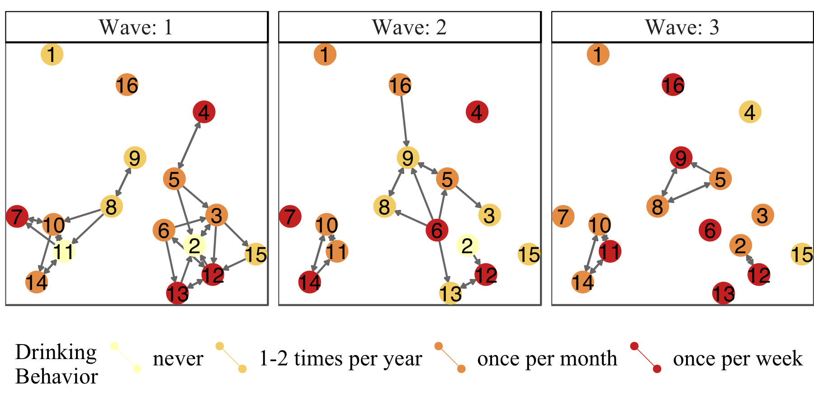
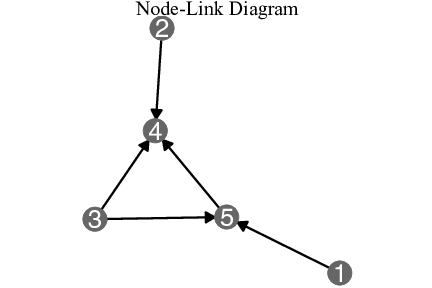
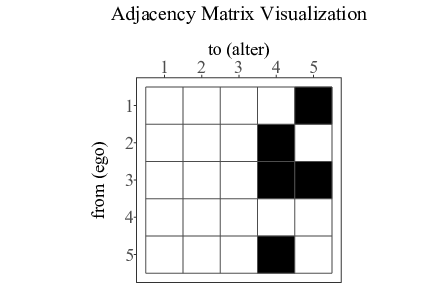
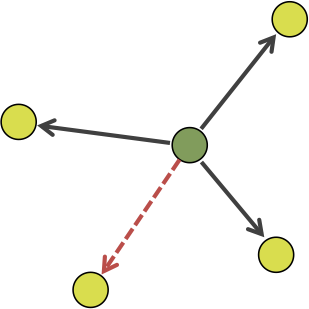
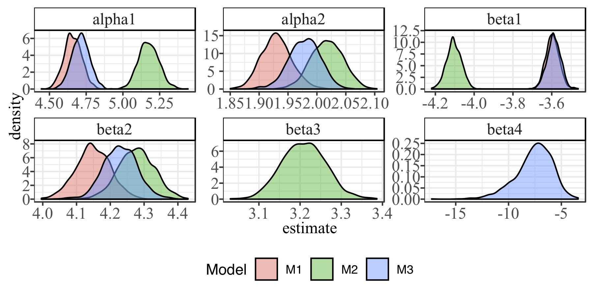
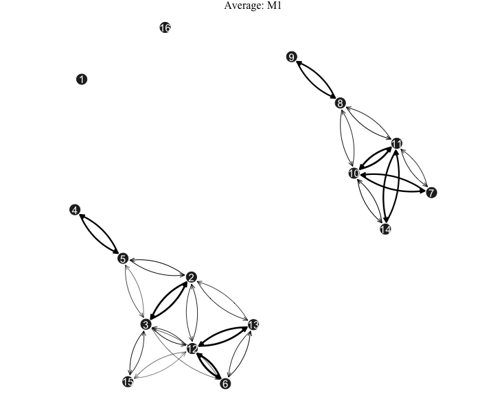
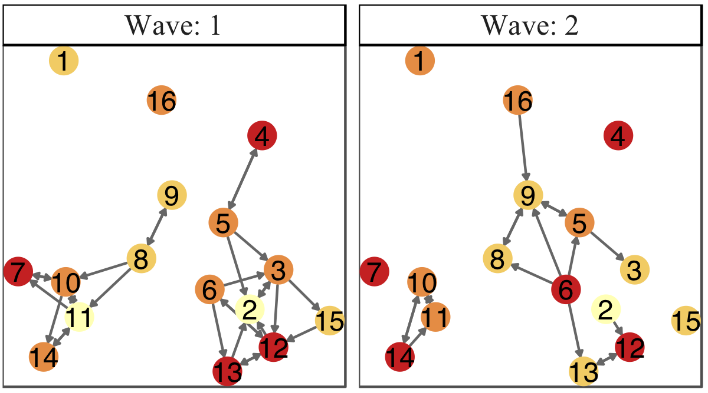
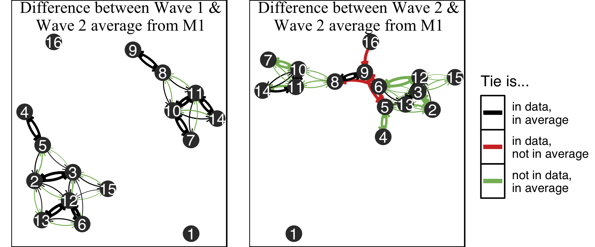

```{r setup, include=FALSE}
knitr::opts_chunk$set(echo = FALSE, warning=FALSE, message=FALSE)
```

```{r pkgsdata}
library(tidyverse)
library(geomnet)
densex <- read_csv("dat/highdensityex.csv")
recipex <- read_csv("dat/highrecipex.csv")
```

# Outline

### Part I

- Social networks 
--

- Network visualizations
--

- Stochastic Actor-Oriented Model: a model for dynamic social networks


### Part II

- Model visualization
    * Put the model in the data space
    * Visualize collections of models 
    * Explore algorithms, not just main result

---
class: inverse, center, middle
# Part I


    
---
class: inverse, center, middle 
# Social networks 

---
class: plotslide, center
# Small friendship network 

Mitchell & Amos (1997) - *Teenage friends and lifestyle study* 



### Key data properties: 

- Directed networks - teenagers say who their friends are 
--

- Have multiple observations over time 
--

- Many factors can influence formation of ties, e.g. drinking behavior 

---
class: inverse, center, middle 
# Network visualizations 

---
class: plotslide, center

  

---
class: inverse, center, middle 
# Stochastic Actor-Oriented Model (SAOM)

---
class: definition
# What is a SAOM?

### A statistical model applied to *dynamic* social networks which takes both the *network structure* and the *node-level covariates* into account

### First developed by Snijders (1996)

---

# How does it do that? 

- Assume *conditional independence* of actors / nodes 
- Model the unobserved tie changes one-at-a-time in a *continuous time Markov Chain*, which is broken into 2 parts: 
    * Estimate the *rate* at which actors make changes in the network in between observations: $\alpha_m$
    * Maximize an actor's *objective function* when it makes a change: $f_{i}(x, \boldsymbol{\beta}, \mathbf{Z})$

---
class: math
# Rate function

- In a period $m$ (between observations) the waiting time until one actor's next opportunity for change follows an $Exp$ distribution with mean $\alpha_m^{-1}$
- In period $m$, the waiting time until *any* actor gets to change follows an $Exp$ distribution with mean $(n\alpha_m)^{-1}$

---
class: math
# Objective function 

Actor $i$ gets the opportunity to change, and attempts to maximize its *objective function*:
$$f_{i}(x, \boldsymbol{\beta}, \mathbf{Z}) = \sum_{k=1}^K \beta_{k} s_{ik}(x,\mathbf{Z})$$

- If a change in a tie from $x_{ij}$ to $x'_{ij} = 1- x_{ij}$ increases the value of $f_{i}(x, \boldsymbol{\beta}, \mathbf{Z})$, then $i$ wants to make that change

---
class: plotslide
# Parameters 

At minimum 2 parameters in the objective function (Ripley et al. 2017): 

| Name | Parameter | Statistic | Picture |
|:-----|:---------:|:---------:|:--------:|
| density | $\beta_1$ | $s_{i1}(x) = \sum_j x_{ij}$|  |
| reciprocity | $\beta_2$ | $s_{i2}(x) = \sum_j x_{ij}x_{ji}$|  |
<!--| covariate-alter | $\beta_3$ | $\sum_j x_{ij}z_j$ | |
| covariate-ego  | $\beta_5$ | $z_i\sum_j x_{ij}$ | |-->

```{r densrecipexrepeat, fig.height=5, fig.show='hold', out.width = '49%'}
ggplot(data = densex %>% filter(ord == 1)) + 
  geom_net(aes(from_id = from, to_id = to), 
                 arrow = arrow(type = 'open', length = unit(2, "points") ), 
                 linewidth = .25, singletons = T, fiteach = T, directed = T, 
                 color = 'black', arrowgap = .015, arrowsize = .3, size =1) + 
        theme_net() +  
  labs(title = expression(paste("High value of " , beta[1]))) + 
  theme(plot.title = element_text(size = 20))

ggplot(data = densex %>% filter(ord == 6)) + 
  geom_net(aes(from_id = from, to_id = to), 
                 arrow = arrow(type = 'open', length = unit(2, "points") ), 
                 linewidth = .25, singletons = T, fiteach = T, directed = T, 
                 color = 'black', arrowgap = .015, arrowsize = .3, size =1) + 
        theme_net() +  
  labs(title = expression(paste("Low value of " , beta[1]))) + 
  theme(plot.title = element_text(size = 20))
```

---
class: plotslide
# More Parameters 

- $s_{i3}$ ( $\beta_3$ ): jumping transitive triplet (node covariate parameter)
- $s_{i4}$ ( $\beta_4$ ): number of doubly acheived distances $\geq 2$  (structure parameter like $\beta_1, \beta_2$ )
- If fitted parameter is high, dotted lines are "encouraged" 

```{r jtt, echo=FALSE, message = FALSE, warning = FALSE, fig.align='center', out.width = "75%"}
jTTe <- data.frame(from = c('i', 'i', 'h'), to = c('h', 'j', 'j'))
jTTn <- data.frame(id = letters[8:10], group = c(1,1,2))

jTT <- merge(jTTe, jTTn, by.x = 'from', by.y = "id", all = T)

set.seed(12345)
jttplot <- ggplot(data = jTT, aes(from_id = from, to_id = to)) +
  geom_net(aes(shape = as.factor(group)), directed = T, labelon = T,
           labelcolour='white',vjust = 0.5, hjust =0.5, arrowgap = .15,
           size=10, fontsize = 5, ecolour="black",
           linetype = c("solid", "solid","dotted", "solid")) +
  expand_limits(x=c(-0.1,1.1), y=c(-0.1,1.1)) +
  theme_void() +
  theme(legend.position = "none", aspect.ratio = 1, plot.title = element_text(size = 15)) + 
  labs(title = expression(paste(s[i3], "(x,z)", "=",Sigma[j != h], x[ij], x[ih], x[hj] %.% 
                                I, "(", z[i], "=", z[h]!= z[j], ")")
                          )
       )
dade <- data.frame(from = c('i', 'i', 'h', 'k', 'i'), to = c('h', 'k', 'j', 'j','j'))
dadn <- data.frame(id = letters[8:11], group = c(1,1,1,1))

dad <- merge(dade, dadn, by.x = 'from', by.y = "id", all = T)

set.seed(12345)
dadplot <- ggplot(data = dad, aes(from_id = from, to_id = to)) +
  geom_net(directed = T, labelon = T, ecolour="black",
           linetype = c("solid", "solid", "dotted", "solid","solid" ,"solid"),
           labelcolour='white',vjust = 0.5, hjust =0.5, arrowgap = .15, size=10, fontsize = 5) +
  expand_limits(x=c(-0.1,1.1), y=c(-0.1,1.1)) +
  theme_void() + 
  theme(legend.position = "none",  aspect.ratio = 1, plot.title = element_text(size = 15)) + 
  labs(title = expression(paste(s[i4], "(x)", "=", "|{j:", x[ij],"=0, ", Sigma[h], x[ih], x[hj] >= 2, "}|" )
                          )
       )
gridExtra::grid.arrange(jttplot, dadplot, nrow = 1)
```

---

# Fitting & Simulation

- Done with the R package RSiena  (Ripley et al 2017)
- Uses a *continuous time Markov chain* (CTMC) to approximate the creation and dissolution of ties one-at-a-time between network observations 
- Relies on the *edge probability*, $p_{ij}$: 
$$p_{ij} = \frac{\exp\{f_{i}(x(i \leadsto j), \boldsymbol{\beta}, \mathbf{Z})\}}{\sum_{h=1}^n \exp\{f_{i}(x(i \leadsto h), \boldsymbol{\beta}, \mathbf{Z})\}}$$
where $x(i \leadsto j) \approx x$ with tie $i\to j$ equal to $x'_{ij}$

---
class: inverse, center, middle
# Part II


---
class: definition 
# Model Visualization for SAOMs

**Model visualization** summarizes the model with graphical, as opposed to numerical, summaries to answer questions of interest

Three main approaches (Wickham et al 2015): 

- View collections of models
    * fit SAOM to data many times 
- View the model in the data-space
    * network "average"
- Exploring algorithms
    * animation of CTMC 

---

# View collections of models 



- fitted models 1,000 times 
- due to simulation, values will be different 
- what do we see? 

---

# View the model in the data space

### *What is an "average" network from a model?* 

### Idea: 

- simulate 1,000 networks from a fitted model
--

- count up the number times an edge occurs
--

- put that edge in the network if it shows up at least 5% of the time
--

- weight the edges by the proportion of occurrences in the 1,000 simulations  

---
class: plotslide
# Average Network: what is the average wave 2 simulated from a very simple model? 



---
class: plotslide
# How does the average compare to the data? 


 



---

# Exploring algorithms 

### *What's going on "under the hood"?*

### Idea: 

- Observe the simulation steps that are used in model fitting
- Animate the CTMC that is underlying 

---
class: plotslide
# Video 1: Node-link diagram (geomnet, tweenr, gganimate)

<iframe src="https://player.vimeo.com/video/240089108" width="600" height="600" frameborder="0" webkitallowfullscreen mozallowfullscreen allowfullscreen></iframe>
<p><a href="https://vimeo.com/240089108">SAOM Microstep Node-Link Animation</a> from <a href="https://vimeo.com/sctyner">Sam Tyner</a> on <a href="https://vimeo.com">Vimeo</a>.</p>

---
class: plotslide
# Video 2: Serialized adjacency matrix (ggplot2, gganimate)

<iframe src="https://player.vimeo.com/video/240092677" width="600" height="600" frameborder="0" webkitallowfullscreen mozallowfullscreen allowfullscreen></iframe>
<p><a href="https://vimeo.com/240092677">SAOM Microstep Adjacency Matrix Animation</a> from <a href="https://vimeo.com/sctyner">Sam Tyner</a> on <a href="https://vimeo.com">Vimeo</a>.</p>

---

# Conclusion

- Model visualization helps us understand the complicated SAO models better
- Forces us to look at them in new ways 
- Shows us phenomenon we may not have seen otherwise 
 

---

# References 

Michell, L. and Amos, A. (1997), "Girls, pecking order and smoking," Social Science & Medicine, 44, 1861-1869.

Ripley, R. M., Snijders, T. A., Boda, Z., Vrs, A., and Preciado, P. (2017), Manual for RSiena, University of Oxford: Department of Statistics; Nuffield College; University of Groningen: Department of Sociology, https://www.stats.ox.ac.uk/~snijders/ siena/RSiena_Manual.pdf.

Snijders, T. A. B. (1996), "Stochastic actor-oriented models for network change," Journal of Mathematical Sociology, 21, 149–172.

Wickham, H., Cook, D., and Hofmann, H. (2015), “Visualizing statistical models: Re- moving the blindfold,” Statistical Analysis and Data Mining: The ASA Data Science Journal, 8, 203–225.

---

# R & R Packages 

Pedersen, T.L. (2016). tweenr: Interpolate Data for Smooth Animations. R package version
  0.1.5. https://CRAN.R-project.org/package=tweenr

R Core Team (2018). R: A language and environment for statistical computing. R Foundation for
  Statistical Computing, Vienna, Austria. URL https://www.R-project.org/.

Ripley, R. M., Snijders, T. A., Boda, Z., Vrs, A., and Preciado, P. (2017), Manual for RSiena, University of Oxford: Department of Statistics; Nuffield College; University of Groningen: Department of Sociology, https://www.stats.ox.ac.uk/~snijders/ siena/RSiena_Manual.pdf.

Robinson, D. (2016). gganimate: Create easy animations with ggplot2. R package version 0.1.0.9000.
  http://github.com/dgrtwo/gganimate (now https://github.com/thomasp85/gganimate)
  
Tyner, S. and Hofmann, H. (2016). geomnet: Network Visualization in the 'ggplot2'
  Framework. R package version 0.2.0. https://CRAN.R-project.org/package=geomnet

Wickham, H. (2017). tidyverse: Easily Install and Load the 'Tidyverse'. R package version
  1.2.1. https://CRAN.R-project.org/package=tidyverse
  
---
class: center, middle

# Thanks! 

<link rel="stylesheet" href="https://use.fontawesome.com/releases/v5.2.0/css/all.css" integrity="sha384-hWVjflwFxL6sNzntih27bfxkr27PmbbK/iSvJ+a4+0owXq79v+lsFkW54bOGbiDQ" crossorigin="anonymous">

## Questions? Reach out!  

### <i class="fas fa-globe"></i> https://sctyner.github.io

### <i class="far fa-envelope"></i> [sctyner@iastate.edu](mailto:sctyner@iastate.edu)

### <i class="fab fa-github"></i> <i class="fab fa-twitter"></i> <i class="fab fa-linkedin"></i> <i class="fab fa-vimeo"></i> [sctyner](https://github.com/sctyner)


