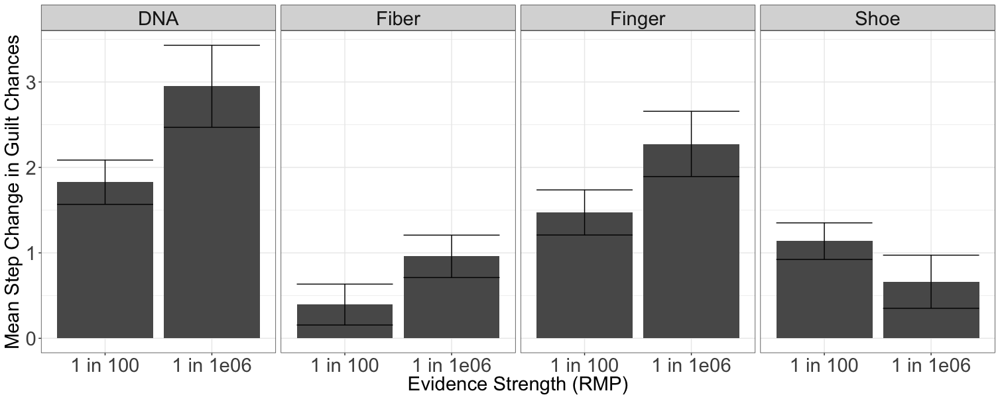
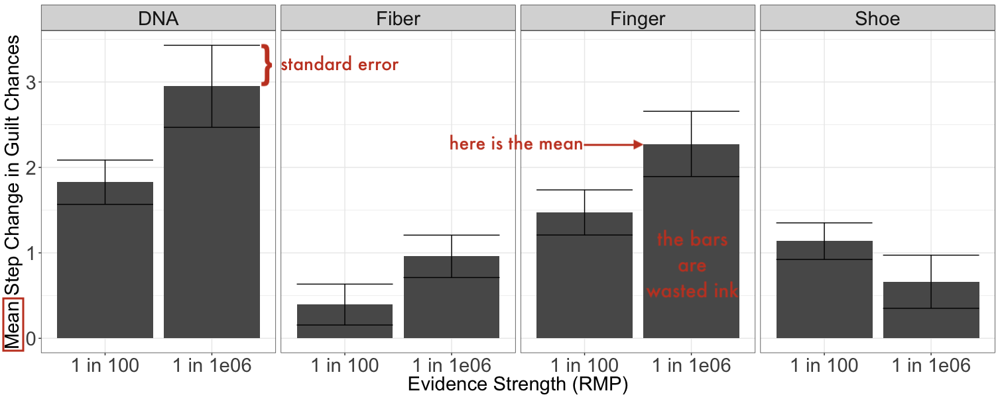
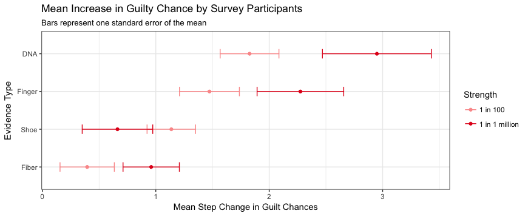
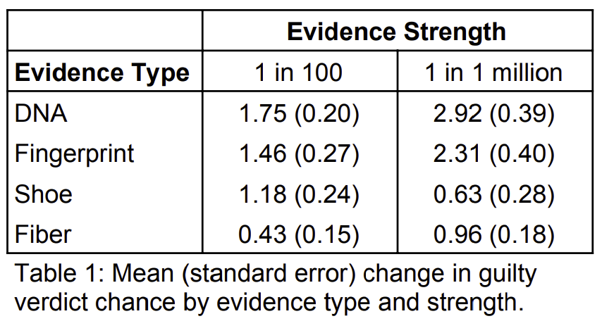
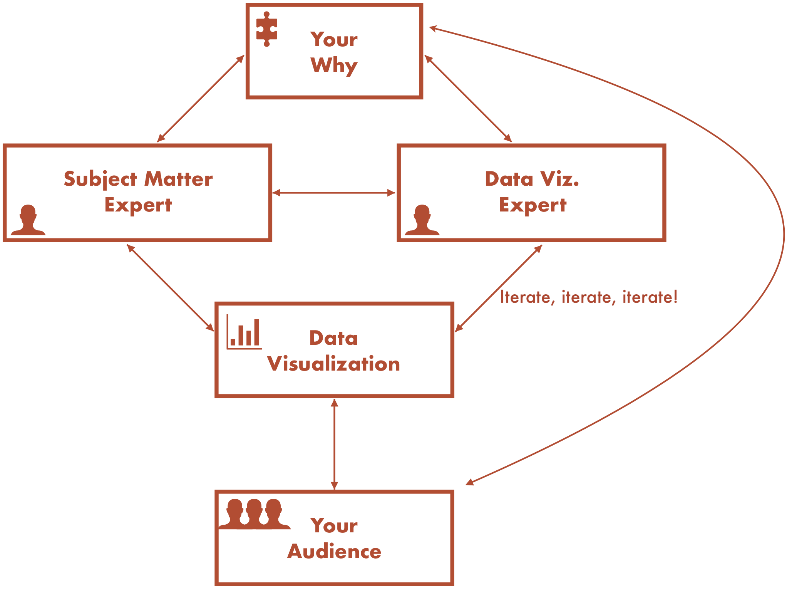

<link rel="stylesheet" href="https://use.fontawesome.com/releases/v5.6.0/css/all.css" integrity="sha384-aOkxzJ5uQz7WBObEZcHvV5JvRW3TUc2rNPA7pe3AwnsUohiw1Vj2Rgx2KSOkF5+h" crossorigin="anonymous">

```{r setup, include=FALSE}
knitr::opts_chunk$set(echo = FALSE)
```

```{r xaringan-themer, include = FALSE}
library(xaringanthemer)
mono_light(
  base_color = "#005DAA",
  background_color =  "#FFFFFF", #"#b9ebfa", # "#7AD1EC", 
  text_font_family = "'Futura'",
  header_font_family = "'Futura'",
  header_h1_font_size = "50px",
  text_color = "#C64329",
  code_inline_color = "#C64329", 
  link_color ="#7AD1EC"
)
```

# *Outline*

- What is my role? 
    + What `r emo::ji("billed_hat")` `r emo::ji("billed_hat")` do I wear?
    + What knowledge do I bring? 
    + What obstacles do I face? 
        * Bad graphics are contagious
        * Lack of subject matter expertise
- What do I think contributes to a successful data visualization project? 
    + Communication
    + Knowledge of audience
    + The right expertise
    

---
class: inverse, center, middle
# *My roles & knowledge*

---
# *Applied statistician with graphics expertise*

- Ph.D. in Statistics from Iowa State University
- At ISU, statistical graphics working group member & organizer
- Dissertation: "Graphical discovery in stochastic actor-oriented models for social network analysis"
- Ph.D. Advisor: Heike Hofmann
- `geomnet` package on [CRAN](https://cran.r-project.org/web/packages/geomnet/index.html)
- Data visualization intern at NORC

---
# *R expertise* 

- Data cleaning & manipulation
- Statistical modeling
- Data tidying for creating graphics 
- Writing R packages
- Using [`rmarkdown`](https://rmarkdown.rstudio.com/) to author reproducible papers, presentations, etc. 
- Data visualization 

---
# *Data visualization in R* 

- [`ggplot2`](https://ggplot2.tidyverse.org/) for vast majority of data visualizations
- [`plotly`](https://plotly-r.com/) for interactivity
- [`gganimate`](https://gganimate.com/) for animation 
- [`cowplot`](https://cran.r-project.org/web/packages/cowplot/vignettes/introduction.html) for combining `ggplot` objects
- [`magick`](https://cran.r-project.org/web/packages/magick/vignettes/intro.html) for image processing 
- [`memer`](https://sctyner.github.io/memer/) for making memes in R

--

```{r, out.width="65%", message = FALSE, fig.align='center', fig.cap='A "pie chart scatterplot" found on StackOverflow.'}
library(memer)
library(magick)
bad <- image_read("img/badgraph.png") %>% image_background("none") %>%  image_rotate(30) %>% image_scale("x300") 
meme_get("IsThisAPigeon") %>% 
  meme_text_pigeon(isthis = "Is this a good data visualization?", humanoid = "StackOverflow", butterfly = "") %>% 
  image_composite(bad, offset = "+400+0")
```

---
class: inverse, center, middle
# *Obstacles*

---
# *Bad graphics are contagious*

--

Not all visualizations published in peer-reviewed journals are good visualizations.

--

Doubly true for visualizations in popular media 

--

- They communicate some information, but they might not communicate it in the best way.
- Ask yourself, "Why did I choose this visualization?" 
    * "Because that's how ____ did it" `r emo::ji("arrow_right")` You *probably* need to pick a different type of visualization. 
    * "Because I saw ____ do it and I thought it looked cool," `r emo::ji("arrow_right")` You *may* need to pick a different type of visualization. 
    * "Because it presents the data clearly, efficiently, and accurately" `r emo::ji("white_check_mark")`

--

- Often, a (boring old) table will suffice.
- Favor substance over style. 

---
# *When it comes to data viz...*

```{r genie, out.width="75%", fig.align='center', fig.cap="From the Saturday morning cartoons I watched as a child."}
knitr::include_graphics("https://pbs.twimg.com/media/DwgqnlHXgAASD0B.jpg")
```


---
# *Example: Dynamite Plot* 

```{r dynamite, fig.show='hold', out.width="95%", fig.align='center', fig.cap="An example of a plot I put on a poster when I forgot to think for myself."}
#knitr::include_graphics(c("dynamiteplot.png","redo-dynamite.png" , "dynamite-table.png"))

# knitr::include_graphics("redo-dynamite.png") 
# knitr::include_graphics("dynamite-table.png")
```

---
# *Example: Dynamite Plot* 

```{r dynamite2, fig.show='hold', out.width="95%", fig.align='center', fig.cap="An example of a plot I put on a poster when I forgot to think for myself."}
#knitr::include_graphics(c("dynamiteplot.png","redo-dynamite.png" , "dynamite-table.png"))

# knitr::include_graphics("redo-dynamite.png") 
# knitr::include_graphics("dynamite-table.png")
```


---
# *Replacement for dynamite plots*

```{r dynamite3, out.width="95%", fig.align='center', fig.cap="The plot I should have put on the poster."}
#knitr::include_graphics(c("dynamiteplot.png","redo-dynamite.png" , "dynamite-table.png"))
# knitr::include_graphics("dynamiteplot.png")
 
# knitr::include_graphics("dynamite-table.png")
```

- Read [Open letter to journal editors: dynamite plots must die](https://simplystatistics.org/2019/02/21/dynamite-plots-must-die/) for more

---
# *The Table Option*

```{r dynamite4, out.width="75%", fig.align='center', fig.cap="I could have also used a table."}
#knitr::include_graphics(c("dynamiteplot.png","redo-dynamite.png" , "dynamite-table.png"))
# knitr::include_graphics("dynamiteplot.png")
#knitr::include_graphics("redo-dynamite.png") 

```

- In this example, it's harder to compare values in the table, so I probably would only use a table to supplement the graphic.    

---
# *Lack of subject matter expertise* 

- Get to play in others' sandboxes 
--

- Not very familiar with the data 
--

- Up against the "curse of knowledge" 

```{r out.width="95%", fig.align='center', fig.cap="Which is the subject matter expert and which is the statistician?"}
knitr::include_graphics("https://miro.medium.com/max/1200/0*qC0M4JWVSUDmotjJ.jpg")
```
   
   
---
class: inverse, center, middle
# *A successful data viz project*

---
# *Communication*

```{r, out.width= "89%", fig.align = "center"}

```


---
# *Knowledge of audience* 

```{r out.width="75%", fig.align='center'}
knitr::include_graphics("http://phdcomics.com/comics/archive/phd062409s.gif")
```

- **Who** is your audience? 
- **Why** is your audience looking at this visualization? 
- **What** do you want your audience to walk away with? 


---
# *Expertise*

.pull-left[
- Subject matter expert
- Data visualization expert
- (Statistician)
- Communications expert* 
- Graphic design expert*
    + *optional depending on audience
    + Image: [xkcd.com/1273](https://xkcd.com/1273/)
]

.pull-right[
```{r out.width="38%", fig.align='center'}
knitr::include_graphics("https://imgs.xkcd.com/comics/tall_infographics.png")
```
]

---
class: center, middle
# Thank you! 

Slides available at [bit.ly/TynerJSM19](http://bit.ly/TynerJSM19)

<i class="fas fa-globe"></i> sctyner.github.io <i class="fas fa-grip-lines-vertical"></i>  <i class="far fa-envelope"></i> sctyner90@gmail.com

<i class="fab fa-github"></i> github.com/sctyner <i class="fas fa-grip-lines-vertical"></i> <i class="fab fa-twitter"></i> @sctyner

<i class="fab fa-linkedin"></i> linkedin.com/in/sctyner
    
<!--
GROUP DISCUSSION

1.     What are the obstacles to a successful data visualization project?

2.     How do we get multiple perspectives when we work alone?

3.     What “hats” (perspectives) are typically missing from most projects?

4.     How do we work with multiple stakeholders who all want different things (e.g. exploding pie charts)? How do we make everyone happy?

5.     Suggestions for questions?
--> 