```{r setup, include=FALSE}
options(htmltools.dir.version = FALSE)
knitr::opts_chunk$set(echo = FALSE, fig.align = "center", 
                      message = FALSE, warning = FALSE, cache =FALSE)
```

```{r xaringan-themer, include = FALSE}
# devtools::install_github("gadenbuie/xaringanthemer")
library(xaringanthemer)
solarized_light(
  inverse_background_color = "#DD5F59", # DD5974 # DD5995
  background_color = "#fafbfc",
  header_color = "#DD5F59",
  text_bold_color = "#d33682",
  header_font_google = google_font("Hind"),
  text_font_google   = google_font("Montserrat", "400", "400i"),
  code_font_google   = google_font("Inconsolata")
)
```

```{r pkgs}
library(tidyverse)
library(readxl)
library(janitor)
library(ggrepel)
library(isuthemes)
library(forcats)
library(ggmosaic)
library(knitr)
library(png)
library(grid)
library(extrafont)
library(ggalt)
library(patchwork)
loadfonts()
library(qqplotr)
theme_set(theme_bw())
# for the arrows
draw_key_line <- function(data, params, size) {
  data$linetype[is.na(data$linetype)] <- 0
  
  grid::segmentsGrob(0.1, 0.5, 0.9, 0.5,
                     gp = grid::gpar(
                       col = alpha(data$colour, data$alpha),
                       lwd = data$size * .pt,
                       lty = data$linetype,
                       lineend = "butt"
                     )
  )
}
```

```{r dat}
depts <- read_csv("../data/processed/las-depts.csv")
# haley data
stud2015 <- read_csv("../data/processed/stud2015.csv")
tenure16 <- read_csv("../data/processed/tenure16.csv")
ug <- read_csv("../data/processed/ug-colleges.csv")
grad <- read_csv("../data/processed/grad-colleges.csv")
# sam data
postdoc <- read_csv("../data/processed/postdocs.csv")
psstaff <- read_csv("../data/processed/psstaff.csv")
# kiegan data
ugdepts3 <- read_csv("../data/processed/ugdepts3.csv")
ugdepts3 <- ugdepts3 %>% mutate(dept_f = factor(dept), dept_new = factor(dept_f, levels = levels(dept_f)[order(prop_male)]))
ugdept_means <- read_csv("../data/processed/ugdept_means.csv")
ugdept_means <- ugdept_means %>% mutate(dept_f = factor(dept), 
                              dept_new = factor(dept_f, levels = levels(ugdepts3$dept_new) ))
ugdepts2 <- read_csv("../data/processed/ugdepts2.csv")
ugdepts2 <- ugdepts2 %>% mutate(dept_f = factor(dept), 
                              dept_new = factor(dept_f, levels = levels(ugdepts3$dept_new) ))
gdepts3 <- read_csv("../data/processed/gdepts3.csv")
gdepts3 <- gdepts3 %>% mutate(dept_f = factor(dept), dept_new = factor(dept_f, levels = levels(dept_f)[order(prop_male)], ordered=T))
gdept_means <- read_csv("../data/processed/gdept_means.csv")
gdept_means <- gdept_means %>% mutate(dept_f = factor(dept), dept_new = factor(dept_f, levels = levels(gdepts3$dept_new)),  ordered=T )
gdepts2 <- read_csv("../data/processed/gdepts2.csv")
gdepts2 <- gdepts2 %>% mutate(dept_f = factor(dept), dept_new = factor(dept_f, levels = levels(gdepts3$dept_new)),  ordered=T) 

# kat data 
LASstudents <- read_csv("../data/processed/las_students.csv")
# colors 
# female, male
cols1 <- c("#C8102E", "#F1BE48")
# female, male, neutral gray
cols2 <- c("#C8102E", "#F1BE48", "#707372") 

# miranda data
groups <- read_rds("../data/processed/maj_groups.rds")
ugtrend <- read_csv("../data/processed/ug-majors-all.csv")
```

class: center, middle

# Background on the report 

---
# Background

Why? 

- ISU Postdoc Association Exec Board
- Sam is the PD rep on the [UCW](https://www.diversity.iastate.edu/connect/ucw) (University Committe for the Advancement of Women and Gender Equity) 
- [Maggie LaWare](https://engl.iastate.edu/directory/maggie-laware/) brought the *LAS Status of Women Report* to the UCW's attention
- Goal: assess the impact of the [ADVANCE](https://www.provost.iastate.edu/faculty-and-staff-resources/development/isu-advance) program on number of female faculty and students in LAS. 
- The program began in 2006, so the goal of the report is to assess progress from 2006-2016 after 10 years. 

---
# Background

Why? (cont.)

- Maggie asked for ideas for the plots, Sam volunteered to recreate them  
- Recruited Haley, Katherine, Kiegan, and Miranda to help out
- Fun little project that will have disproportionate impact on our community


---
class: inverse, center, middle

# Haley

---
## Faculty and College Governance  

Faculty status in Humanities and Social Sciences Departments in LAS

.pull-left[
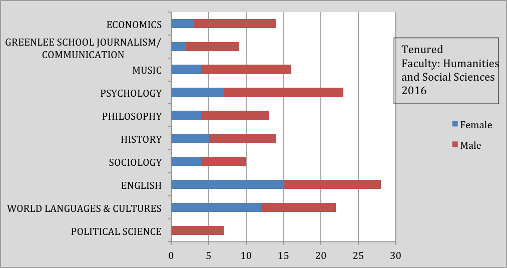  
]
.pull-right[
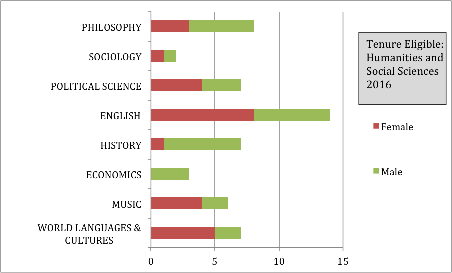  
]
.center[
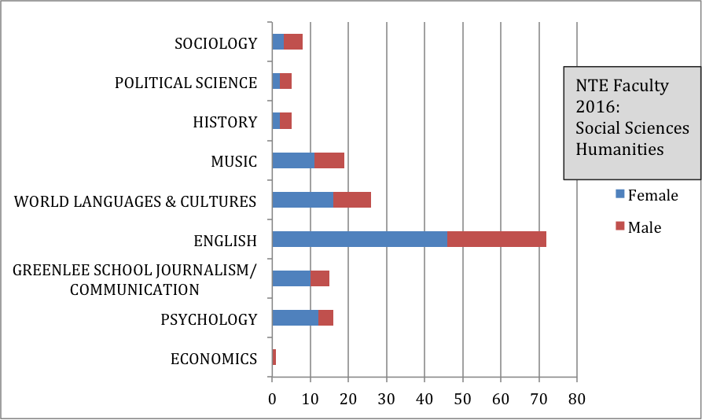  
]

---
## Updated graphic

```{r haley, fig.width = 10}
STEM <- filter(depts, category == "STEM")
nonSTEM <- filter(depts, category != "STEM")
tenureSTEM16 <- filter(tenure16, dept %in% STEM$dept)
tenureSTEM16$dept <-  as.factor(tools::toTitleCase(tolower(tenureSTEM16$dept)))
levels(tenureSTEM16$dept)[4] <- "EEOB"
levels(tenureSTEM16$dept)[5] <- "GDCB"
levels(tenureSTEM16$dept)[6] <- "GAS"

hayplot1 <- tenureSTEM16 %>% 
  select(-c(perc_female, total)) %>% 
  gather(gender, count, female:male) %>% 
  mutate(dept = str_wrap(dept, 20),
         gender = tools::toTitleCase(gender)) %>% 
  ggplot() + 
  geom_mosaic(aes(x = product(gender, dept), weight= count, fill = gender), divider = mosaic("v")) +
  geom_vline(xintercept = .5, color = "grey90", linetype = "dashed") + 
  facet_grid(~tenure) + 
  ggtitle("STEM Departments in LAS") +
  scale_fill_manual(name = "Gender", values = cols1) +
  coord_fixed(ratio = 1) +
  theme(legend.position = "none",
        axis.title.x = element_blank(), 
        axis.title.y = element_blank())

tenurenSTEM16 <- filter(tenure16,dept %in% nonSTEM$dept)
tenurenSTEM16$dept <-  as.factor(tools::toTitleCase(tolower(tenurenSTEM16$dept)))
levels(tenurenSTEM16$dept)[3] <- "GSJC"

hayplot2 <- tenurenSTEM16 %>% select(-c(perc_female, total)) %>% 
  gather(gender, count, female:male) %>% 
  mutate(dept = str_wrap(dept, 20),
         gender = tools::toTitleCase(gender)) %>% 
  ggplot() + 
  geom_mosaic(aes(x = product(gender, dept), weight= count, fill = gender), divider = mosaic("v")) +
  geom_vline(xintercept = .5, color = "grey90", linetype = "dashed") + 
  facet_grid(~tenure) + 
  ggtitle("Humanities and Social Sciences Departments in LAS") + 
  scale_fill_manual(name = "Gender", values = cols1) +
  coord_fixed(ratio = 1) +
  theme(legend.position = "bottom", axis.title.x = element_blank(), axis.title.y = element_blank())
``` 

```{r fig.width=10}
hayplot2
```

---
## Faculty and College Governance  

Faculty status in STEM Departments in LAS

.pull-left[
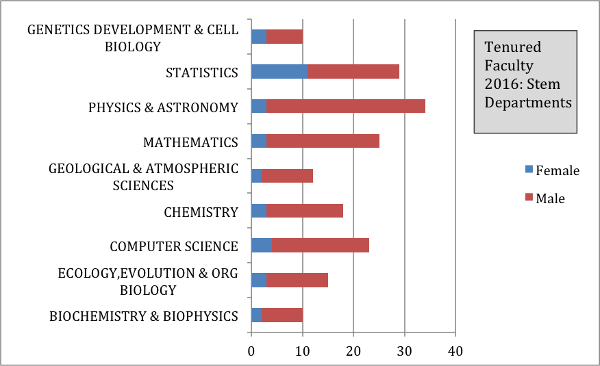  
]
.pull-right[
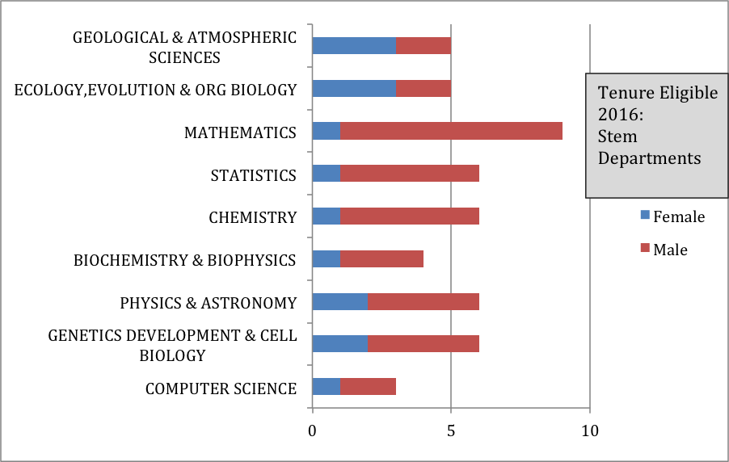  

]
.center[
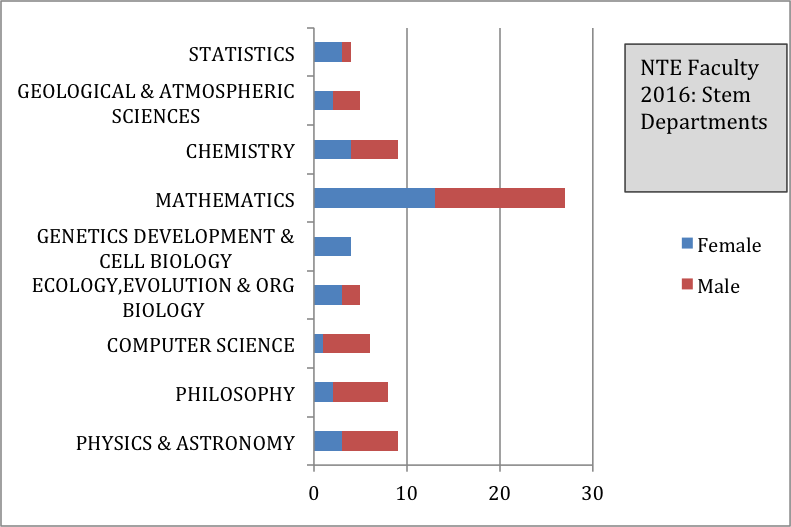  
]


???
top: Faculty Status of STEM Departments in LAS.EEOB = Ecology, Evolution & Org. Biology, GDCB = Genetics Development & Cell Biology, GAAS = Geological & Atmospheric Sciences"

bottom: Faculty Status of Humanities and Social Sciences Departments in LAS. GSJC = Greenlee School Journalism/Communication.

---
## Updated graphic 

```{r fig.width=10}
hayplot1
```

---
## Student Gender Balance  

Undergraduate students

.center[
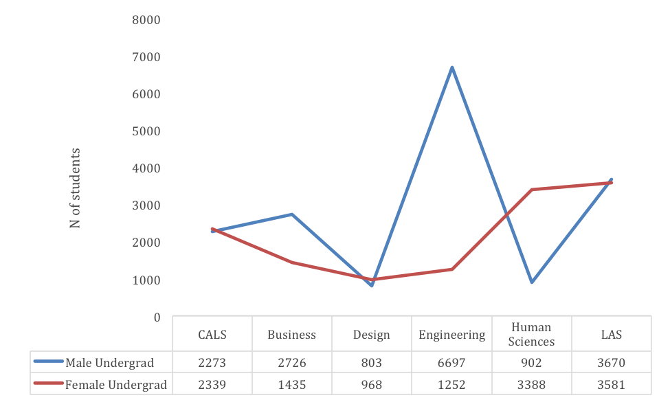 
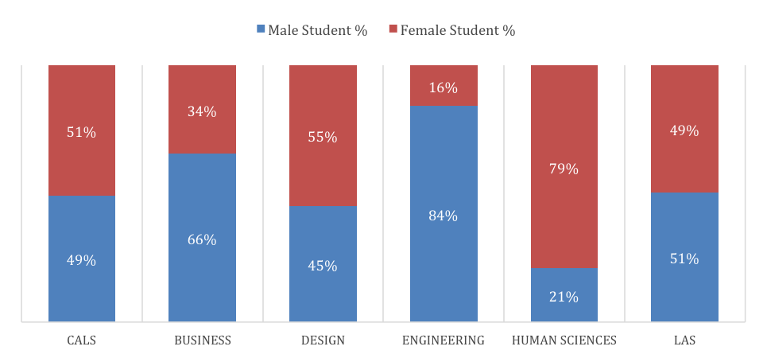  
]

Graduate students

.center[
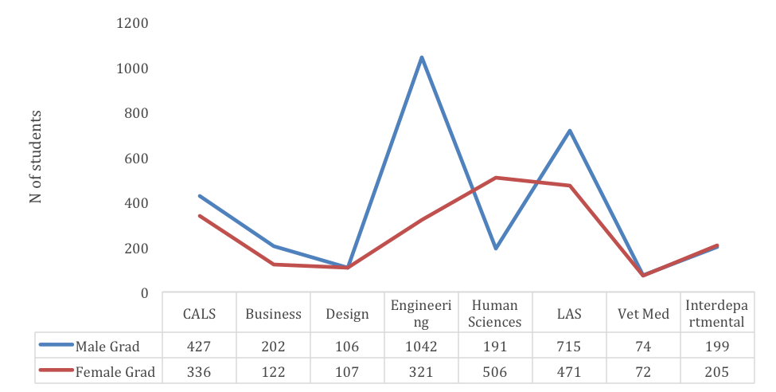 
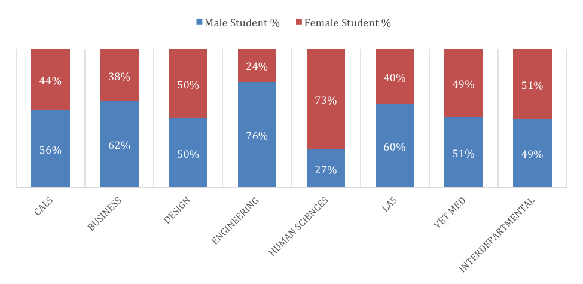  

]

---
## Updated graphics

```{r}
stud2015 <- stud2015 %>% rename(College = college, Gender = gender)
ugrad <- stud2015 %>% filter(grad == "undergrad" & count > 0)
  
ug_plot <- ggplot(ugrad) + 
  geom_mosaic(aes(x = product(College), weight = count, fill = Gender), divider = mosaic("v"))  +
  geom_vline(xintercept = .5, color = "grey90", linetype = "dashed") + 
  #facet_wrap(~grad) +
  scale_fill_manual(name = "Gender", values = cols1)  + 
  coord_fixed() + 
  ggtitle("Undergraduate Enrollment in Fall 2015")

positions <- ggplot_build(ug_plot)$data[[1]][,3:7]
positions %>% mutate(ypos = (ymin + ymax)/2, xpos = (xmin + xmax)/2) -> positions

ug_plot + 
  geom_text(aes(x = positions$xpos, y = positions$ypos, label = positions$`.wt`), 
            colour = "white")
```

---
## Updated graphics

```{r}
grad <- stud2015 %>% filter(grad == "grad" & count > 0) 
  
g_plot <- ggplot(grad) + 
  geom_mosaic(aes(x = product(College), weight = count, fill = Gender), divider = mosaic("v"))  +
  geom_vline(xintercept = .5, color = "grey90", linetype = "dashed") + 
  #facet_wrap(~grad) +
  scale_fill_manual(name = "Gender", values = cols1)  + 
  coord_fixed() +
  ggtitle("Graduate Enrollment in Fall 2015")
  

gpositions <- ggplot_build(g_plot)$data[[1]][,3:7]
gpositions %>% mutate(ypos = (ymin + ymax)/2, xpos = (xmin + xmax)/2) -> gpositions

g_plot + 
  geom_text(aes(x = gpositions$xpos, y = gpositions$ypos, label = gpositions$`.wt`), 
            colour = "white")
```


---
class: inverse, center, middle
# Katherine  

---
## Student Gender Balance (over time)

Undergraduate students

.center[
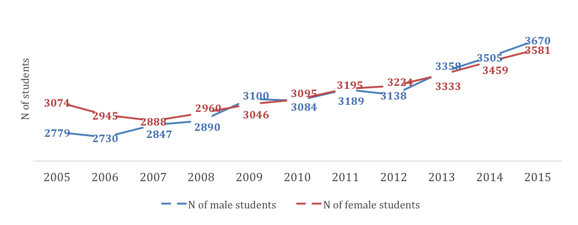
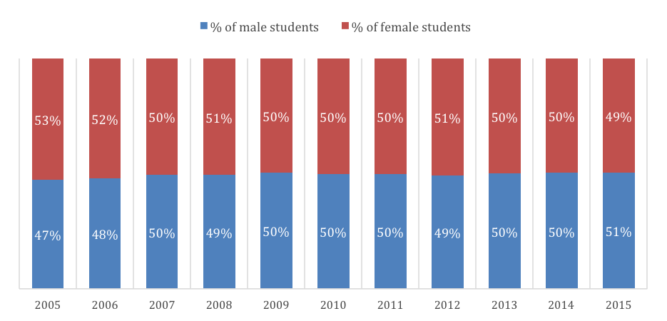  
]

Graduate students

.center[
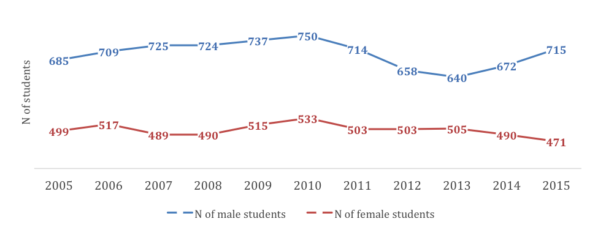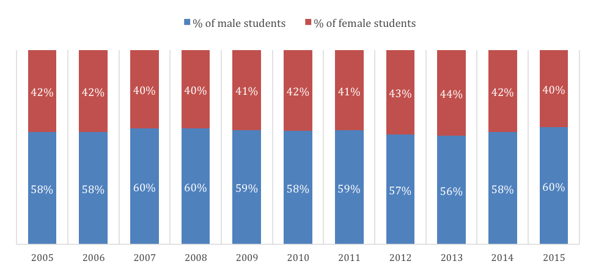  
]

---
## Updated Graphics

```{r katherine, fig.width = 10}
kplot1 <- LASstudents %>%
  filter(level == "undergrad") %>%
  ggplot(aes(x = factor(year), y = population, label = population, group = sex,
             color = sex)) + 
  geom_point(alpha = 0.75) + 
  geom_line(alpha = 0.75) + 
  theme_bw() +
  labs(x = "Academic Year", y = "Number of Undergraduate Students", color = "") +
  scale_y_continuous(limits = c(0, 4500)) + 
  geom_text_repel(data = subset(LASstudents, 
                                level == "undergrad" & position == "higher"),
                  nudge_y = 400,
                  direction = "y", 
                  show.legend = FALSE) + 
  geom_text_repel(data = subset(LASstudents,
                                level == "undergrad" & position == "lower"),
                  nudge_y = -400,
                  direction = "y", 
                  show.legend = FALSE) + 
  theme(legend.position = "none") +
  scale_color_manual(values = c("#C8102E", "#F1BE48"),
                     labels = c("Female Students", "Male Students"))

kplot2 <- LASstudents %>%
  filter(level == "undergrad") %>%
  ggplot(aes(x = factor(year), y = percent, fill = sex)) + 
  geom_bar(stat = "identity") + 
  labs(x = "Academic Year", y = "Percent of Undergraduate Students", fill = "") +
  coord_flip() + 
  theme_bw() + 
  theme(legend.position = "none") + 
  scale_fill_manual(values = c("#C8102E", "#F1BE48"),
                     labels = c("Female Students", "Male Students")) + 
  geom_text(data = subset(LASstudents, level == "undergrad" & sex == "female"),
            aes(label = sprintf("%.1f %%", percent)),
            y = 91, 
            hjust = 0,
            color = "white") + 
  geom_text(data = subset(LASstudents, level == "undergrad" & sex == "male"),
            aes(label = sprintf("%.1f %%", percent)),
            y = 1, 
            hjust = 0,
            color = "white") + 
  geom_hline(yintercept = 50, color = "grey")

kplot1 + kplot2 + plot_layout(ncol = 1)
```

---
## Updated Graphics

```{r katherine2, fig.width = 10, fig.cap = "Number of LAS graduate students by gender for 2005 – 2015 academic years"}
k2plot1 <- LASstudents %>%
  filter(level == "grad") %>%
  ggplot(aes(x = factor(year), y = population, color = sex, group = sex, 
             label = population)) + 
  geom_point(alpha = 0.75) + 
  geom_line(alpha = 0.75) + 
  theme_bw() +
  labs(x = "Academic Year", y = "Number of Graduate Students", color = "") +
  scale_y_continuous(limits = c(0, 900)) + 
  geom_text_repel(data = subset(LASstudents, level == "grad" & position == "higher"),
                  nudge_y = 50,
                  direction = "y", 
                  show.legend = FALSE) + 
  geom_text_repel(data = subset(LASstudents, level == "grad" & position == "lower"),
                  nudge_y = -50,
                  direction = "y", 
                  show.legend = FALSE) + 
  theme(legend.position = "none") + 
  scale_color_manual(values = c("#C8102E", "#F1BE48"),
                     labels = c("Female Students", "Male Students"))

k2plot2 <- LASstudents %>%
  filter(level == "grad") %>%
  ggplot(aes(x = factor(year), y = percent, fill = sex)) + 
  geom_bar(stat = "identity") + 
  labs(x = "Academic Year", y = "Percent of Graduate Students", fill = "") +
  coord_flip() + 
  theme_bw() + 
  theme(legend.position = "none") + 
  scale_fill_manual(values = c("#C8102E", "#F1BE48"),
                     labels = c("Female Students", "Male Students")) + 
  geom_text(data = subset(LASstudents, level == "grad" & sex == "female"),
            aes(label = sprintf("%.1f %%", percent)),
            y = 91, 
            hjust = 0,
            color = "white") + 
  geom_text(data = subset(LASstudents, level == "grad" & sex == "male"),
            aes(label = sprintf("%.1f %%", percent)),
            y = 1, 
            hjust = 0,
            color = "white") + 
  geom_hline(yintercept = 50, color = "grey")

k2plot1 + k2plot2 + plot_layout(ncol = 1)
```
---
class: inverse, center, middle
# Kiegan  

---
## Student Gender Balance by Major - Undergraduate  
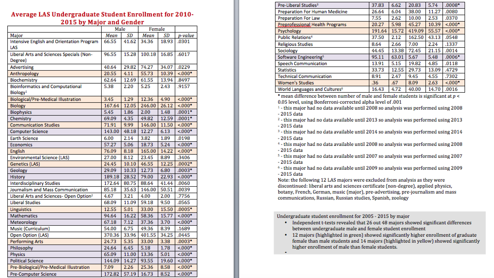  

---
## Student Gender Balance by Major - Graduate  
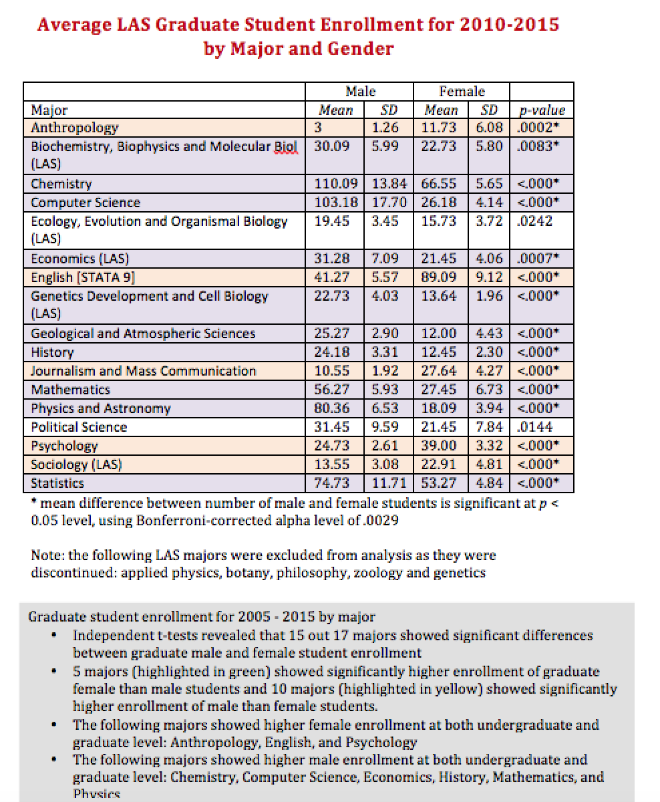  

---
## Main ideas to communicate  

Gender balance by major  

  - Percentages  
  
  - Magnitude of difference  
  
  - Changes over time (getting better?)  

Significance  

Size of major  

---
## Updated graphics  

```{r maj-enroll-raw,  fig.cap="Average difference in enrollment between female and males students in each department from 2005-2015.", fig.height = 5.5, fig.width = 9}
ugdept_means %>% 
    mutate(ci_lower = ifelse(n_years < 3, diff, ci_lower), 
           ci_upper = ifelse(n_years < 3, diff, ci_upper)) %>% 
  filter(dept_new != "Total") %>% filter(!is.na(dept_code)) %>% 
  ggplot() + 
    geom_vline(xintercept = 0, lty = 2) + 
    geom_segment(aes(x=ci_lower, xend=ci_upper, 
                      y=dept_new, yend=dept_new, 
                     colour = male_female), lwd = 1) +
  labs(x = 'Male - Female Enrollment', 
       y="Department", 
       title="Difference in Average Undergraduate Enrollment" , subtitle="From 2005 to 2015. 95% confidence intervals shown.") +
  geom_point(aes(x = diff, y = dept_new, fill = not_enough), pch = 21) + 
    scale_colour_manual(values =cols2[c(3,1,2)], name = "Differences in\nAverage Enrollment") +
    scale_fill_manual(values = c("black", "grey"), name = "Data Availability\nfor Department") + 
  theme(legend.title = element_text(size = rel(.75)))

```

---
## Updated graphics  

```{r maj-enroll-prop, fig.cap="Average proportion of female students in each department from 2005-2015.", fig.height = 6, fig.width = 9}
ugdepts3 %>%   
  ggplot() + 
  geom_vline(xintercept = 0.5, lty = 2) + 
  geom_segment(aes(x = ci_lower, xend = ci_upper, 
                   y = dept_new, yend = dept_new, colour = change_dir, size = n_2015)) + 
  geom_point(aes(x = prop_female, y = dept_new), shape = I("|"), size = 3) + 
  scale_colour_manual(values = cols2, name = "Proportional Enrollment") +
  labs(x = "Proportion Female", y = "Department", title = "Proportion Female, 2005 to 2015") + 
  scale_size_continuous(name = "Number Enrolled in\nDepartment, 2015", breaks = c(50, 250, 450)) + 
  guides(color = guide_legend(order=1),
         size = guide_legend(order=2)) + 
  theme(legend.title = element_text(size = rel(.75)))
      #  legend.text = element_text(size = rel(3)))
```

---
## Updated [graphics](https://www.nytimes.com/interactive/2018/11/07/us/politics/how-democrats-took-the-house.html) 

```{r change-prop-ugm, fig.height = 6, fig.width = 9, fig.cap="Change in proportion of female students in each major from 2005-2015."}
GeomSegment$draw_key <- draw_key_line
ugdepts2 %>% 
  ggplot() +
  geom_vline(xintercept = 0.5, lty = 2) + 
  geom_segment(aes(x = prop_fy, xend = prop_2015, 
                              y = dept_new, yend = dept_new, colour = change_dir, size = n_2015),#, size = 2.8,
                          arrow = arrow(length = unit(0.1, "cm")), linejoin = 'mitre') + 
  #geom_point(aes(x = point_jiggle, y = dept_new), shape=4, size = 3) + 
  scale_colour_manual(name = "Change in Gender\nProportion", values= cols2, labels=c("Significantly more female", "Significantly more male", "No significant difference")) +
  geom_label(aes(x = prop_fy, y = dept_new, label = year_label), 
             size = 2, label.size = 0) + 
  labs(x = "Proportion of Female Enrollees", y = "Department", title = "Change in Proportion of Female Enrollees", subtitle="From 2005 (or later year given) to 2015") + 
  scale_size_continuous(name = "Number of Majors\nin 2015", breaks = c(15, 50, 85, 120, 200, 400, 900)) +
  guides(color = guide_legend(order=1),
         size = guide_legend(order=2)) + 
  theme(legend.title = element_text(size = rel(.75)))

```

---
## Updated graphics  

```{r grad-major-raw, fig.width = 9}
gdept_means %>% 
  mutate(ci_lower = ifelse(n_years < 3, diff, ci_lower), 
         ci_upper = ifelse(n_years < 3, diff, ci_upper)) %>% 
  filter(dept_new != "Total") %>% 
  filter(!is.na(dept_code)) %>% 
  mutate(dept_new = dept_new) %>% 
  ggplot() + 
  geom_vline(xintercept = 0, lty = 2) + 
  geom_segment(aes(x=ci_lower, xend=ci_upper, 
                  y=dept_new, yend=dept_new, 
                  colour = male_female), lwd = 1) +
  labs(x = 'Male-Female Enrollment' , 
       y="Department", 
        title="Difference in Average Graduate Enrollment" , subtitle="From 2005 to 2015. 95% confidence intervals shown.") +
  #scale_color_brewer(palette='Set1') + 
  theme_bw() + 
  geom_point(aes(x = diff, y = dept_new)) + 
  scale_colour_manual(name = "Difference in Average Enrollment", 
                      values = cols1) +
  scale_shape_discrete(name = "Data Availability for Department") + 
  theme(legend.title = element_text(size = rel(.75)))
```

---
## Updated graphics  

```{r grad-major-prop, fig.width = 9}
gdepts3 %>%   
  mutate(dept_new = dept_new) %>% 
  ggplot() + 
  geom_vline(xintercept = 0.5, lty = 2) + 
  geom_segment(aes(x = ci_lower, xend = ci_upper, 
                   y = dept_new, yend = dept_new, colour = change_dir, size = n_2015)) + 
  geom_point(aes(x = prop_female, y = dept_new), shape = I("|"), size = 3) + 
  scale_colour_manual(values = cols2, name = "Proportional Enrollment") +
  labs(x = "Proportion Female", y = "Department", title = "Proportion Female, 2005 to 2015") + 
  scale_size_continuous(name = "Number Enrolled in\nDepartment, 2015", breaks = c(25, 100, 150)) + 
  guides(color = guide_legend(order=1),
         size = guide_legend(order=2)) + 
  theme(legend.title = element_text(size = rel(.75))) + 
  xlim(0,1)
      #  legend.text = element_text(size = rel(3)))
```

---
## Updated graphics 

```{r change-prop-gm, fig.width = 9}
GeomSegment$draw_key <- draw_key_line
gdepts2 %>% 
  mutate(dept_new = dept_new) %>% 
  ggplot() +
  geom_vline(xintercept = 0.5, lty = 2) + 
  geom_segment(aes(x = prop_fy, xend = prop_2015, 
                              y = dept_new, yend = dept_new, colour = change_dir, size = n_2015),#, size = 2.8,
                          arrow = arrow(length = unit(0.1, "cm")), linejoin = 'mitre') + 
  #geom_point(aes(x = point_jiggle, y = dept_new), shape=4, size = 3) + 
  scale_colour_manual(name = "Change in Gender\nProportion", values= cols2[3], labels=c("No significant difference")) +
  geom_label(aes(x = prop_fy, y = dept_new, label = year_label), 
             size = 2, label.size = 0) + 
  labs(x = "Proportion of Female Enrollees", y = "Department", title = "Change in Proportion of Female Enrollees", subtitle="From 2005 (or later year given) to 2015") + 
  scale_size_continuous(name = "Number of Majors\nin 2015", breaks = c(15, 50, 85, 120, 200, 400, 900)) +
  guides(color = guide_legend(order=1),
         size = guide_legend(order=2)) + 
  theme(legend.title = element_text(size = rel(.75))) + 
  xlim(0,1)

```

---
class: inverse, center, middle

# Miranda  

---
## Student Gender Balance Over Time  


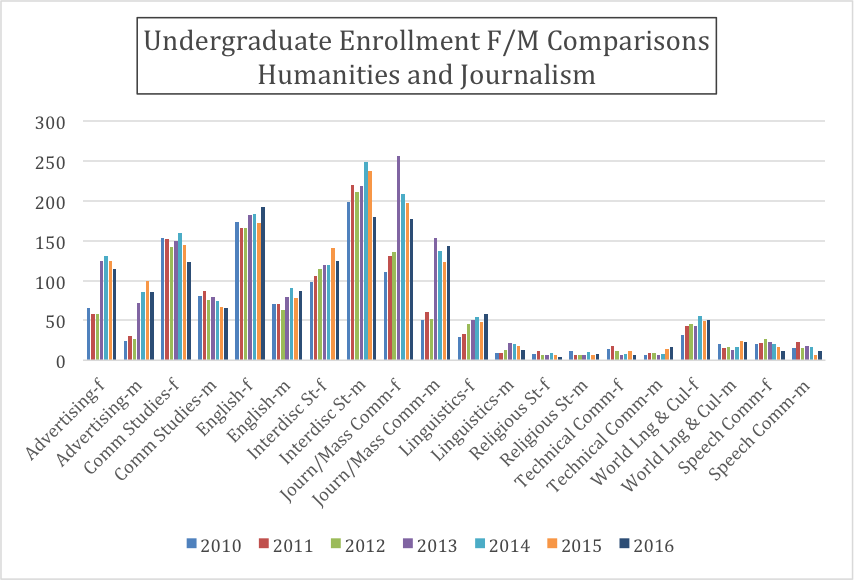

---
## Updated graphics

```{r ug-en-hj-sci, fig.width=10}
dat <- ugtrend[ugtrend$Major %in% groups[[1]],]
dat <- dat %>% group_by(Major) %>% filter(!is.na(Number)) %>% 
  mutate(nyrs = length(unique(Year)), Year = str_replace(Year, "20", "'")) %>% 
  filter(nyrs >=3)

ggplot(data = dat, aes(x = Year, y = Number, color = Gender, group = Gender)) +
    geom_line() +
    geom_point() +
    facet_wrap(~Major, nrow = 2) +
    scale_color_manual(values=cols1) +
    labs(x = "Year", y = "Number enrolled", title = "Undergraduate Enrollment by Gender, 2010-2016", subtitle =  names(groups)[1]) + 
    theme(axis.text.x = element_text(angle = 45), legend.position = "bottom") 
```


---
## Student Gender Balance Over Time  

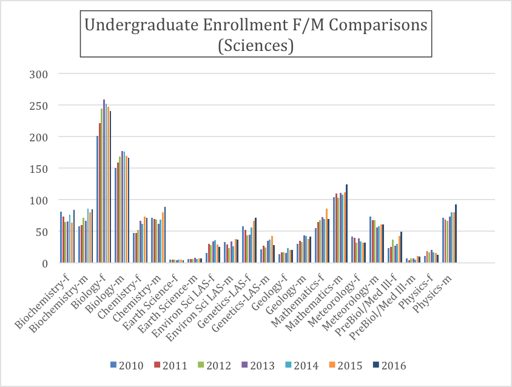

---
## Updated graphics

```{r ug-sci, fig.width = 8}
dat <- ugtrend[ugtrend$Major %in% groups[[2]],]
dat<- dat %>% group_by(Major) %>% filter(!is.na(Number)) %>% 
  mutate(nyrs = length(unique(Year)), Year = str_replace(Year, "20", "'")) %>% 
  filter(nyrs >=3)
ggplot(data = dat, aes(x = Year, y = Number, color = Gender, group = Gender)) +
    geom_line() +
    geom_point() +
    facet_wrap(~Major, nrow = 3) +
    scale_color_manual(values=cols1) +
    labs(x = "Year", y = "Number enrolled", title = "Undergraduate Enrollment by Gender, 2010-2016", subtitle =  names(groups)[2]) + 
    theme(axis.text.x = element_text(angle = 45), legend.position = c(.85, .1)) 
```

---
## Student Gender Balance Over Time  

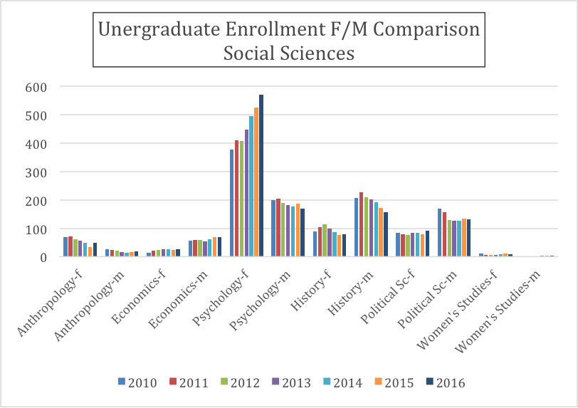   


---
## Updated graphics

```{r ug-soc-sci, fig.width = 8}
dat <- ugtrend[ugtrend$Major %in% groups[[3]],]
dat<- dat %>% group_by(Major) %>% filter(!is.na(Number)) %>% 
  mutate(nyrs = length(unique(Year)), Year = str_replace(Year, "20", "'")) %>% 
  filter(nyrs >=3)
ggplot(data = dat, aes(x = Year, y = Number, color = Gender, group = Gender)) +
    geom_line() +
    geom_point() +
    facet_wrap(~Major, nrow = 2) +
    scale_color_manual(values=cols1) +
    labs(x = "Year", y = "Number enrolled", title = "Undergraduate Enrollment by Gender, 2010-2016", subtitle =  names(groups)[3]) + 
    theme(axis.text.x = element_text(angle = 45), legend.position = "bottom") 
```

---
## Student Gender Balance Over Time  

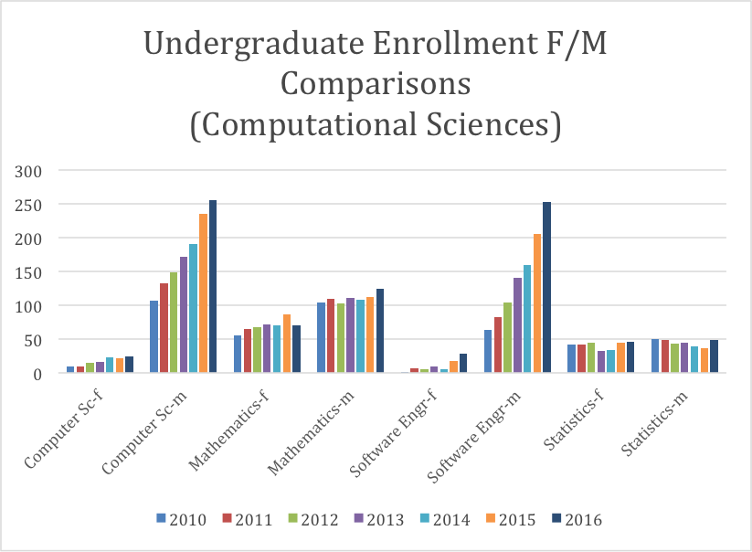 

---
## Updated graphics

```{r ug-comp-sci}
dat <- ugtrend[ugtrend$Major %in% groups[[4]],]
dat<- dat %>% group_by(Major) %>% filter(!is.na(Number)) %>% 
  mutate(nyrs = length(unique(Year)), Year = str_replace(Year, "20", "'")) %>% 
  filter(nyrs >=3)
ggplot(data = dat, aes(x = Year, y = Number, color = Gender, group = Gender)) +
    geom_line() +
    geom_point() +
    facet_wrap(~Major, nrow = 2) +
    scale_color_manual(values=cols1) +
    labs(x = "Year", y = "Number enrolled", title = "Undergraduate Enrollment by Gender, 2010-2016", subtitle =  names(groups)[4]) + 
    theme(axis.text.x = element_text(angle = 45), legend.position = "bottom") 
```

---
## Updated graphics

```{r ug-other, fig.width=10}
dat <- ugtrend[ugtrend$Major %in% groups[[5]],]
dat<- dat %>% group_by(Major) %>% filter(!is.na(Number)) %>% 
  mutate(nyrs = length(unique(Year)), Year = str_replace(Year, "20", "'")) %>% 
  filter(nyrs >=3)
ggplot(data = dat, aes(x = Year, y = Number, color = Gender, group = Gender)) +
    geom_line() +
    geom_point() +
    facet_wrap(~Major, nrow = 3) +
    scale_color_manual(values=cols1) +
    labs(x = "Year", y = "Number enrolled", title = "Undergraduate Enrollment by Gender, 2010-2016", subtitle =  names(groups)[5]) + 
    theme(axis.text.x = element_text(angle = 45), legend.position = c(.85, .1)) 
```

---
class: inverse, center, middle

# Sam  

---
## Post Docs  

```{r postdocs.test}
postdoc %>% group_by(year, gender) %>% 
  summarize(yr_pd_tot = sum(number)) %>% ungroup() %>%
  group_by(year) %>% 
  mutate(total = sum(yr_pd_tot),
         perc = yr_pd_tot/total) %>% 
  filter(gender == "female") -> pd_totals 
testing <- pd_totals[,c(1,3:5)]
testing$pvalue <- NA
for (i in 1:6){
 ptest <- prop.test(x = pd_totals$yr_pd_tot[i], 
            n = pd_totals$total[i], p = .5,
            correct = T, alternative = "t")
 testing$pvalue[i] <- ptest$p.value
}

knitr::kable(testing, digits = 4, col.names = c("Year", "# Female Postdocs in LAS", "Total # Postdocs in LAS", "Proportion Female", "p-value"), caption = "Female postdocs in LAS. The p-value is from a two-sided proportion test that the true proportion of female postdocs is 0.5. Every year except 2010 is significant at $\\alpha = 0.05$.", format = "html")
```

---
## Post Docs  


```{r postdocs1, fig.cap = "The percentage of female postdocs in LAS from 2010-2015. Counts shown in the label, # female / total."}
pd_totals %>% 
  ggplot(aes(x = year, y = perc)) + 
  geom_line(color = cols2[3]) + 
  geom_point(color = cols2[3]) + 
  geom_label_repel(aes(label = paste0(yr_pd_tot, "/", total)), alpha = .7) + 
  geom_hline(yintercept = 0.5, linetype = 'dotted', alpha = .5) +  
  scale_y_continuous(labels = scales::percent, limits = c(0,1), breaks = 0:10/5) + 
  labs(x = "Year", y = "Percentage female", title = "LAS Postdocs by Gender, 2010-2015", subtitle = "# female postocs in LAS / # total LAS postdocs") 
```

---
## Post Docs  


```{r postdocs2, fig.width = 14, fig.height=8}
postdoc %>% spread(gender, number) %>% 
  mutate(total = male + female,
         perc_female = female / total,
         below_50 = perc_female < 0.5,
         dept = str_wrap(dept, 25)) %>% 
  filter(dept != "CTR FOR CATALYSIS") -> pd_by_dept
pd_by_dept %>%   
  ggplot(aes(x = year, y = perc_female)) + 
  geom_hline(yintercept = .5, linetype = "dotted", alpha = .7) + 
  geom_line(group = 1) + 
  geom_point(aes(color = below_50), size = 2) +
  geom_label_repel(aes(x = year, y = perc_female, label = paste0(female, "/", total)), alpha = .7) + 
  scale_color_isu() + 
  labs(color = "< 50% female", x = "Year", y = "Percent Female") +
  scale_y_continuous(breaks = 0:4/4, labels = scales::percent) + 
  facet_wrap(~dept) + 
  theme(axis.text.x = element_text(angle = 30))
```

---
## P&S and Merit Staff  

```{r psstaff.test}
psstaff %>% group_by(year, gender) %>% 
  summarize(yr_ps_tot = sum(number)) %>% ungroup() %>%
  group_by(year) %>% 
  mutate(total = sum(yr_ps_tot),
         perc = yr_ps_tot/total) %>% 
  filter(gender == "female") -> ps_totals 
testing <- ps_totals[,c(1,3:5)]
testing$pvalue <- NA
for (i in 1:6){
 ptest <- prop.test(x = ps_totals$yr_ps_tot[i], 
            n = ps_totals$total[i], p = .5,
            correct = T, alternative = "t")
 testing$pvalue[i] <- ptest$p.value
}
knitr::kable(testing, digits = 4, col.names = c("Year", "# Female P&S Staff in LAS", "Total # P&S Staff in LAS", "Proportion Female", "p-value"), caption = "Female P&S staff in LAS. The p-value is from a two-sided proportion test that the true proportion of female P&S Staff is 0.5. No year is significantly different than 0.5.", format = "html")
```


---
## P&S and Merit Staff  


```{r psstaff1, fig.cap = "The percentage of female postdocs in LAS from 2010-2015. Counts shown in the label, # female / total."}
ps_totals %>% 
  ggplot(aes(x = year, y = perc)) + 
  geom_line(color = cols2[3]) + 
  geom_point(color = cols2[3]) + 
  geom_label_repel(aes(label = paste0(yr_ps_tot, "/", total)), alpha = .7) + 
  geom_hline(yintercept = 0.5, linetype = 'dotted', alpha = .5) +  
  scale_y_continuous(labels = scales::percent, limits = c(0,1), breaks = 0:10/5) + 
  labs(x = "Year", y = "Percentage female", title = "LAS P&S Staff by Gender, 2010-2015", subtitle = "# female P&S Staff in LAS / # total LAS P&S Staff") 
```


---
## P&S and Merit Staff  


```{r psstaff2, fig.width = 14, fig.height=8}
psstaff %>% spread(gender, number) %>% 
  mutate(total = male + female,
         perc_female = female / total,
         below_50 = perc_female < 0.5,
         dept = str_wrap(dept, 25)) %>% 
  group_by(dept) %>% filter(length(unique(year)) > 2)  -> ps_by_dept
ps_by_dept %>%   
  ggplot(aes(x = year, y = perc_female)) + 
  geom_hline(yintercept = .5, linetype = "dotted", alpha = .7) + 
  geom_line(group = 1) + 
  geom_point(aes(color = below_50), size = 2) +
  geom_label_repel(aes(x = year, y = perc_female, label = paste0(female, "/", total)), alpha = .7) + 
  scale_color_isu() + 
  labs(color = "< 50% female", x = "Year", y = "Percent Female") +
  scale_y_continuous(breaks = 0:4/4, labels = scales::percent) + 
  facet_wrap(~dept) + 
  theme(axis.text.x = element_text(angle = 30))
```


```{r merit.test, eval = FALSE}
psstaff %>% group_by(year, gender) %>% 
  summarize(yr_ps_tot = sum(number)) %>% ungroup() %>%
  group_by(year) %>% 
  mutate(total = sum(yr_ps_tot),
         perc = yr_ps_tot/total) %>% 
  filter(gender == "female") -> ps_totals 
testing <- ps_totals[,c(1,3:5)]
testing$pvalue <- NA
for (i in 1:6){
 ptest <- prop.test(x = ps_totals$yr_ps_tot[i], 
            n = ps_totals$total[i], p = .5,
            correct = T, alternative = "t")
 testing$pvalue[i] <- ptest$p.value
}
knitr::kable(testing, digits = 4, col.names = c("Year", "# Female P&S Staff in LAS", "Total # P&S Staff in LAS", "Proportion Female", "p-value"), caption = "Female P&S staff in LAS. The p-value is from a two-sided proportion test that the true proportion of female P&S Staff is 0.5. No year is significantly different than 0.5.")
```


```{r merit1, fig.cap = "The percentage of female postdocs in LAS from 2010-2015. Counts shown in the label, # female / total.", eval = FALSE}
ps_totals %>% 
  ggplot(aes(x = year, y = perc)) + 
  geom_line(color = cols2[3]) + 
  geom_point(color = cols2[3]) + 
  geom_label_repel(aes(label = paste0(yr_pd_tot, "/", total)), alpha = .7) + 
  geom_hline(yintercept = 0.5, linetype = 'dotted', alpha = .5) +  
  scale_y_continuous(labels = scales::percent, limits = c(0,1), breaks = 0:10/5) + 
  labs(x = "Year", y = "Percentage female", title = "LAS P&S Staff by Gender, 2010-2015", subtitle = "# female P&S Staff in LAS / # total LAS P&S Staff") 
```


```{r merit2, fig.width = 14, fig.height=8, eval = FALSE}
psstaff %>% spread(gender, number) %>% 
  mutate(total = male + female,
         perc_female = female / total,
         below_50 = perc_female < 0.5,
         dept = str_wrap(dept, 25)) %>% 
  group_by(dept) %>% filter(length(unique(year)) > 2)  -> ps_by_dept
ps_by_dept %>%   
  ggplot(aes(x = year, y = perc_female)) + 
  geom_hline(yintercept = .5, linetype = "dotted", alpha = .7) + 
  geom_line(group = 1) + 
  geom_point(aes(color = below_50), size = 2) +
  geom_label_repel(aes(x = year, y = perc_female, label = paste0(female, "/", total)), alpha = .7) + 
  scale_color_isu() + 
  labs(color = "< 50% female", x = "Year", y = "Percent Female") +
  scale_y_continuous(breaks = 0:4/4, labels = scales::percent) + 
  facet_wrap(~dept) + 
  theme(axis.text.x = element_text(angle = 30))
```

