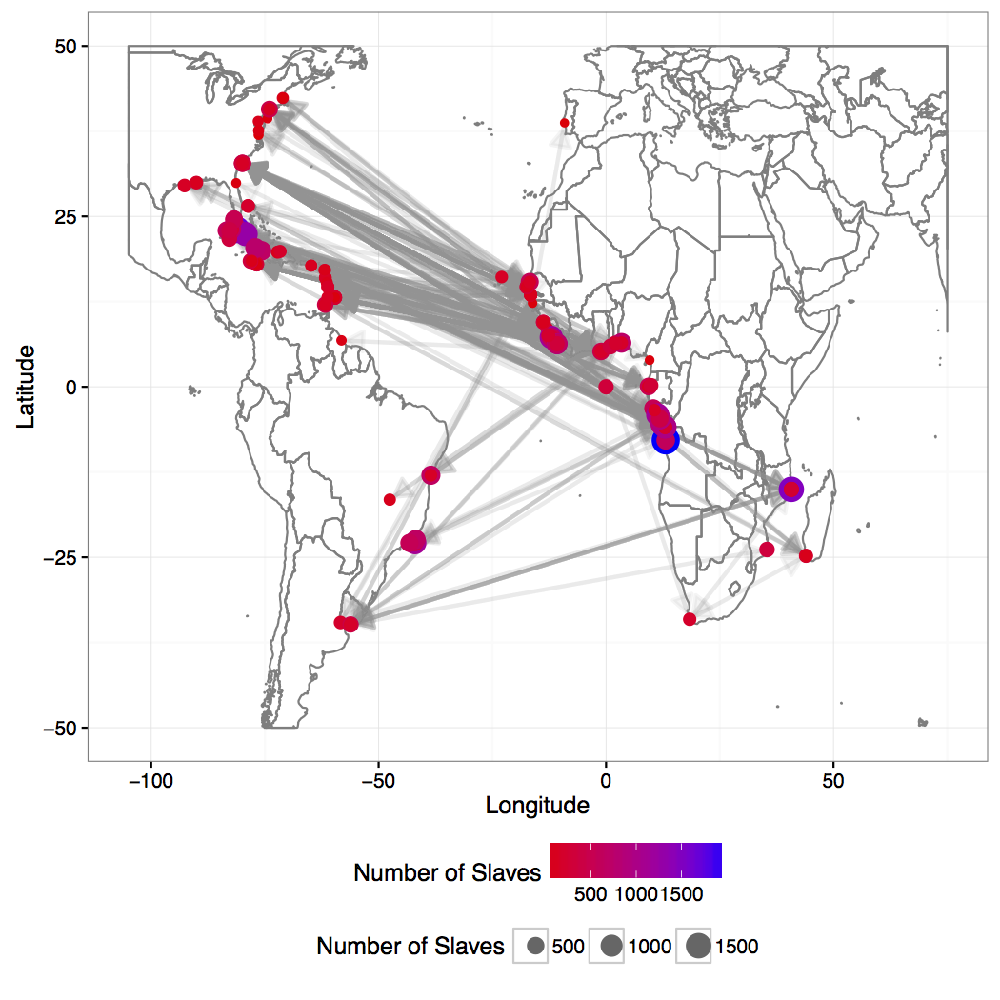

```{r setup, include=FALSE}
options(htmltools.dir.version = FALSE, echo = TRUE, message = FALSE, warning = FALSE)
```

# Outline

- Cool historical graphics
- Getting data
- Recreating graphics

---
class: inverse, center, middle

# Cool historical graphics

---
# Rank of states and territories in population

Created by Henry Gannett after the 1890 census, first published in 1898. [Source](https://www.loc.gov/resource/g3701gm.gct00010/?sp=10)


---
# Black population of Georgia by Counties

Created by W.E.B Du Bois in 1900 for the "Negro Exhibit of the American Section at the Paris Exposition Universelle in 1900 to show the economic and social progress of African Americans since emancipation" [Source](http://www.loc.gov/pictures/collection/anedub/item/2013650424/)

  

---
class: inverse, center, middle

# Getting the data

---
# Data Source 

Data source: https://data2.nhgis.org/main 

What is needed? 

1. Total population of states in each decennial census year
  
  a. Geographic levels: State
  
  b. Years: Decennial years, 1790-1890
  
  c. Topics: Total population
    
2. Total black population in Georgia counties in the census years 1870, 1880, and 1890
  
  a. Geographic levels: Counties
  
  b. Years: Decennial years, 1870-1890
  
  c. Topics: Race
    
---
# Read & glimpse data (1)

```{r readdat, message=FALSE, warning=FALSE}
library(tidyverse)
dat1 <- read_csv("dat/nhgis0001_ts_nominal_state.csv")
glimpse(dat1)
```


---
# Read & glimpse data (2)

```{r readdat2, message=FALSE, warning=FALSE}
dat2 <- read_csv("dat/nhgis0004_csv/nhgis0004_ds27_1890_county.csv")
glimpse(dat2)
```

---
# Codebooks 

1. `A00AAYYYY`: The total persons in that state in year `YYYY`
2. `AVF001`: Negro population 1890
3. `AVF002`: Negro population 1880
4. `AVF003`: Negro population 1870

---
# Data cleaning (1)

Gather the appropriate variables and rank states by population 

```{r cleandat}
dat1 %>% gather(Census, Population, A00AA1790:A00AA2010) %>% 
  mutate(Census = as.integer(str_replace(Census,"A00AA", "")),
         STATE = str_trim(str_replace(STATE, "Territory", ""))) %>% 
  group_by(Census, STATE) %>% 
  summarize(TotPop = sum(na.omit(Population))) %>% 
  filter(TotPop != 0) %>%
  arrange(Census, desc(TotPop)) %>% 
  mutate(rank = row_number()) -> dat1.2
head(dat1.2)
```

---
# Data cleaning (2)

Get only the data we care about

```{r cleandat2, message=FALSE, warning=FALSE}
dat2 %>% filter(STATE == "Georgia") %>% 
  select(STATE, COUNTY, AVF001:AVF003) %>% 
  gather(Year, Population, AVF001:AVF003) %>% 
  mutate(Year = replace(Year, Year == "AVF001", 1890),
         Year = replace(Year, Year == "AVF002", 1880),
         Year = replace(Year, Year == "AVF003", 1870),
         Year = parse_integer(Year)) -> dat2.2
glimpse(dat2.2)
```

---
class: inverse, center, middle

# Recreating graphics

---
# Using the `ggflags` package

Instead of symbols, use the flag of each state: https://github.com/baptiste/ggflags

```{r ggflags, eval = FALSE}
devtools::install_github("baptiste/ggflags")
library(ggflags)
```


---
# Match the data to the flags 

All the flags are named "us-xx" where "xx" is the two-letter abbreviation for the state. Need to create a variable for state that matches the flag names. 

```{r states_clean}
# some states are territories
territories <- data_frame(name1 = unique(dat1.2$STATE)[is.na(match(unique(dat1.2$STATE), state.name))])
territories$name2 <- paste(territories$name1, "Territory")
territories$name2[3] <- territories$name1[3]
for (i in 1:6){
  dat1.2$STATE[dat1.2$STATE == territories$name1[i]] <- territories$name2[i]
}
# state name and abbreviations
states <- data_frame(name = state.name, abb = state.abb)
dat1.2$state.abbr <- NA
for (i in 1:nrow(states)){
  dat1.2$state.abbr[dat1.2$STATE == states$name[i]] <- tolower(states$abb[i])
}
dat1.2$state.abbr[dat1.2$STATE == "District Of Columbia"] <- "dc"
# state variable matches the flags.
dat1.2$state <- paste0("us-", dat1.2$state.abbr)
```

---
# Making the plot

```{r flags1, eval = FALSE}
library(ggflags)
figdat <-  dat1.2 %>% filter(Census < 1891 & state %in% names(.flaglist))
ggplot() + 
  geom_line(data = figdat, aes(x = -Census, y = -rank, group = STATE)) + 
  geom_flag(data = figdat, aes(x = -Census, y = -rank, country = state), size = 6) + 
  geom_text(aes(x = -seq(1790, 1890, 10), y = 0, label = seq(1790, 1890, 10))) + 
  geom_text(data = figdat %>% filter(Census ==1890), aes(x = -1900, y = -rank, label = STATE), hjust = 0, size = 3) + 
  geom_text(data = figdat %>% filter(Census ==1790), aes(x = -1780, y = -rank, label = STATE), hjust = 1, size = 3) + 
  scale_country() + 
  theme_void() + 
  theme(legend.position = 'none')
```

---

```{r flags2, echo=FALSE, fig.width=11, fig.height=9}
library(ggflags)
figdat <-  dat1.2 %>% filter(Census < 1891 & state %in% names(.flaglist))
ggplot() + 
  geom_line(data = figdat, aes(x = -Census, y = -rank, group = STATE)) + 
  geom_flag(data = figdat, aes(x = -Census, y = -rank, country = state), size = 8) + 
  geom_text(aes(x = -seq(1790, 1890, 10), y = 0, label = seq(1790, 1890, 10))) + 
  geom_text(data = figdat %>% filter(Census ==1890), aes(x = -1900, y = -rank, label = STATE), hjust = .5, size = 4) + 
  geom_text(data = figdat %>% filter(Census ==1790), aes(x = -1780, y = -rank, label = STATE), hjust = .5, size = 4) + 
  scale_country() + 
  theme_void() + 
  theme(legend.position = 'none')
```

---
```{r flags3, echo=FALSE, fig.width=11, fig.height=9}
figdat <-  dat1.2 %>% filter(Census < 1891)
cols <-  colorRampPalette(wesanderson::wes_palette("GrandBudapest1", n=4))(length(unique(figdat$STATE)))
ggplot() + 
  geom_line(data = figdat, aes(x = -Census, y = -rank, group = STATE)) + 
  geom_label(data = figdat, aes(x = -Census, y = -rank, fill = STATE, label = STATE), color = 'black', size = 2) + 
  scale_fill_manual(values = cols) + 
  geom_text(aes(x = -seq(1790, 1890, 10), y = 0, label = seq(1790, 1890, 10))) + 
  geom_text(data = figdat %>% filter(Census ==1890), aes(x = -1900, y = -rank, label = STATE), hjust = .75, size = 4) + 
  geom_text(data = figdat %>% filter(Census ==1790), aes(x = -1780, y = -rank, label = STATE), hjust = .25, size = 4) + 
  scale_country() + 
  theme_void() + 
  expand_limits(x = c(-1910, -1770)) + 
  theme(legend.position = 'none')
```

---
# Data for Map of Georgia

```{r gamap, fig.align='center'}
#install.packages("USAboundaries")
library(sf)
library(USAboundaries)
library(USAboundariesData)
cnty_dat <- us_counties(map_date = "1891-01-01")
ga <- cnty_dat[cnty_dat$state_name == "Georgia",]
ga$name <-  tolower(str_replace(ga$name, " \\(ext\\)", ""))
dat2.2$COUNTY <- dat2.2$COUNTY %>% tolower
sum(is.na(match(dat2.2$COUNTY , ga$name)))
```

---
# Map of GA

```{r mapga2, fig.align='center', fig.height=5}
ggplot(ga) + 
  geom_sf(data = ga) + 
  coord_sf(crs = st_crs(ga))
```

---
# Join to population data & plot


```{r mergedat, eval=FALSE}
dat2.3 <- merge(ga, dat2.2, by.x = "name", by.y = "COUNTY")
ggplot(dat2.3) + 
  geom_sf(data = dat2.3, aes(fill = Population )) + 
  facet_wrap(~Year, nrow= 1) + 
  coord_sf(crs = st_crs(ga))
```

---

```{r mergedatfalse, fig.align='center',echo = FALSE, out.width='100%'}
dat2.3 <- merge(ga, dat2.2, by.x = "name", by.y = "COUNTY")
ggplot(dat2.3) + 
  geom_sf(data = dat2.3, aes(fill = Population )) + 
  facet_wrap(~Year, nrow= 1) +  
  coord_sf(crs = st_crs(ga))
```

---
# Categorical

```{r mergedat2.4, eval=FALSE}
dat2.3$Population2 <- cut(dat2.3$Population, 
       breaks =c(0,1000,2500,5000,10000,15000,20000,30000, 1e06), 
       include.lowest = T, ordered_result = T,
       labels = c("<1,000", "1,000-2,500", "2,500-5,000", "5,000-10,000", 
                  "10,000-15,000","15,000-20,000", "20,000-30,000", ">30,000"))
ggplot() + 
  geom_sf(data = dat2.3, aes(fill = Population2 )) + 
  facet_grid(.~Year) + 
  ggtitle("Black population of Georgia by Counties")
```

---

```{r mergedat2map, fig.align='center', out.width='100%', echo = FALSE}
dat2.3$Population2 <- cut(dat2.3$Population, 
       breaks =c(0,1000,2500,5000,10000,15000,20000,30000, 1e06), 
       include.lowest = T, ordered_result = T,
       labels = c("<1,000", "1,000-2,500", "2,500-5,000", "5,000-10,000", 
                  "10,000-15,000","15,000-20,000", "20,000-30,000", ">30,000"))
ggplot() + 
  geom_sf(data = dat2.3, aes(fill = Population2 )) + 
  facet_grid(.~Year) + 
  ggtitle("Black population of Georgia by Counties")
```

---
class: inverse, center, middle

# More pictures if time allows

---
# Proportion Free


---
# Get data

```{r getdatprops, echo = TRUE, message = FALSE, warning = FALSE}
# http://www.loc.gov/pictures/resource/ppmsca.33913/?co=anedub
library(tidyverse)
t1 <- read_csv("dat/nhgis0003_csv/nhgis0003_ds1_1790_nation.csv")
#AAQ001:      Non-White: Free
#AAQ002:      Non-White: Slave
t11 <- c("year" = 1790, "free" = t1$AAQ001, "slave" = t1$AAQ002)
t2 <- read_csv("dat/nhgis0003_csv/nhgis0003_ds2_1800_nation.csv")
#AAY001:      Free
#AAY002:      Slave
t21 <- c("year" = 1800, "free" = t2$AAY001, "slave" = t2$AAY002)
t3 <- read_csv("dat/nhgis0005_csv/nhgis0005_ds3_1810_nation.csv")
# AA7001:      Free
# AA7002:      Slave
t31 <- c("year" = 1810, "free" = t3$AA7001, "slave" = t3$AA7002)
t4 <- read_csv("dat/nhgis0005_csv/nhgis0005_ds4_1820_nation.csv")
# ABB003:      Nonwhite: Slave >> Male
# ABB004:      Nonwhite: Slave >> Female
# ABB005:      Nonwhite: Free >> Male
# ABB006:      Nonwhite: Free >> Female
t41 <- c("year" = 1820, "free" = t4$ABB005 + t4$ABB006, "slave" = t4$ABB003 + t4$ABB004)
t5 <- read_csv("dat/nhgis0005_csv/nhgis0005_ds5_1830_nation.csv")
# ABQ001:      Slave
# ABQ002:      Free
t51 <- c("year" = 1830, "free" = t5$ABQ002, "slave" = t5$ABQ001)
t6 <- read_csv("dat/nhgis0005_csv/nhgis0005_ds7_1840_nation.csv")
# ACS001:      White
# ACS002:      Nonwhite: Free
# ACS003:      Nonwhite: Slave
t61 <- c("year" = 1840, "free" = t6$ACS002, "slave" = t6$ACS003)
t7 <- read_csv("dat/nhgis0005_csv/nhgis0005_ds10_1850_nation.csv")
# AE6001:      White
# AE6002:      Nonwhite: Free
# AE6003:      Nonwhite: Slave
t71 <- c("year" = 1850, "free" = t7$AE6002, "slave" = t7$AE6003)
t8 <- read_csv("dat/nhgis0005_csv/nhgis0005_ds14_1860_nation.csv")
# AH3001:      White
# AH3002:      Free colored
# AH3003:      Slave
# AH3004:      Indian
# AH3005:      Half breed
# AH3006:      Asiatic
t81 <- c("year" = 1860, "free" = t8$AH3002, "slave" = t8$AH3003)
t9 <- read_csv("dat/nhgis0004_csv/nhgis0004_ds17_1870_county.csv")
# AK3002:      Colored
t91 <- c("year" = 1870, "free" = sum(t9$AK3002, na.rm = T), "slave" = 0)
dat <- data.frame(rbind(t11, t21, t31, t41, t51, t61, t71, t81, t91))
dat
```

---
# Form data for plot

```{r mungedata}
figdat <- dat %>% gather(status, pop, free:slave) %>% 
  group_by(year) %>% mutate(total_pop = sum(pop), perc = pop/total_pop) %>% ungroup
head(figdat)
```

---
# Plot code

```{r codeplot, eval=FALSE}
ggplot() + 
  geom_area(data = figdat, aes(x = year, y = pop, fill = status), position = 'fill') + 
  geom_text(data = figdat %>% filter(status == "free"), hjust = -.1,vjust = -1,size = 3,
            aes(x = year, y = 1-perc, label = paste0(round(100*perc,1), "%"))) + 
  scale_fill_manual(values = c("forestgreen", "black")) + 
  scale_x_continuous(breaks = seq(1790,1870, 10), position = "top") + 
  ggtitle("Proportion of Freemen and Slaves among Black Americans")
```

---

```{r propplot, fig.align='center', fig.height=7, echo = FALSE}
ggplot() + 
  geom_area(data = figdat, aes(x = year, y = pop, fill = status), position = 'fill') + 
  geom_text(data = figdat %>% filter(status == "free"), hjust = -.1,vjust = -1,size = 3,
            aes(x = year, y = 1-perc, label = paste0(round(100*perc,1), "%"))) + 
  scale_fill_manual(values = c("forestgreen", "black")) + 
  scale_x_continuous(breaks = seq(1790,1870, 10), position = "top") + 
  ggtitle("Proportion of Freemen and Slaves among Black Americans")
```

---
# Slave trade 


---
# Using `geomnet`



---
# Sources for previous plots 

[W.E.B Du Bois graphic](http://www.loc.gov/pictures/collection/anedub/item/2013650420/)

[my `geomnet` plot](http://www.loc.gov/pictures/collection/anedub/item/2013650420/)

[data](http://www.slavevoyages.org/)

---
# Thanks!

Slides created via the R package [**xaringan**](https://github.com/yihui/xaringan).

`tidyverse` package used: Hadley Wickham (2017). tidyverse: Easily Install and Load the 'Tidyverse'. R package version 1.2.1. https://CRAN.R-project.org/package=tidyverse

- `ggplot2`, `dplyr`, `tidyr`, `readr` packages used.

NHGIS Data: Steven Manson, Jonathan Schroeder, David Van Riper, and Steven Ruggles. IPUMS National Historical Geographic Information System: Version 12.0 [Database]. Minneapolis: University of Minnesota. 2017. http://doi.org/10.18128/D050.V12.0

