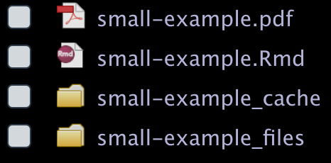
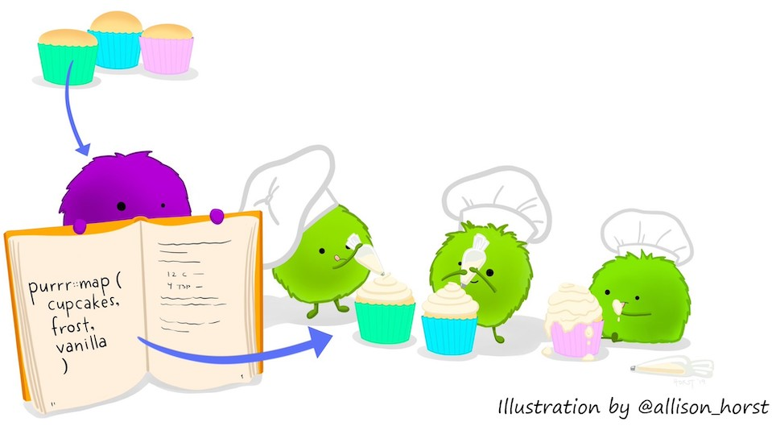
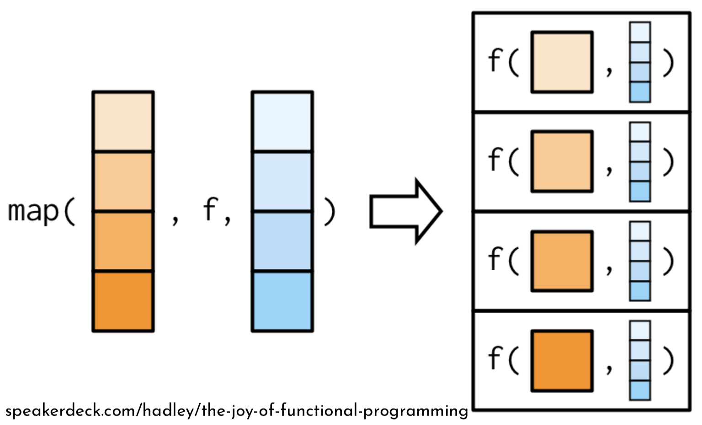
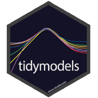

```{r xaringan-themer, include = FALSE}
library(xaringanthemer)
mono_light(
  base_color = "#531b3d",
  header_font_google = google_font("Nunito"),
  header_h1_font_size = "50px",
  text_font_google   = google_font("Chivo", "300", "300i"),
  code_font_google   = google_font("Droid Mono"), 
  code_inline_color = "#7e7e7f", 
  link_color = "#a8397b"
)
```

# Outline 

Part I: Reproducibility 
 
1. The RStudio IDE 
2. The .Rmd file, `rmarkdown`, and `knitr` 
3. `rticles` , `blogdown`, & others: templates galore

Part II: Efficiency 

1. `tidyverse` principles 
2. Core `tidyverse` for data storage, manipulation, transformation, & visualization
3. `purrr` : remove `for` loops from your vocabulary
4. (if time) `tidymodels` : applying `tidyverse` principles to modeling

---
# Disclaimer 

The tools presented here represent one way of conducting data analysis projects in R.

I make no claims that:

- the views in this talk represent those of my past, current, or future employers;
- there is one right way to do reproducibile research;
- the `tidyverse` paradigm is more correct than any other R programming paradigm.

I am presenting these tools because they were taught to me in grad school. I liked them and found them beneficial, so I have continued to use them and expand my understanding of them. 

Final disclaimer: One or more authors and/or maintainers of many of the packages I will present are my academic siblings.


---
class: inverse, center, middle
# Part I: Reproducibility 

```{r,echo=FALSE}
knitr::include_graphics("http://phdcomics.com/comics/archive/phd031214s.gif")
```
---
class: inverse, center, middle
# 1. The RStudio IDE

```{r, echo = FALSE, out.width="60%"}
knitr::include_graphics("https://www.rstudio.com/wp-content/uploads/2014/07/RStudio-Logo-Blue-Gray-400x140@2x.png")
```

---
# Why RStudio? 

Project management: 

- Begin with .Rproj file, not .R files: 
    * Create a unique folder for each project
    * Ability to share .Rproj file with others to recreate your exact working environment 
    * Easily incorporate version control with git & GitHub/GitLab 
- New directory created to house your .Rproj file:
    * Use folders such as `code/`, `dat/`, and `img/` to keep everything organized
    * Keeping everything in the RStudio-created directory makes work easier to share and reproduce
    * This directory should stand alone: your entire project should be reproducible with those files alone. 
    
---
## File `r emo::ji("arrow_right")` New Project...
```{r, out.width="45%", fig.show='hold', echo=FALSE}
knitr::include_graphics(c("img/rproj-1.png", "img/rproj-2.png", "img/rproj-3.png"))
```

---
class: inverse, center, middle
# 2. The .Rmd file, `rmarkdown`, and `knitr` 

```{r out.width="33%", echo=FALSE}
knitr::include_graphics(c("https://d33wubrfki0l68.cloudfront.net/aee91187a9c6811a802ddc524c3271302893a149/a7003/images/bandthree2.png", 
                          "http://hexb.in/hexagons/rmarkdown.png",
                          "http://hexb.in/hexagons/knitr.png"
                          ))
```

---
# .Rmd file 

Rmd = R + **Markdown**

**Markdown** is a lightweight markup language meant to be easily readable and writeable in plain text that can be converted to other formats, namely HTML. 

.pull-left[
**Markdown**

`**Bold text**`

`*Italic text*`

`1. Numbered`

`2. List`

`3. Items`
]

.pull-right[
**HTML**
````
<strong>Bold text</strong>
<em>Italic text</em>
<ul>
<li>Numbered</li>
<li>List</li>
<li>Items</li>
</ul>
````
]

---
# .Rmd file 

Rmd = R + **Markdown**

**Markdown** is a lightweight markup language meant to be easily readable and writeable in plain text that can be converted to other formats, namely HTML. 

.pull-left[
**Markdown**

`**Bold text**`

`*Italic text*`

`1. Numbered`

`2. List`

`3. Items`
]

.pull-right[
**LaTeX**
```
\textbf{Bold Text}
\textit{Italic text}
\begin{enumerate}
  \item Numbered
  \item List 
  \item Items
\end{enumerate}
```
]


---
# .Rmd file 

Rmd = **R** + Markdown

.Rmd files allow you to seamlessly place R code and output in documents written in Markdown.

```{r ,fig.align='center', out.width='47%'}
plot(faithful)
```

---
# .Rmd file 

Use an Rmd file to put R code and results into: 

- PDFs 
- Webpages (HTML)
- HTML slides 
- Word documents
- Websites 
- and more! 

Visit [rmarkdown.rstudio.com](https://rmarkdown.rstudio.com/) for example galleries.

---
# Components of a .Rmd file

a. YAML Header 

b. Markdown 

c. R code chunks

---
# a. YAML Header

Always start a .Rmd file with the YAML header. 

YAML = **Y**AML **A**in't **M**arkup **L**anguage (formerly **Y**et **A**nother **M**arkup **L**anguage)

.pull-left[
````
---
title: "Your title"
author: "First Last"
date: "6/19/2019"
output: html_document
---
````
] 

.pull-right[
Start YAML with `---`

Proceed with `field: value` pairs 

Output can be `html_document`, `pdf_document`, `word_document`

End YAML with `---`
]

More on YAML + .Rmd Documents in Chapter 2 of [R Markdown: The Definitive Guide](https://bookdown.org/yihui/rmarkdown/basics.html)

---
# b. Markdown 

After the closing `---` of the YAML header, begin writing your document in [Pandoc's](https://pandoc.org/MANUAL.html) markdown. 

.pull-left[
**Markdown**

`# Header `

``

]

.pull-right[
**Rendered as**
# Header 


]

----

More on Markdown + .Rmd Documents in Chapter 2.5 of [R Markdown: The Definitive Guide](https://bookdown.org/yihui/rmarkdown/markdown-syntax.html) and in the [cheat sheet](https://github.com/rstudio/cheatsheets/raw/master/rmarkdown-2.0.pdf). Many cheatsheets for the materials presented today live inside RStudio under the help menu. 

---
# c. R Code chunk

.pull-left[
````
`r ''````{r chunkname, options}
x <- "hello world"
x
```
````


]

.pull-right[
Begin a code chunk with three backticks (above tab key), `{r}`, and any options separated by `,`.

Then put R code 

End code chunk with three more backticks on a new line.
]

----

- The `chunkname` is for your reference. If any figures are produced from that chunk they will have that filename.
- The options affect the look of the R code and resulting output. 
    * `echo = TRUE`: code will appear in final document.
    * `eval = FALSE`: don't execute code when preparing final document
    * `out.width = '50%'`: plot output will be half the width of the rendered page
    * `fig.show = 'hold'`: if a chunk makes $\geq 2$ plots, show them after all other code in the chunk has been run

---
# a + b + c: Simple example 

```{r, out.width=c("55%", "45%"), echo = FALSE}
knitr::include_graphics(c("img/small-ex-1.png", "img/small-ex-2.png"))
```

.pull-left[
```{r, out.width="75%", echo = FALSE}

```
]

.pull-right[
When `cache = TRUE`, the directories `*_cache/` and `*_files/` are created. The plot is saved as `myplot.png` in `*_files/figure-latex/`
]

---
# **Q**: How? **A**: `knitr` & `rmarkdown`

[`knitr`](https://github.com/yihui/knitr) and  [`rmarkdown`](https://github.com/rstudio/rmarkdown) are the R packages doing most of the work to go from plain text markdown and R code to a PDF, MS Word, or HTML document. 

`knitr` came first as an alternative to Sweave for turning .Rnw files into PDFs. 

- `knitr` takes R code in a code chunk, runs it, grabs the output, and writes it in Markdown
- All chunk options are part of `knitr`. Full list and description of chunk options [here](https://yihui.name/knitr/options/)
- Fun fact: `knitr::purl("mydoc.Rmd")` will extract all R code out of a .Rmd file and save it (in the same directory) as `mydoc.R`. 

If using RStudio, no code is needed to convert from .Rmd to any format: just click the "`r emo::ji("yarn")` `Knit`" button. If not using RStudio: 

```{r, eval = FALSE, echo = TRUE}
rmarkdown::render("input.Rmd")
```

---
# More output

Other packages build on the functionality of `knitr` + `rmarkdown` to create 

- Websites 
- Books 
- and more! 


---
class: inverse, center, middle
# 3. `rticles` , `blogdown`, & others: templates galore

```{r echo = FALSE, out.width="33%"}
knitr::include_graphics(c("img/rticles.png", "https://camo.githubusercontent.com/0cab37d0a0a1237bc1fd97f41ceff51ce42f4444/68747470733a2f2f626f6f6b646f776e2e6f72672f79696875692f626c6f67646f776e2f696d616765732f6c6f676f2e706e67", "https://camo.githubusercontent.com/3a6eb33909ba8de431b07a0f1fd7cb800f7ba2db/68747470733a2f2f626f6f6b646f776e2e6f72672f79696875692f626f6f6b646f776e2f696d616765732f6c6f676f2e706e67"))
```

---
# The [`rticles`](https://github.com/rstudio/rticles) `r emo::ji("package")`: journal templates

```{r, eval=FALSE}
install.packages("rticles")
```

.Rmd file templates for 

- Sage journals
- The R Journal articles
- Taylor & Francis journals
- Elsevier journals
- American Stat. Assoc. journals
- Many more! 

In RStudio: File `r emo::ji("arrow_right")` New File `r emo::ji("arrow_right")` R Markdown `r emo::ji("arrow_right")` From Template

In R: 
```{r, eval = FALSE, tidy=TRUE}
rmarkdown::draft("MyJSSArticle.Rmd", 
                 template = "jss_article", package = "rticles")
```

---
# The [`blogdown`](https://bookdown.org/yihui/blogdown/) `r emo::ji("package")`: websites 

Maintain a personal website using Markdown + R. 

- Write blog posts in .Rmd files to put code + output + analysis together seamlessly
- Advanced topic! Read the `blogdown` [book](https://bookdown.org/yihui/blogdown/) before proceeding! 

```{r, echo = FALSE, out.width="35%", fig.align="center"}
knitr::include_graphics("https://bookdown.org/yihui/blogdown/images/cover.png")
```

---
# The [`bookdown`](https://bookdown.org/yihui/bookdown/) `r emo::ji("package")`: write books 

Write a book with R Markdown! 

- Each chapter is a .Rmd file 
- Online, epub, or PDF output formats 

- Advanced topic! Read the `bookdown` [book](https://bookdown.org/yihui/bookdown/) before proceeding! 

```{r, echo = FALSE, out.width="35%", fig.align="center"}
knitr::include_graphics("https://bookdown.org/yihui/bookdown/images/cover.jpg")
```

---
# The [`pagedown`](https://github.com/rstudio/pagedown) `r emo::ji("package")`: paged HTML 

Replace PDF output from LaTeX with the more easily machine-read HTML 

- Create HTML versions of your CV, poster, papers, etc. 
- In development. [Proceed](https://github.com/rstudio/pagedown) with caution! 

```{r, fig.align='center', out.width="40%", echo= FALSE}

```


---
# More R Markdown possibilities

- Beamer slides

 `output: beamer_presentation`
 
- Tufte handout 
    ```
    output:
      tufte::tufte_handout: default
    ```
- HTML 5 Slides 

  `output: ioslides_presentation`
  
- Dashboards 

```{r, eval=FALSE}
install.packages("flexdashboard")
```
 
    In RStudio: File `r emo::ji("arrow_right")` New File `r emo::ji("arrow_right")` R Markdown `r emo::ji("arrow_right")` 
    
    From Template `r emo::ji("arrow_right")` Flex Dashboard
    
---
class: inverse, center, middle
# Part II: Efficiency 

```{r echo = FALSE, fig.align="center", out.width = "70%"}
knitr::include_graphics("https://imgs.xkcd.com/comics/is_it_worth_the_time_2x.png")
```

---
class: inverse, center, middle
# 1. `tidyverse` principles 

```{r, echo=FALSE, fig.align='center', out.width="40%"}
knitr::include_graphics("https://avatars1.githubusercontent.com/u/22032646?s=200&v=4")
```

---
class: primary
# Tidy Tools Principles 

From the [Tidy Tools Manifesto](https://cran.r-project.org/web/packages/tidyverse/vignettes/manifesto.html)

a. Reuse existing data structures.  
b. Compose simple functions with the pipe. (`%>%`)  
c. Embrace functional programming.  
d. Design for humans.  

See also: 
- The `tidyverse` principles: [principles.tidyverse.org](https://principles.tidyverse.org/)
- The `tidyverse` style guide: [style.tidyverse.org](https://style.tidyverse.org/)
- The tidy evaluation guide: [tidyeval.tidyverse.org](https://tidyeval.tidyverse.org/) 

---
class: primary
# a. Reuse existing data structures 

Use things of class `data.frame`, `list`, `tibble` in favor of creating a separate data structure / class. 

The `tibble` class is the `tidyverse` [approach](https://cran.r-project.org/web/packages/tibble/vignettes/tibble.html) to the `data.frame` class. 

A `tibble`

- never changes an input’s type, (no more `stringsAsFactors = FALSE`!)
- never adjusts the names of variables (e.g. inserting periods for spaces)
- evaluates its arguments lazily and sequentially, so you can use earlier variables when creating new variables 
```{r}
library(tibble)
my_tbl <- tibble(x = rnorm(100), y = x +5)
```

- It never uses `row.names()`. (i.e. don't encode information somewhere other than the data table)
- It only recycles vectors of length 1. (Recycling vectors of greater lengths is a frequent source of bugs.)

---
# b. Compose functions with `%>%` 

Strings functions together in a human readable way. `r emo::ji("eyes")`

.pull-left[
**No pipes**
```
y <- f(x)
z <- g(y)
```
or
```
z <- g(f(x))
```
]

.pull-right[
**Pipes**
```
x %>% f() %>% g() -> z
```

Read as "take `x`, do `f`, then do `g`, which creates `z`."
]

Tidy Tips for writing functions: 

- Strive to keep functions as simple as possible (but no simpler!). 
- Generally, each function should do one thing well.
- Function names should be verbs.

Note: Using `%>%` is NOT compulsory in the `tidyverse` and related packages.  

---
# c. Functional programming

R is a functional programming language. Embrace it, don't fight it! 

Python, C#, others are object-oriented programming languages. [(See more)](https://adv-r.hadley.nz/oo.html)

Most important reason for using FP: 

- Use tools that abstract over for-loops, like the `apply` family of functions or the `map` functions in `purrr`.

```{r, echo=FALSE, fig.align='center',out.width="30%",fig.cap="https://xkcd.com/1270/"}
knitr::include_graphics("https://imgs.xkcd.com/comics/functional_2x.png")
```

---
# d. Design for Humans `r emo::ji("developer")` `r emo::ji("developer")` `r emo::ji("developer")`

"Computer efficiency is a secondary concern because the bottleneck in most data analysis is thinking time, not computing time." - [H. Wickham](https://cran.r-project.org/web/packages/tidyverse/vignettes/manifesto.html)

- Evocative function names that are easy to remember how to use (e.g. `filter`, `arrange`, etc.)
    * Note: these are verbs! 

- Favor explicit, lengthy names, over short, implicit, names. (e.g `db_list_tables`) 
    * Save short names for the most important functions!  

- Function families are identified by a common prefix, not a common suffix. (e.g. `str_sub`, `str_replace`, `str_remove` in `stringr`)
    * Helps with recall & autocomplete to make writing code faster.


---
class: inverse, center, middle
# 2. Core `tidyverse` for data storage, manipulation, transformation, & visualization

```{r, echo=FALSE, out.width="20%"}
knitr::include_graphics(c(                         "https://d33wubrfki0l68.cloudfront.net/f55c43407ae8944b985e2547fe868e5e2b3f9621/720bb/images/hex-tibble.png", "https://d33wubrfki0l68.cloudfront.net/66d3133b4a19949d0b9ddb95fc48da074b69fb07/7dfb6/images/hex-readr.png",
"https://d33wubrfki0l68.cloudfront.net/5f8c22ec53a1ac61684f3e8d59c623d09227d6b9/b15de/images/hex-tidyr.png",
"https://d33wubrfki0l68.cloudfront.net/071952491ec4a6a532a3f70ecfa2507af4d341f9/c167c/images/hex-dplyr.png",
  "https://d33wubrfki0l68.cloudfront.net/0ab849ed51b0b866ef6895c253d3899f4926d397/dbf0f/images/hex-ggplot2.png"))
```

---
# The [`tibble`](https://tibble.tidyverse.org/) `r emo::ji("package")`

A table structure with classes `"tbl_df", "tbl", "data.frame"`.

- Easy to create: `tbl <- tibble(x = rnorm(100), y= x*5 +2)` 
- Has nice printing qualities

```{r}
library(tibble)
as_tibble(iris)
```


---
# The [`readr`](https://readr.tidyverse.org/) `r emo::ji("package")`

- `read_*()`, `write_*()`: Read in CSVs, tab-delimited, RDS, raw files, etc.  
- `col_*()`: declare types of columns being read in (character, date, factor, integer, etc.)

```{r, echo=FALSE, warning = FALSE, message = FALSE}
library(tidyverse)
```

```{r}
library(tidyverse)
bb_dat <- read_csv("https://raw.githubusercontent.com/tidyverse/tidyr/master/data-raw/billboard.csv")
```

---
# `readr` (cont.)

```{r}
head(bb_dat)
```

---
# `readr` (cont.)

- `parse_*()`: change a `character` column/vector to a different type (number, logical, datetime, etc.)

```{r}
bb_dat$artist %>% head
parse_number(bb_dat$artist %>% head)
```

---
# The [`tidyr`](https://tidyr.tidyverse.org/) `r emo::ji("package")`

- `gather()`: takes multiple columns, and gathers them into variable-value pairs: it makes "wide" data longer.
- `spread()`: takes two columns (variable & value), and spreads into multiple columns: it makes "long" data wider.

```{r}
bb_dat <- bb_dat %>% gather(week, position, wk1:wk76) 
head(bb_dat)
```

---
# `tidyr` (cont.)

```{r}
bb_dat %>% spread(week, position) %>% head 
```

---
# Wide `r emo::ji("left_right_arrow")` long data 

```{r, out.width="70%", echo = FALSE, fig.align='center'}
knitr::include_graphics("https://omnianalytics.io/wp-content/uploads/2018/08/file35535a5445eb.gif")
```


---
# The [`dplyr`](https://dplyr.tidyverse.org/) `r emo::ji("package")`

`dplyr` has five main verbs for data manipulation:

- `mutate()`: adds new variables that can be functions of existing variables
- `select()`: picks columns based on their names and/or positions.
- `filter()`: picks rows based on their values.
- `summarize()`: reduces multiple values down to a single summary statistic.
- `arrange()`: changes the ordering of the rows.

```{r}
bb_dat %>% mutate(week = parse_number(week)) %>% 
  select(2:4, week, position) -> bb_dat
head(bb_dat, 3)
```

---
# `dplyr` (cont.)

`group_by()`: takes an existing `tbl` and converts it into a grouped `tbl` where operations are performed "by group".

```{r}
bb_dat %>% filter(!is.na(position)) %>% 
  group_by(artist, track) %>% 
  summarize(highest = min(position, na.rm = T), 
  length = max(week, na.rm = T)) %>%
  arrange(desc(length)) -> bb_dat_summ
head(bb_dat_summ)
```


---
# The [`ggplot2`](https://ggplot2.tidyverse.org/) `r emo::ji("package")`

Implements [The Grammar of Graphics](https://www.amazon.com/Grammar-Graphics-Statistics-Computing/dp/0387245448/ref=as_li_ss_tl?ie=UTF8&qid=1477928463&sr=8-1&keywords=the+grammar+of+graphics&linkCode=sl1&tag=ggplot2-20&linkId=f0130e557161b83fbe97ba0e9175c431) in R.

```{r, fig.align='center', out.width="50%", message = FALSE}
ggplot(data = bb_dat_summ, aes(x = length, y = highest)) + 
  geom_point()
```

---
# `ggplot2` (cont.)

Add layers: 

```{r, fig.align='center', out.width="50%", message = FALSE}
ggplot(data = bb_dat_summ, aes(x = length, y = highest)) + 
  geom_point() + 
  geom_smooth(method = "lm")
```

---
# `ggplot2` (cont.)

```{r, fig.align='center', out.width="50%", message = FALSE, warning=FALSE}
ggplot(data = bb_dat_summ, aes(x = length, y = highest)) + 
  geom_point() + 
  geom_smooth(method = "lm") + 
  xlim(0,30)
```

---
# More core `tidyverse` resources 

[`ggplot2` tutorial](https://uc-r.github.io/ggplot_intro)

[Tidy Tuesdays](https://github.com/rfordatascience/tidytuesday): practice your Tidyverse skills with others 

[Welcome to the tidyverse](https://speakerdeck.com/hadley/welcome-to-the-tidyverse)

[*R for Data Science* book](https://r4ds.had.co.nz/)

[*R for Data Science* book solutions](https://jrnold.github.io/r4ds-exercise-solutions/)

[Tidy Data Science Workshop](https://tidy-ds.wjakethompson.com/)

---
class: inverse, center, middle
# 3. `purrr` : remove `for` loops from your vocabulary

```{r, echo=FALSE, fig.align="center", out.width="30%"}
knitr::include_graphics("https://d33wubrfki0l68.cloudfront.net/9221ddead578362bd17bafae5b85935334984429/37a68/images/hex-purrr.png")
```

---
# What is the [`purrr`](https://purrr.tidyverse.org/) `r emo::ji("package")`?

- enhances R's functional programming abilities 

- (one of the core tenets of the `tidyverse`) 

- write less & faster code with the `map()` family of functions 

```{r, echo = FALSE, fig.align='center', out.width="75%"}

```

---
# `purrr`

```{r eval = FALSE}
map(.x, .f, ...)
```

- `.x`: an object to which you want to do the same thing over and over again
- `.f`: the function that will operate on *each element* of `.x`
- `...`: a place to put any other named arguments you want to use in `.f`

Example: compute the mean of the two variables we created in the `bb_dat_summ` dataset

```{r, echo = FALSE}
bb_dat_summ <- bb_dat_summ %>% ungroup()
```

```{r}
bb_dat_summ %>% select(length, highest) %>% map(mean, na.rm = TRUE)
```

---
# Compare to other methods

```{r}
mean_length <- mean(bb_dat_summ$length, na.rm = TRUE)
mean_highest <- mean(bb_dat_summ$highest, na.rm = TRUE)
mean_length; mean_highest
```

--

```{r}
mymeans <- list()
for(i in c("length", "highest")){
  mymeans[[i]] <- mean(bb_dat_summ[[i]], na.rm = TRUE)
}
mymeans
```

---
# Why use `purrr` instead? 

- `map()` treats the function and the object as equals

- `for` loops and other methods emphasize the object, not what you're doing to it

- It's fast and slick

```{r, echo=FALSE, out.width="80%", fig.align='center'}

```

---
# Another example

Simulation: 

- you have a grid of parameters, `mu` and `sigma`
- you want to simulate from the model with each combination of `mu` and `sigma`

```{r}
mu <- 1:5
sigma <- 1:3

mysims <- crossing(mu,sigma) %>% 
  mutate(sims = map2(mu, sigma, rnorm, n = 100))
glimpse(mysims)
```

---
## Visualize simulations 

```{r, message = FALSE, out.width='500px', out.height="400px", fig.align='center'}
mysims %>% unnest() %>% ggplot(aes(x = sims)) + geom_histogram() + 
  facet_grid(sigma~mu, labeller = "label_both")
```

---
# Use `purrr` for modeling 

```{r}
bb_dat_mods <- bb_dat %>% nest(-artist, -track) %>% 
  mutate(lms = map(data, ~lm(data = ., position ~ week, ))) 
bb_dat_mods[114,] ; bb_dat_mods$lms[[114]]    
```

---
# `purrr` for modeling 

```{r}
bb_dat_mods %>% mutate(intercept = map_dbl(lms, ~coef(.)[1]),
                       slope = map_dbl(lms, ~coef(.)[2])) %>% 
  select(artist, track, intercept, slope) %>% 
  arrange(slope)
```


---
# Other `purrr` functions 

- `flatten()`: similar to `unlist()`
- `walk(.x, .f, ...)`: perform function `.f` on each element of `.x` for the side effects (e.g. `write_csv()` for saving data to disk)
- `pmap(.l, .f, ...)`: perform function `.f` on 3 or more objects of the same length in a list `.l` 
- `detect(.x, .f, ...)`: for a function `.f` that returns a logical value, return the first element of `.x` that returns `TRUE` 


---
# More `purrr` resources 

- "The Joy of Functional Programming" by Hadley Wickham
    * Slides on [Speakerdeck](https://speakerdeck.com/hadley/the-joy-of-functional-programming)
    * Example code on [Github](https://github.com/hadley/joy-of-fp)

- [Iteration](https://r4ds.had.co.nz/iteration.html), Chapter 21 in *R for Data Science*

---
class: inverse, center, middle
# 4. (if time) `tidymodels` : applying `tidyverse` principles to modeling

```{r, echo=FALSE, fig.align="center", out.width="30%"}

```

---
# `tidymodels` packages `r emo::ji("package")` `r emo::ji("package")` `r emo::ji("package")`

All stored in a [Github organization](https://github.com/tidymodels)

```{r, fig.show='hold', out.width="20%", echo = FALSE}
knitr::include_graphics("https://raw.githubusercontent.com/topepo/rstudio-conf-2019/master/Materials/images/yardstick.png")
knitr::include_graphics("https://raw.githubusercontent.com/topepo/rstudio-conf-2019/master/Materials/images/parsnip.png")
knitr::include_graphics("https://raw.githubusercontent.com/topepo/rstudio-conf-2019/master/Materials/images/recipes.png")
knitr::include_graphics("https://raw.githubusercontent.com/tidymodels/rsample/master/rsample_hex_thumb.png")
```

Others: `broom`, `tidyposterior`, `dials`, `infer`, `probably`, `textrecipes`, `embed`

--

## `r emo::ji("warning")` Warning `r emo::ji("warning")` 

The `tidymodels` framework is still in development, so proceed with caution.

---
# `r emo::ji("package")`: `rsample`

From the package [website](https://tidymodels.github.io/rsample/): 

- "The scope of `rsample` is to provide the basic building blocks for creating and analyzing resamples of a data set but does not include code for modeling or calculating statistics."

- Anything to do with sampling the data: 
    + splitting into training/testing (`initial_split()`)
    + sets for cross-validation (`vfold_cv()`)
    + other bootstrapping needs (e.g. `bootstrap()`)

```{r, echo=FALSE, fig.align='center', out.width="25%"}
knitr::include_graphics("https://raw.githubusercontent.com/tidymodels/rsample/master/rsample_hex_thumb.png")
```

---
# `r emo::ji("package")`: `parsnip`

From the [website](https://tidymodels.github.io/parsnip/): 

- Goal: Separate the definition of a model from its evaluation.

- Decouple the model specification from the implementation (whether the implementation is in R, spark, or something else). 

- Harmonize the argument names (e.g. `n.trees`, `ntrees`, `trees`) so that users can remember a single name. 

- From the same author as the `caret` package. (Eventually all of `caret` will be in `parsnip`)

```{r, echo=FALSE, fig.align='center', out.width="25%"}
knitr::include_graphics("https://raw.githubusercontent.com/topepo/rstudio-conf-2019/master/Materials/images/parsnip.png")
```

---
class: primary
# `r emo::ji("package")`: `recipes`

From the [website](https://tidymodels.github.io/recipes/): 


"The idea of the recipes package is to define a recipe or blueprint that can be used to sequentially define the encodings and preprocessing of the data (i.e. "feature engineering")."

```{r recipeex, eval=F}
data("Sonar",package = "mlbench")
sonar_rec <- recipe(Class ~ ., data = Sonar) %>%
  step_center(all_predictors()) %>%
  step_scale(all_predictors())
```

```{r, echo=FALSE, fig.align='center', out.width="30%"}
knitr::include_graphics("https://raw.githubusercontent.com/topepo/rstudio-conf-2019/master/Materials/images/recipes.png")
```

---
class: primary
# `r emo::ji("package")`: `yardstick`

From the [website](https://tidymodels.github.io/yardstick): "yardstick is a package to estimate how well models are working using tidy data principles." 

- `conf_mat(truth, estimate)`: confusion matrix
- `roc_auc(truth, estimate)`: computes area under the ROC curve
- `spec(truth, estimate)`: computes specificity
- `sens(truth, estimate)`: computes sensitivity
- `roc_data(truth, estimate)`: returns a dataframe of values for plotting ROC curves
- `autoplot()`: plot ROC curve. requires output from `roc_data`.

```{r, echo=FALSE, fig.align='center', out.width="20%"}
knitr::include_graphics("https://raw.githubusercontent.com/topepo/rstudio-conf-2019/master/Materials/images/yardstick.png")
```

---
# `tidymodels` resources

[Book](https://tidymodels.github.io/model-implementation-principles/)

[Github](https://github.com/tidymodels)

Max Kuhn's rstudio::conf 2019 [Applied Machine Learning workshop](https://github.com/topepo/rstudio-conf-2019) and [`parsnip` talk](https://resources.rstudio.com/rstudio-conf-2019/parsnip-a-tidy-model-interface)

---
class: center, middle
# Thank you! 

--

# Questions?