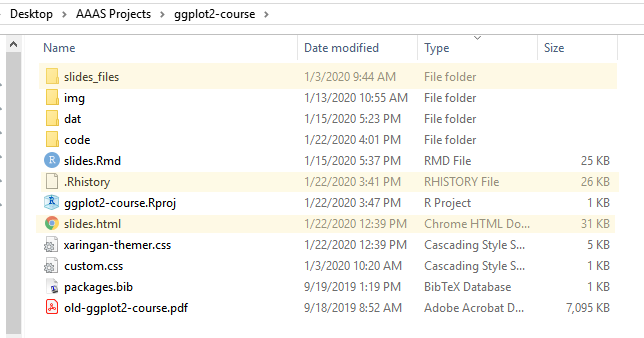
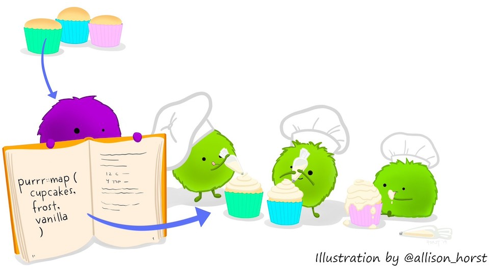
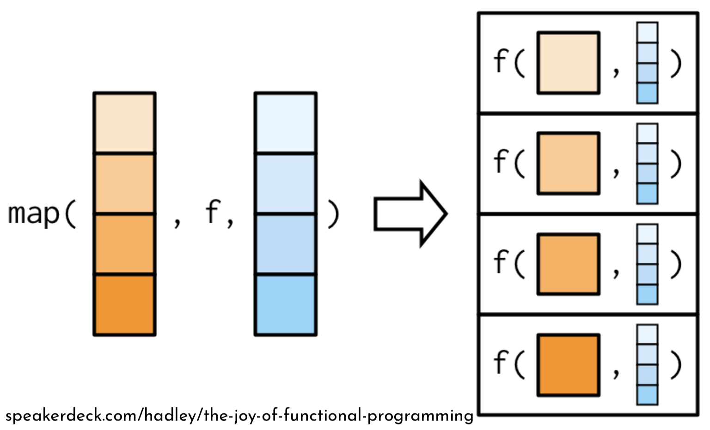
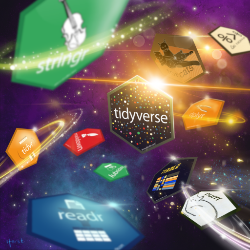

```{r setup, include=FALSE}
options(htmltools.dir.version = FALSE)
knitr::opts_chunk$set(echo = TRUE, out.width = "80%", message = FALSE, warning = FALSE, fig.align = 'center')
```

<!--Title: Increasing Reproducibility and Efficiency with R 
Abstract: Reproducibility, the ability to reproduce one’s results from the same data and code, and efficiency go hand-in-hand for statistical analyses. The more efficient your code, the easier it is to reproduce your results. When collaborating with others, reproducible and efficient code is even more vital.  In R and RStudio, there are many tools available to increase both your efficiency and your reproducibility. In this talk, I will focus on two families of tools: the rmarkdown and the tidyverse suites of R packages. Rmarkdown and related packages make it easy to conduct reproducible research, and the tidyverse programming paradigm helps you write more efficient R code. You will leave this talk with knowledge of at least one new R package to add to your R toolbox and make your research better.--> 


```{r xaringan-themer, include = FALSE}
library(xaringanthemer)
mono_light(
  base_color = "#b41f24",
  text_font_google = google_font("Source Sans Pro"),
  text_font_size = "24px",
  header_font_google = google_font("Source Sans Pro"),
  header_h1_font_size = "50px",
  code_inline_color = "#2a3683",
  code_inline_font_size = ".8em",
  code_font_size = ".75em",
  code_font_family = "Fira Code",
  code_font_url    = "https://cdn.rawgit.com/tonsky/FiraCode/1.204/distr/fira_code.css",
  link_color = lighten_color("#2a3683", strength = .4)
)
```

```{r echo=FALSE}
options(tibble.print_min = 5)
```

# Outline 

Part I: Reproducibility 
 
1. The RStudio IDE 
2. The .Rmd file, `rmarkdown`, and `knitr` 
3. `rticles` , `blogdown`, & others: templates galore

Part II: Efficiency 

1. `tidyverse` principles 
2. Core `tidyverse` for data storage, manipulation, transformation, & visualization
3. `purrr` : remove `for` loops from your vocabulary
4. The expansion of the `tidyverse` (if time)


---
# Disclaimers 

The tools presented here represent one possible way of conducting data analysis projects in R.

I make no claims that:

- the views in this talk represent those of my past, current, or future employers;
- there is one right way to do reproducibile research;
- the `tidyverse` paradigm is more correct than any other R programming paradigm.

I am presenting these tools because I like them, use them frequently, and find them beneficial.


---
class: inverse, center, middle
# Part I: Reproducibility 

```{r echo = FALSE, fig.align="center", out.width = "90%", fig.cap='Source: "Scratch" by <a href="http://phdcomics.com/comics/archive.php?comicid=1689">PhD Comics</a>'}
#fig.cap='Source: <a href="http://phdcomics.com/comics/archive.php?comicid=1689">PhD Comics</a>'
knitr::include_graphics("http://phdcomics.com/comics/archive/phd031214s.gif")
```

???
This comic represents a common problem in research. Thankfully, the R and RStudio universes contain many tools to help your research projects be reproducible. (next)


---
class: inverse, center, middle
# 1. The RStudio IDE

```{r, echo = FALSE, out.width="60%", fig.cap="Source: rstudio.com"}
knitr::include_graphics("https://d33wubrfki0l68.cloudfront.net/62bcc8535a06077094ca3c29c383e37ad7334311/a263f/assets/img/logo.svg")
```

???
The first of these is the RStudio IDE. How many in the room use RStudio? (Gauge how many hands, then decide how quickly to move through.)

---
# Why RStudio? 

Facilitates good project management procedures: 

- Begin with .Rproj file, not .R files: 
    * Create a unique folder for each project
    * Ability to share project files with others, [making it easier to reproduce your work](https://support.rstudio.com/hc/en-us/articles/200526207-Using-Projects) 
    * Easily incorporate version control with [git & GitHub/GitLab](https://happygitwithr.com/) 
- Avoids use of `setwd()` and `rm(list = ls())`. (More on this from [Jenny Bryan](https://www.tidyverse.org/blog/2017/12/workflow-vs-script/))
- If all code in same place, use Ctrl/Command + Shift + F to find code snippets in files 

???
One of the primary benefits of using RStudio is the built-in project management tools. R projects help keep you organized. 
  
    
---
## File `r emo::ji("arrow_right")` New Project...
```{r, out.width="33%", fig.show='hold', echo=FALSE, fig.align='default', fig.cap="How to create a new RStudio Project."}
knitr::include_graphics(c("img/rproj-1.png", "img/rproj-2.png", "img/rproj-3.png"))
```

???
To create a new R project...

---
# Ensure reproducibility

- New directory created to house your .Rproj file:
    * Use folders such as `code/`, `dat/`, and `img/` to keep everything organized
    * This directory should stand alone: **your entire project should be reproducible with only the files in that directory**
- Example file management: (highlighted files generated by RStudio)   
```{r, out.width="65%", echo=FALSE}
#     * Keeping everything in the RStudio-created directory makes work easier to share and reproduce

```

???
Within the directory that RStudio creates for your project, ensure reproducibility  of your work by having good file management. store .R files in a code directory, store data files in a data directory, store saved plots in an image directory, etc. You should completely be able to start from scratch with just your files in the rstudio-created directory. Here's an example folder. 

---
class: inverse, center, middle
# 2. The .Rmd file, `rmarkdown`, and `knitr` 

```{r out.width="32%", echo=FALSE, fig.cap='Source: <a href="https://bookdown.org/yihui/rmarkdown/">R Markdown: The Definitive Guide</a>', fig.show='hold'}
knitr::include_graphics(c("https://d33wubrfki0l68.cloudfront.net/aee91187a9c6811a802ddc524c3271302893a149/a7003/images/bandthree2.png", 
                          "http://hexb.in/hexagons/rmarkdown.png",
                          "http://hexb.in/hexagons/knitr.png"
                          ))
```

???
Another key issue in reproducibility is report or paper-writing. Documenting your process is incredibly important for reproducibility and RMarkdown makes that easier. 


---
# .Rmd file 

Rmd = R + **Markdown**

**Markdown** is a lightweight markup language meant to be easily readable and writeable in plain text that can be converted to other formats, namely HTML. 

.pull-left[
**Markdown**  

`**Bold text**`  
`*Italic text*`  
`1. Numbered`  
`2. List`  
`3. Items`
]

.pull-right[
**LaTeX**  

`\textbf{Bold Text}`  
`\textit{Italic text}`  
`\begin{enumerate}`  
`\item Numbered`  
`\item List`  
`\item Items`  
`\end{enumerate}`
]

???
An Rmd file is a files that combines text and R code and results. How many people here use LaTeX? (...) Latex and Markdown are both markup languages. Markdown is much more lightweight than LaTeX but it's also not as flexible.  

---
# .Rmd file 

Rmd = R + **Markdown**

**Markdown** is a lightweight markup language meant to be easily readable and writeable in plain text that can be converted to other formats, namely HTML. 

.pull-left[
**Markdown**

`**Bold text**`  
`*Italic text*`  
`1. Numbered`  
`2. List`  
`3. Items`
]

.pull-right[
**HTML**

`<strong>Bold text</strong>`  
`<em>Italic text</em>`  
`<ul>`  
`<li>Numbered</li>`  
`<li>List</li>`  
`<li>Items</li>`  
`</ul>`

]

???
Markdown is primarily used to convert plain text to HTML, which is very cumbersome to type by hand. 


---
# .Rmd file 

.Rmd files allow you to seamlessly place **R** code and output in documents written in Markdown.

```{r out.width='40%'}
plot(faithful)
```

???
The next part of an RMarkdown file is R code. Here's an example using base plot to make a scatter plot of some built-in data. 


---
# .Rmd file 

Use an Rmd file to put R code and results into: 

- PDFs
- webpages (HTML)
- HTML slides
- MS Word documents
- PowerPoint slides 
- Presentation Ninja slides (e.g. these slides. See the [`xaringan`](https://slides.yihui.name/xaringan/#1) package),
- Beamer slides
- and more! 

Visit [rmarkdown.rstudio.com](https://rmarkdown.rstudio.com/) for example galleries.


---
# Components of a .Rmd file

a. YAML Header 

b. Markdown 

c. R code chunks

???
An Rmd file contains 3 parts: a YAML header, Markdown, and R code "chunks" 

---
# a. YAML Header

Always start a .Rmd file with the YAML header. 

YAML = **Y**AML **A**in't **M**arkup **L**anguage (formerly **Y**et **A**nother **M**arkup **L**anguage)

.pull-left[
```yaml
---
title: "Your title"
author: "First Last"
date: "02/20/2020"
output: html_document
---
```
] 

.pull-right[
Start YAML with `---`

Proceed with `field: value` pairs 

Output can be `html_document`, `pdf_document`, `word_document`

End YAML with `---`
]

----

More on YAML + .Rmd Documents in Chapter 2 of [R Markdown: The Definitive Guide](https://bookdown.org/yihui/rmarkdown/basics.html)

???
The YAML header tells R how to process your plaintext file. It has to be the first thing in your file. There are all kinds of fields needed & able to be used depending on what output you want. 


---
# b. Markdown 

After the YAML header, write your document in [Pandoc's](https://pandoc.org/MANUAL.html) markdown.  
.pull-left[
**Markdown**

`# Header `

``

]
.pull-right[
**Rendered as**
# Header  


]


----

More on Markdown + .Rmd Documents in Chapter 2.5 of [R Markdown: The Definitive Guide](https://bookdown.org/yihui/rmarkdown/markdown-syntax.html) and in the [cheat sheet](https://github.com/rstudio/cheatsheets/raw/master/rmarkdown-2.0.pdf). 


???
All writing must be in markdown. There is a cheatsheet that contains the majority of markdown syntax. You can also do tables and include images in markdown


---
# c. R Code chunk

.pull-left[
Put stuff here  
````{r chunkname, options}`  
`x <- rnorm(10)`  
`x`

` ``` `
]

.pull-right[
Begin a code chunk with three backticks (above tab key), `{r}`, and any options separated by `,`.

Then put R code 

End code chunk with three more backticks on a new line.
]

----
The options affect the look of the R code and resulting output.
  * `echo = TRUE`: code will appear in final document.
  * `out.width = '50%'`: plot output will be half the width of the rendered page

???
In an Rmarkdown document, R code lives inside of code chunks, which are offset by pairs of 3 backticks. 
- The `chunkname` is for your reference. If any figures are produced from that chunk they will have that filename.


---
# a + b + c: Simple example 

```{r, out.width=c("55%", "45%"), echo = FALSE, fig.align='default'}
knitr::include_graphics(c("img/small-ex-1.png", "img/small-ex-2.png"))
```
<!--.pull-left[
```{r, out.width="75%", echo = FALSE}
knitr::include_graphics("img/small-ex-3.png")
```
]
When `cache = TRUE`, the directories `*_cache/` and `*_files/` are created. The plot is saved as `myplot.png` in `*_files/figure-latex/`-->

---
# **Q**: How? **A**: `knitr` & `rmarkdown`

[`knitr`](https://github.com/yihui/knitr) and  [`rmarkdown`](https://github.com/rstudio/rmarkdown) are the R packages doing most of the work to go from plain text markdown and R code to output document

`knitr` came first: alternative to Sweave for turning .Rnw files into PDFs. 

- `knitr` takes R code in a code chunk, runs it, & grabs the output
- All chunk options are part of `knitr`. Full list and description of chunk options [here](https://yihui.name/knitr/options/)
- Fun fact: `knitr::purl("mydoc.Rmd")` will extract all R code out of a .Rmd file and save it (in the same directory) as `mydoc.R`. 

???
Here's a simple example of taking the three Rmarkdown file pieces to create a pdf 


---
# Compiling Rmd Files


If using RStudio, no code is needed to convert from .Rmd to any format: just click the  "`r emo::ji("yarn")` `Knit`" button. 

If not using RStudio: 

```{r, eval = FALSE, echo = TRUE}
rmarkdown::render("input.Rmd")
```

---
# More output

Other packages build on the functionality of `knitr` + `rmarkdown` to create 

- Websites 
- Books 
- and more! 

???
There are many different output types from Rmarkdown documents. We'll touch on a few of them in the next section. Does anyone have any questions right now? 

---
class: inverse, center, middle
# 3. `rticles` , `blogdown`, & others: templates galore

```{r echo = FALSE, out.width="25%", fig.align='default'}
knitr::include_graphics(c("img/rticles.png", "https://camo.githubusercontent.com/0cab37d0a0a1237bc1fd97f41ceff51ce42f4444/68747470733a2f2f626f6f6b646f776e2e6f72672f79696875692f626c6f67646f776e2f696d616765732f6c6f676f2e706e67", "https://camo.githubusercontent.com/3a6eb33909ba8de431b07a0f1fd7cb800f7ba2db/68747470733a2f2f626f6f6b646f776e2e6f72672f79696875692f626f6f6b646f776e2f696d616765732f6c6f676f2e706e67"))
```

???
Now we'll cover a few different types of outputs you can create from RMarkdown documents. 


---
#  `r emo::ji("package")` [`rticles`](https://github.com/rstudio/rticles): journal templates

```{r, eval=FALSE}
install.packages("rticles")
```

.Rmd file templates for 

- Sage journals
- The R Journal
- Taylor & Francis journals
- American Stat. Assoc. journals
- Many more! 

In RStudio: File `r emo::ji("arrow_right")` New File `r emo::ji("arrow_right")` R Markdown `r emo::ji("arrow_right")` From Template

In R: 
```{r, eval = FALSE, tidy=TRUE}
rmarkdown::draft("MyJSSArticle.Rmd", 
                 template = "jss_article", package = "rticles")
```

---
# `r emo::ji("package")` [`blogdown`](https://bookdown.org/yihui/blogdown/): websites 

Maintain websites & blogs using Markdown + R.  
- Write blog posts in .Rmd files to put code + output + analysis together seamlessly
- Advanced topic! Read the `blogdown` [book](https://bookdown.org/yihui/blogdown/) before proceeding! 

```{r, echo = FALSE, out.width="25%", fig.align="center"}

```


---
# `r emo::ji("package")` [`bookdown`](https://bookdown.org/yihui/bookdown/): write books 

Write a book with R Markdown!  
- Each chapter is a .Rmd file
- Online, epub, or PDF output formats
- Advanced topic! Read the `bookdown` [book](https://bookdown.org/yihui/bookdown/) before proceeding! 

```{r, echo = FALSE, out.width="25%", fig.align="center"}

```

---
# `r emo::ji("package")` [`pagedown`](https://github.com/rstudio/pagedown): paged HTML 

Replace PDF output from LaTeX with the more easily machine-read HTML 

- Create HTML versions of your CV, poster, papers, etc. 
- In development. [Proceed](https://github.com/rstudio/pagedown) with caution! 
- See my talk from the DC R conference on pagedown [here](https://bit.ly/TynerDCR19)

```{r, fig.align='center', out.width="25%", echo= FALSE}

```

---
# More R Markdown possibilities

- Beamer slides: `output: beamer_presentation`
- Tufte handout:
```yaml
output:
  tufte::tufte_handout: default
```
- HTML 5 Slides: `output: ioslides_presentation`
- Dashboards:    
```{r, eval=FALSE}
install.packages("flexdashboard")
```
    - In RStudio: File `r emo::ji("arrow_right")` New File `r emo::ji("arrow_right")` R Markdown `r emo::ji("arrow_right")` From Template `r emo::ji("arrow_right")` Flex Dashboard

---
# Reproducibility conclusions

- Use RStudio projects to help with project structure & management
- Use R Markdown documents to make documents more reproducible: place code and results inside your documents
- Take advantage of R Markdown extensions to more easily share research online


???
This brings us to the end of the reproducibility portion of the talk. Are there any questions before we move on to efficiency? 

---
class: inverse, center, middle
# Part II: Efficiency 

```{r echo = FALSE, fig.align="center", out.width = "50%", fig.cap='Source: "Is it worth the time?" by <a href="https://xkcd.com/1205/">xkcd</a>'}
knitr::include_graphics("img/is_it_worth_the_time.png")
```

???
Efficiency here is about the way YOU work, not the way your computer works. There are various tools in R that work to speed up computation time. They are not covered here. But I will say that the tidyverse tools I present here are faster computationally than their base R equivalents for most operations. 

---
class: inverse, center, middle
# 1. `tidyverse` principles 

```{r, echo=FALSE, fig.align='center', out.width="40%", fig.cap='Source: <a href="https://github.com/tidyverse/tidyverse">tidyverse</a>'}
knitr::include_graphics("https://avatars1.githubusercontent.com/u/22032646?s=200&v=4")
```


???
The tidyverse is an opinionated family of R packages that follow the same set of four principles. 

---
# Tidy Tools Principles 

From the [Tidy Tools Manifesto](https://cran.r-project.org/web/packages/tidyverse/vignettes/manifesto.html)

a. Reuse existing data structures.  (i.e. stick with data frames!)  
b. **Compose simple functions with the pipe.** (`%>%`)    
c. Embrace functional programming.  (i.e. accept R as it R)  
d. **Design for humans.**  

See also: 
- The `tidyverse` principles: [principles.tidyverse.org](https://principles.tidyverse.org/)
- The `tidyverse` style guide: [style.tidyverse.org](https://style.tidyverse.org/)
- The tidy evaluation guide: [tidyeval.tidyverse.org](https://tidyeval.tidyverse.org/) 


<!------# a. Reuse existing data structures 

Use things of class `data.frame`, `list`, `tibble` in favor of creating a separate data structure / class. 

The `tibble` class is the `tidyverse` [approach](https://cran.r-project.org/web/packages/tibble/vignettes/tibble.html) to the `data.frame` class. 

A `tibble`

- never changes an input’s type, (no more `stringsAsFactors = FALSE`!)
- never adjusts the names of variables (e.g. inserting periods for spaces)
- evaluates its arguments lazily and sequentially, so you can use earlier variables when creating new variables 
```{r}
library(tibble)
my_tbl <- tibble(x = rnorm(100), y = x +5)
```

- It never uses `row.names()`. (i.e. don't encode information somewhere other than the data table)
- It only recycles vectors of length 1. (Recycling vectors of greater lengths is a frequent source of bugs.)--> 

---
# b. Compose functions with `%>%` 

Strings functions together in a human readable way. `r emo::ji("eyes")`  
.pull-left[
**No pipes**
```
y <- f(x)
z <- g(y)
```
or
```
z <- g(f(x))
```
]

.pull-right[
**Pipes**
```
x %>% f() %>% g() -> z
```

Read as "take `x`, do `f`, then do `g`, which creates `z`."
]

<!---Tidy Tips for writing functions: 

- Strive to keep functions as simple as possible (but no simpler!). 
- Generally, each function should do one thing well.
- Function names should be verbs.---> 

Note: Using `%>%` is NOT compulsory in the `tidyverse` and related packages.  


<!------# c. Functional programming

R is a functional programming language. Embrace it, don't fight it! 

Python, C#, others are object-oriented programming languages. [(See more)](https://adv-r.hadley.nz/oo.html)

Most important reason for using FP: 

- Use tools that abstract over for-loops, like the `apply` family of functions or the `map` functions in `purrr`.-->

---
# d. Design for Humans `r emo::ji("developer")` `r emo::ji("developer")` `r emo::ji("developer")`

"Computer efficiency is a secondary concern because the bottleneck in most data analysis is thinking time, not computing time." - [H. Wickham](https://cran.r-project.org/web/packages/tidyverse/vignettes/manifesto.html)

- Evocative function names that are easy to remember how to use (e.g. `filter`, `arrange`, etc.)
- Favor explicit, lengthy names, over short, implicit, names. (e.g `db_list_tables`) 
- Function families are identified by a common prefix, not a common suffix. (e.g. `str_sub`, `str_replace`, `str_remove` in `stringr`)
    * Helps with recall & autocomplete to make writing code faster.

---
class: inverse, center, middle
# 2. Core `tidyverse` for data storage, manipulation, transformation, & visualization

```{r, echo=FALSE, out.width="20%", fig.show="hold", fig.cap='Source: <a href="https://www.tidyverse.org/">tidyverse.org</a>'}
knitr::include_graphics(c("img/hex-tibble.png", "img/hex-readr.png", "img/hex-tidyr.png", "img/hex-dplyr.png",
  "img/hex-ggplot2.png"))
```

???
tidyverse has 8 core packages. Each one has one specific purpose. We'll cover some of them next. Before we move on are there any questions? 


```{r, echo=FALSE, warning = FALSE, message = FALSE}
library(tidyverse)
```

---
# `r emo::ji("package")` [`tibble`](https://tibble.tidyverse.org/): data structure

A table structure with classes `"tbl_df", "tbl", "data.frame"`.

- Easy to create
- Has nice printing qualities

```{r}
library(tibble)
(my_tbl <- tibble(x = rnorm(100), y= x*5 +2))
```

???
The first core package, tibble, deals with the structure of data. A tibble is similar to a data frame, but is easier to create and has nice printing qualities. 

---
# `r emo::ji("package")` [`readr`](https://readr.tidyverse.org/): read data 

- `read_*()`, `write_*()`: Read in and write out CSVs, tab-delimited, RDS, raw files, etc.  
- `col_*()`: declare types of columns being read in (character, date, factor, integer, etc.)

```{r echo=FALSE}
knitr::include_graphics("img/data-no-push.png")
```

```{r}
library(tidyverse)
sigacts <- read_csv("dat/sigacts.csv", 
                   col_types = list(col_character(),col_character(),               
                                    col_character(),col_character(),
                                    col_date(format = "%d-%b-%y"), col_character(),
                                    col_character()))
```

???
The next package in the core tidyverse is readr, which deals with reading in data. I have a screenshot here of some data that I got from Nick of significant activities from syria. It has 7 columns: area, event category, event sub-category, time, date, and MGRS location of friendly and non-partner forces. I use the col_character and col_date functions to read in the data. 

---
# `readr` (cont.)

```{r}
sigacts
```

- `parse_*()`: change a `character` column/vector to a different type (number, logical, datetime, etc.)

```{r}
sigacts$`Time of Event` %>% head; parse_number(sigacts$`Time of Event` %>% head)
```

???
Now, we take a look at the data that was read into R. The readr package also contains a family of parse functions to convert characters to numbers, dates, etc. We use it here to get the numbers out of the time variable. 

---
# `r emo::ji("package")` [`stringr`](https://stringr.tidyverse.org/): string manipulation

Easily clean up character variables with the `stringr` package functions such as:
- [`str_to_lower(string)`](https://stringr.tidyverse.org/reference/case.html): convert `string` to lower case
- [`str_remove_all(string, pattern)`](https://stringr.tidyverse.org/reference/str_remove.html): remove all instances of `pattern` from `string`
- Many more, good to have knowledge of [regular expressions](https://regex101.com/) to use 

```{r}
sigacts$`Time of Event` %>% head ; str_to_lower(sigacts$`Time of Event` %>% head)
sigacts$`MGRS FRIENDLY` %>% head ; str_remove_all(sigacts$`MGRS FRIENDLY` %>% head, "\\W")
```

???
Stringr is the core tidyverse package for dealing with strings. We'll use two functions, str_to_lower and str_remove_all. We need to make sure all the Zs in the time variable are lowercase so we can create times from them later and we need to remove all non-word characters from the mgrs columns for getting the locations in lat,long later. 

---
# `r emo::ji("package")` [`dplyr`](https://dplyr.tidyverse.org/): data manipulation

- `mutate()`: adds new variables that can be functions of existing variables
- `select()`: picks columns based on their names and/or positions.
- `filter()`: picks rows based on their values.
- `summarize()`: reduces multiple values down to a single summary statistic.
- `arrange()`: changes the ordering of the rows.

???
Next in the core tidyverse is dplyr for data manipulation. There are five main manipulation functions in dplyr. 

--
```{r}
sigacts <- sigacts %>% 
  mutate(`Time of Event` = parse_time(str_to_lower(`Time of Event`), format="%H%Mz")) %>% 
  mutate_at(1:3, str_to_lower) %>% 
  mutate_at(vars(starts_with("MGRS")), str_remove_all, pattern = "\\W")
sigacts %>% select(1:4, starts_with("MGRS"))
```


---
# `dplyr` (cont.)

`group_by()`: takes an existing `tbl` and converts it into a grouped `tbl` where operations are performed "by group".

```{r}
(sigacts_summ <- sigacts %>% 
  group_by(AREA, Event) %>% 
  count() %>% 
  arrange(desc(n)))
```

???
The group_by function groups the data and any operations after grouping are performed on the group. So here, we group by area and event, then count the number of occurrences in the data

---
#  `r emo::ji("package")` [`ggplot2`](https://ggplot2.tidyverse.org/): data visualization

Implements [The Grammar of Graphics](https://www.amazon.com/Grammar-Graphics-Statistics-Computing/dp/0387245448/ref=as_li_ss_tl?ie=UTF8&qid=1477928463&sr=8-1&keywords=the+grammar+of+graphics&linkCode=sl1&tag=ggplot2-20&linkId=f0130e557161b83fbe97ba0e9175c431) in R.

```{r, fig.align='center', out.width="80%", warning=TRUE, fig.width=10, fig.height=4}
ggplot(data = sigacts, aes(x = DOI, y = `Time of Event`)) + 
  geom_point() 
```


---
# `ggplot2` (cont.)

Add layers: 

```{r, fig.align='center',  out.width="80%", warning=TRUE, fig.width=10, fig.height=4}
ggplot(data = sigacts, aes(x = DOI, y = `Time of Event`)) + 
  geom_point() + geom_rug()
```

???
We add the rug geom, which places a bar on each axis at each value of the data. So, we can see that there are many dates missing times of events, and most events occur in between 5pm and 10pm. 

---
# `r emo::ji("package")` [`tidyr`](https://tidyr.tidyverse.org/): create tidy data

- [`pivot_longer()`](https://tidyr.tidyverse.org/reference/pivot_longer.html): takes multiple columns of a table, and pivots them into 2 new columns of name&mdash;value pairs: it makes "wide" data longer.
- [`pivot_wider()`](https://tidyr.tidyverse.org/reference/pivot_wider.html): takes 2 columns & creates multiple columns. One column becomes the new columns' names; the other's values populate the new columns, making "long" data wider. 

```{r, out.width="30%", echo = FALSE, fig.align='center', fig.cap="Source: <a href='https://omnianalytics.io/2018/08/30/animating-the-data-transformation-process-with-gganimate/'>omnianalytics.io</a>"}
knitr::include_graphics("https://omnianalytics.io/wp-content/uploads/2018/08/file35535a5445eb.gif")
```

???
The next core tidyverse package is tidyr, which restructures data into a tidy format. There are two workhorse functions: pivot_longer and pivot_wider. These turn wide data long, and long data wide, as shown in the gif. 

---
# `tidyr` (cont.): wide to long

```{r}
(sigacts_longer <- sigacts %>% 
  pivot_longer(cols = starts_with("MGRS"), 
               names_to = "who", names_prefix = "MGRS ", 
               values_to = "mgrs", values_drop_na = TRUE))
```

???
Here we make the sigacts data wider. 

---
# `tidyr` (cont.): long to wide

```{r, warning=TRUE}
(sigacts_wider <- sigacts_longer  %>% 
  pivot_wider(names_from = "who", values_from = "mgrs"))
```

???
Now, we try to reverse the process by making long data wider. This does not work because there are multiple values for each combination of the values in the area, event, subcategory, time, and date variables. 

<!-----# `ggplot2` (cont.)

```{r, fig.align='center', out.width="50%", message = FALSE, warning=FALSE, eval=FALSE}
ggplot(data = bb_dat_summ, aes(x = length, y = highest)) + 
  geom_point() + 
  geom_smooth(method = "lm") + 
  xlim(0,30)
```
-->

---
# More core `tidyverse` resources 

[`ggplot2` tutorial](https://uc-r.github.io/ggplot_intro)

[Tidy Tuesdays](https://github.com/rfordatascience/tidytuesday): practice your Tidyverse skills with others 

[Welcome to the tidyverse](https://speakerdeck.com/hadley/welcome-to-the-tidyverse)

[*R for Data Science* book](https://r4ds.had.co.nz/)

[*R for Data Science* book solutions](https://jrnold.github.io/r4ds-exercise-solutions/)

[Tidy Data Science Workshop](https://tidy-ds.wjakethompson.com/)

???
To dive deeper into the core tidyverse, here are some resources. In the next section, we'll cover a really exciting core tidyverse package, purrr. Before moving on, are there any questions? 


---
class: inverse, center, middle
# 3. `purrr` : remove `for` loops from your vocabulary

```{r, echo=FALSE, fig.align="center", out.width="30%"}
knitr::include_graphics("img/hex-purrr.png")
```


---
# What is the [`purrr`](https://purrr.tidyverse.org/) `r emo::ji("package")`?

- enhances R's functional programming abilities 
- (one of the core tenets of the `tidyverse`) 
- write less & faster code with the `map()` family of functions 

```{r, echo = FALSE, fig.align='center', out.width="65%"}

```


---
# `purrr`

```{r eval = FALSE}
map(.x, .f, ...)
```

- `.x`: an object to which you want to do the same thing over and over again
- `.f`: the function that will operate on *each element* of `.x`
- `...`: a place to put any other named arguments you want to use in `.f`

```{r, echo=FALSE, out.width="50%", fig.align='center'}

```


---
# `purrr`: example set up

To map the locations, we neet to convert MGRS to latitude, longitude pairs. There's an R package [mgrs](https://github.com/hrbrmstr/mgrs) for this! 

```{r}
sigacts_longer$mgrs %>% head %>% mgrs::mgrs_to_latlng()
```

---
# `purrr`: example 

Keep the results with the full dataset with `dplyr::mutate` + `purrr:map`:
```{r}
(sigacts_longer <- sigacts_longer %>% 
  mutate(coords = map(mgrs, mgrs::mgrs_to_latlng, include_mgrs_ref = FALSE)))
```


---
# `purrr`: example (cont.)

Use the `tidyr::unnest` function to make the coordinates their own column

```{r}
(sigacts_longer <- sigacts_longer %>% unnest(c(coords)))
```

Then (next slide) use `ggplot2` to plot them. 

---

```{r out.width='48%'}
world <- rnaturalearth::ne_countries(scale = "medium", returnclass = "sf")
ggplot() + geom_sf(data = world) + 
  geom_point(data = sigacts_longer, aes(x = lng, y = lat, color = who), alpha = .5) + 
  scale_color_manual(name = NULL, values = c("black", "red")) + 
  xlim(c(36,48)) + ylim(c(30,39)) + theme_void() + theme(legend.position = c(.85,.9))
```

???
Here we can see that most of the events are in Syria as expected but there are some in neighboring Iraq and Turkey

<!-----
# Compare to other methods

```{r eval = FALSE}
mean_length <- mean(bb_dat_summ$length, na.rm = TRUE)
mean_highest <- mean(bb_dat_summ$highest, na.rm = TRUE)
mean_length; mean_highest
```

```{r eval=FALSE}
mymeans <- list()
for(i in c("length", "highest")){
  mymeans[[i]] <- mean(bb_dat_summ[[i]], na.rm = TRUE)
}
mymeans
```
--> 

---
# Why use `purrr`? 

- `map()` treats the function and the object as equals

- `for` loops and other methods emphasize the object, not the function

- It's fast and slick


---
# `purrr`: another example

Simulation:  
- you have a grid of parameters, `mu` and `sigma`
- you want to simulate from the model with each combination of `mu` and `sigma`

```{r}
mu <- 1:5
sigma <- 1:3

mysims <- crossing(mu,sigma) %>% 
  mutate(sims = map2(mu, sigma, rnorm, n = 100))
glimpse(mysims)
```

???
(Note to self: only do if time!)

---
## Visualize simulations 

```{r, message = FALSE, out.width='500px', out.height="400px", fig.align='center'}
mysims %>% unnest(c(sims)) %>% ggplot(aes(x = sims)) + geom_histogram() + 
  facet_grid(sigma~mu, labeller = "label_both")
```

<!-----
# Use `purrr` for modeling 

```{r eval=FALSE}
bb_dat_mods <- bb_dat %>% nest(-artist, -track) %>% 
  mutate(lms = map(data, ~lm(data = ., position ~ week, ))) 
bb_dat_mods[114,] ; bb_dat_mods$lms[[114]]    
```
-->

<!-----
# `purrr` for modeling 

```{r eval=FALSE}
bb_dat_mods %>% mutate(intercept = map_dbl(lms, ~coef(.)[1]),
                       slope = map_dbl(lms, ~coef(.)[2])) %>% 
  select(artist, track, intercept, slope) %>% 
  arrange(slope)
```
--->

---
# Other `purrr` functions 

- `flatten()`: similar to `unlist()`
- `walk(.x, .f, ...)`: perform function `.f` on each element of `.x` for the side effects (e.g. `write_csv()` for saving data to disk)
- `pmap(.l, .f, ...)`: perform function `.f` on 3 or more objects of the same length in a list `.l` 
- `detect(.x, .f, ...)`: for a function `.f` that returns a logical value, return the first element of `.x` that returns `TRUE` 


---
# More `purrr` resources 

- "The Joy of Functional Programming" by Hadley Wickham
    * Slides on [Speakerdeck](https://speakerdeck.com/hadley/the-joy-of-functional-programming)
    * Example code on [Github](https://github.com/hadley/joy-of-fp)

- [Iteration](https://r4ds.had.co.nz/iteration.html), Chapter 21 in *R for Data Science*

<!-- Idea: add links to the other tidy R families such as tidymodels and fable (time series)--> 

???
Here are some other resources on purrr. Any questions before we go on to the final section? 

---
class: inverse, center, middle
# 4. The Expansion of the `tidyverse`

```{r echo=FALSE, out.width="40%", fig.cap="Illustration by <a href='https://twitter.com/allison_horst'>@allison_horst</a>"}

```

---
# Other `tidyverse` packages 

Not in "core" `tidyverse` but still a part of the `tidyverse`

- [`readxl`](https://readxl.tidyverse.org/), [`haven`](https://haven.tidyverse.org/) for reading data from Excel, SAS, SPSS, and Stata 
- [`rvest`](https://github.com/hadley/rvest), [`httr`](https://github.com/r-lib/httr) for web data 
- [`lubridate`](https://lubridate.tidyverse.org/) for dates and times 
- [`glue`](https://github.com/tidyverse/glue) for a tidy alternative to `paste()` and `sprintf()`

Full list at [tidyverse.org/packages](https://www.tidyverse.org/packages/)! 

---
# `tidyverse` spinoffs

.pull-left[
[`tidymodels`](https://github.com/tidymodels): a family of packages used for modelling. Examples:  
- [`parsnip`](https://tidymodels.github.io/parsnip/): "a tidy, unified interface to models" 
- [`rsample`](https://tidymodels.github.io/rsample/): functions for resampling 
- [`recipes`](https://tidymodels.github.io/recipes/): data processing and design matrices for modeling 
```{r echo=FALSE, out.width="50%",fig.align="default"}

```
]
.pull-right[
[`tidyverts`](https://tidyverts.org/): "tidy tools for time series." Examples:  
- [`tsibble`](https://tsibble.tidyverts.org/): tidy temporal data structures 
- [`fable`](https://fable.tidyverts.org/): tidy forecasting with common time series models  

```{r echo=FALSE, out.width="45%",fig.align="default", fig.show='hold'}
knitr::include_graphics(c("img/hex-tsibble.png", "img/hex-fable.png"))
```
]

---
# `tidyverse`-compatible packages 

Not in the `tidyverse` but AFAIK obey the `tidyverse` principles and style guide

- Some `ggplot2` [extensions](https://www.ggplot2-exts.org/) like `ggthemes`, `ggsci`, `gganimate`, etc. 
- [`janitor`](http://sfirke.github.io/janitor/) for cleaning data 
- [`sf`](https://r-spatial.github.io/sf/) for map data using "simple features" 
- Many more!  


---
class: center, middle
# Thank you! 


--

<link rel="stylesheet" href="https://use.fontawesome.com/releases/v5.6.0/css/all.css" integrity="sha384-aOkxzJ5uQz7WBObEZcHvV5JvRW3TUc2rNPA7pe3AwnsUohiw1Vj2Rgx2KSOkF5+h" crossorigin="anonymous">

# Questions?

#### <i class="fas fa-globe"></i> sctyner.github.io <i class="fas fa-grip-lines-vertical"></i>  <i class="far fa-envelope"></i> sctyner90@gmail.com

#### <i class="fab fa-github"></i> github.com/sctyner <i class="fas fa-grip-lines-vertical"></i> <i class="fab fa-twitter"></i> @sctyner

#### <i class="fab fa-linkedin"></i> linkedin.com/in/sctyner


